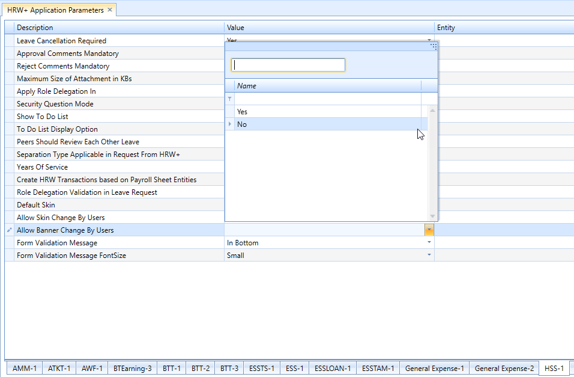
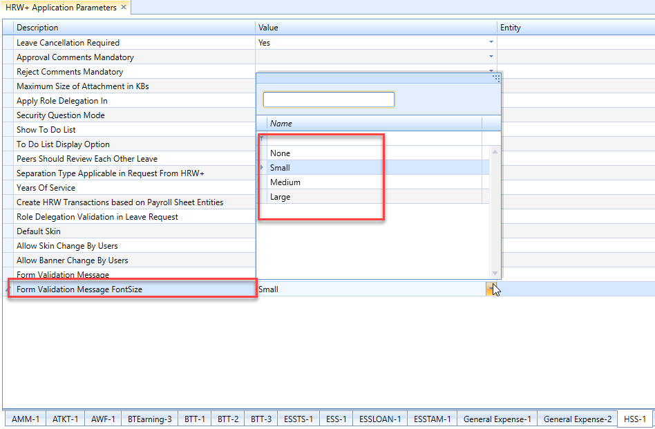

# Administration (ESS)

## Auto Approval for Earning/deduction cancellation

### Nov 2021- #23623

The client require provision to auto approve earning and deduction
cancellation.

To enable Auto Approve, execute the SQL.

## Overtime cancellation in the web application

### Dec2021-#21211

Developed Overtime cancellation in the web applications.

In order to implement the change, execute two scripts.

## Company Documents in the web application

### April 2021 -  # 21440

A new screen "Company Documents" was developed in web application.

In order to implement the new feature, execute an SQL to enable the menu.

## Development of card types screen in web

### April 2021 -  # 21840

A new screen "Card Types" was developed in web application.

In order to implement the new screen, execute an SQL.

## Option to delegate the proxy role

### Aug 2019 -  # 16034

Currently it was not able to assign role to a proxy. Hence the client required to delegate the role to the proxy user during role delegation along with the approval delegation.

For implementing this change, a new parameter named  Role Delegation Applicability  was introduced in the HSS-1 tab of HRW + Application Parameters.

Execute a query to enable the application parameter.

## List Employee Names in Alphabetical Order

### Aug 2019- #  16305

The client required to list he employee name in alphabetic order in the Select Employee dropdown available for the Proxy users in the Attendance Regularisation screen.

For implementing this, a new parameter was added in the PROXY-1 tab of HRW + Application Parameters named  Employee List Order in Proxy List .

Execute a query to enable the application parameter.

## User Interface Changes to HR Works Plus

### Dec 2018 #12841

Added new parameter in HSS**-1** tab of the **HRW+ Application Parameters** screen.

1. **Default Skin**: Changing the skin will change the appearance, theme palette and other user interface elements. Users can change the default skin set for ESS and/ or set any of the available skins by choosing the respective values from this dropdown. If no values are set for this parameter or None is selected as its value, the ESS will appear in the default skin.

**Note**: This can be done by any users having admin rights or having the required permissions to make these changes in HR Works. If you want to allow the employees/ ESS users also to change the theme set here or the default theme, see the details provided on the **Allow Skin Change By Users** parameter.

1. **Allow Skin Change By Users**: We can set either Yes or No as the values for this parameter, which will decide whether to allow employees/ ESS users to change the skin of ESS application.
   
2. **Allow Banner Change By Users**: By selecting Yes or No as the value for this parameter, you can allow or disallow ESS users to change the ESS banner.
   

## Change in Validation Message view

### Dec 2018 #12963

The validation messages that appear on transaction entry or processing are usually positioned at the bottom of the page/ form. Client wants it to customize it so that they can specify the position of all validation messages and also set the format like font size.

The following are done for implementing these changes:

- Added new parameter in **HSS-1** tab of the **HRW+ Application Parameters** screen.

  1. The **Form Validation Message** parameter has the following options as its values which the user can select and specify the position of the validation message:

     - In Bottom
     - In Center.
     - If nothing is set for this parameter or None is selected, the message appears at the bottom-right of the page/ form.

       

1. **Form Validation Message Font Size**: Users can specify the font size of the message text as follows:

   - Small
   - Medium
   - Large:
   - If no value is selected or None is selected for this parameter, the message text appears in the default font size.

     
