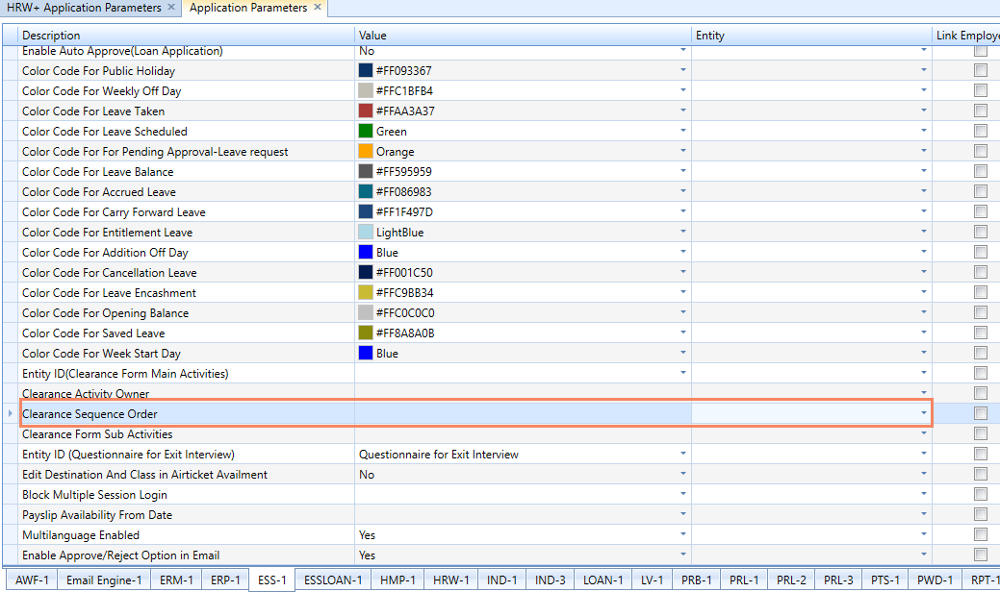
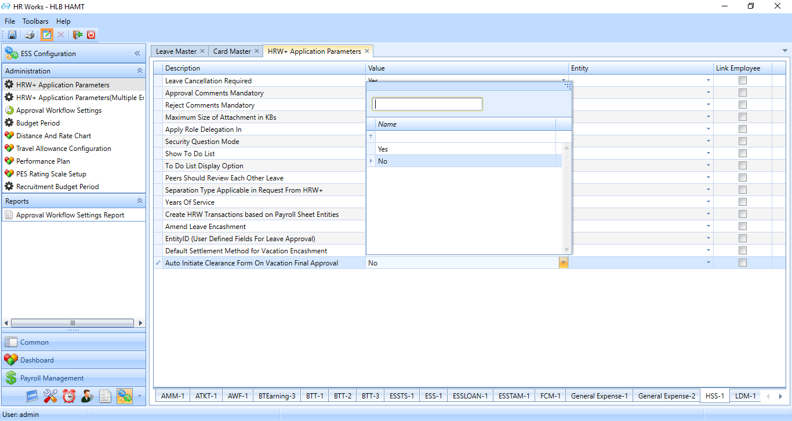
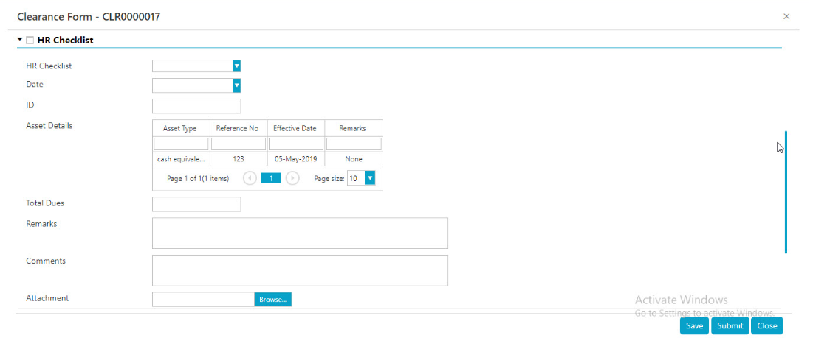
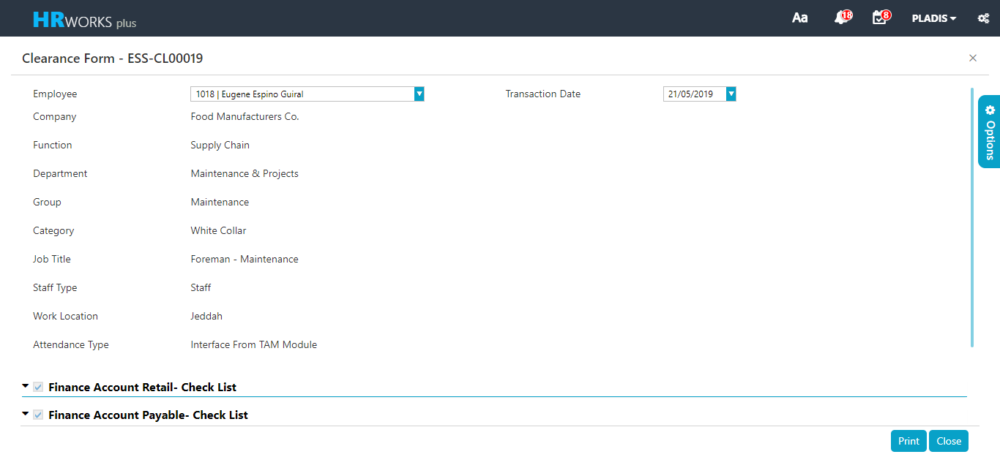

# Clearance Form and Exit Interview

## Sequence order for Clearance form sub activity

### Oct 2019 -  # 16430

The client required to process the clearance sub activities in the sequence order given below.

1.  Department Sub Activity

2.  IT Sub Activity

3.  HR Sub Activity

4.  Auto Garage Sub Activity

5.  Finance Sub Activity

At 1st clearance form should be sent to Department Head (Department Sub Activity) once approved from Department, it should flow to IT Manager (IT Sub Activity) and so on.

To implement the change, execute a query to enable the application parameter.

## Ability to see all clearance form request by other users

### May 2019-   #15145

Currently, the clearance form could be seen only by the requested User. However, the user required to view and print all the clearance request to all the users.

For this execute a query for enabling HRW+ Application parameter.

## Vacation Clearance Form and Automatic Initiation

### May 2019-   #14581

The client required to automatically initiate the clearance form during a vacation request approval. The clearance form will be initiated after the final approval of the vacation request.

For this a new parameter named  Auto Initiate Clearance Form On Vacation Final Approval  was introduced in the HSS-1 Tab of the HRW + Application Parameter. When the parameter is set to 'Yes' the clearrance form is automatically initiated.

Execute a query for enabling the parameter.

*Figure: HRW + Application Parameter Screen*

## Asset Details link to Clearance form

### May 2019-   #14212

The client required to track the Employee Asset Details such as Asset Name, Asset No etc through the Employee Personal Records. When an employee gets separated, the clearance form must list the assets the which the employee had, but not returned. The assets in which the return date is null will be listed.

For this Create assets in Card Types and set values in Card Master.

Create Different assets for checklist in the Personal Records fields of Card Types, further create corresponding parameters under each asset and set the values for the employees.

Execute a view for getting the details regarding the assets.

*Fig: Clearance Form showing Asset Details*

## Provide Print option in all level of request and approval

### May 2019-   #15150

All the request and approval screen contain the option to Print the form in all levels. Hence the user required an option to print the Clearance form in all the request and approval screen.

Execute a query for enabling the clearance form in all request and approval screen.

Set the HRW + Application Parameter for printing.

*Figure: Clearance Form*
