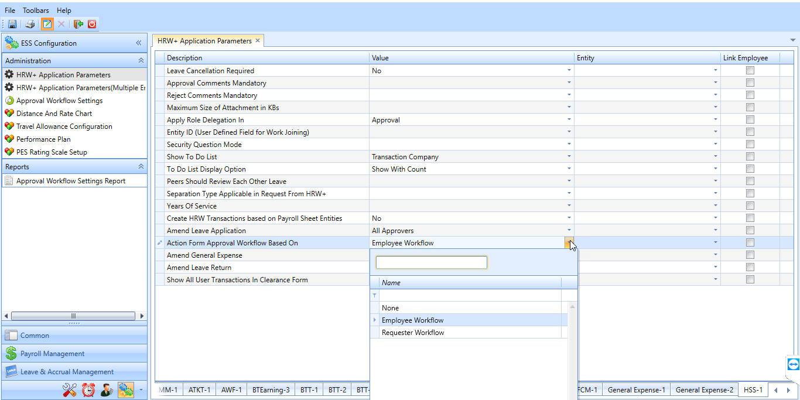
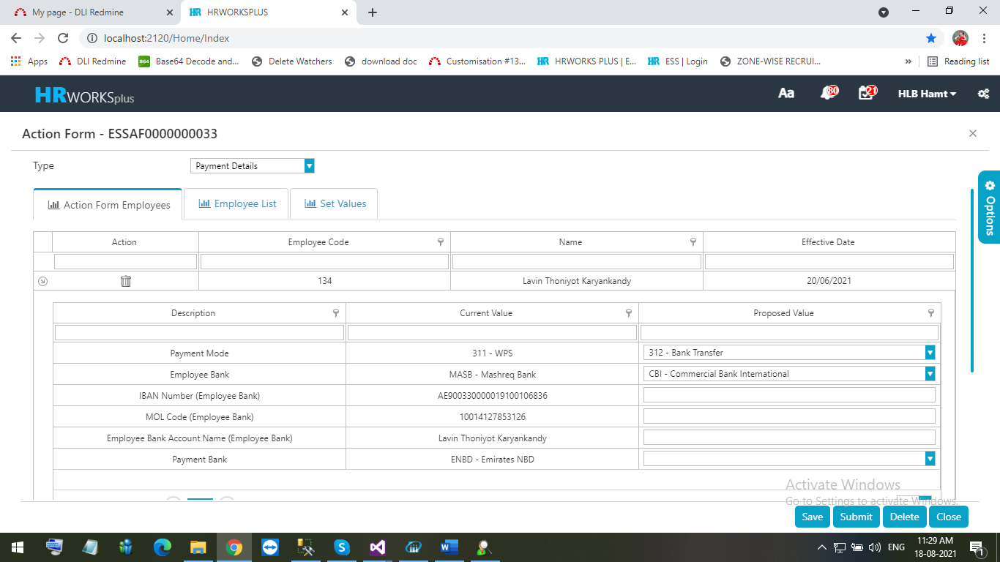
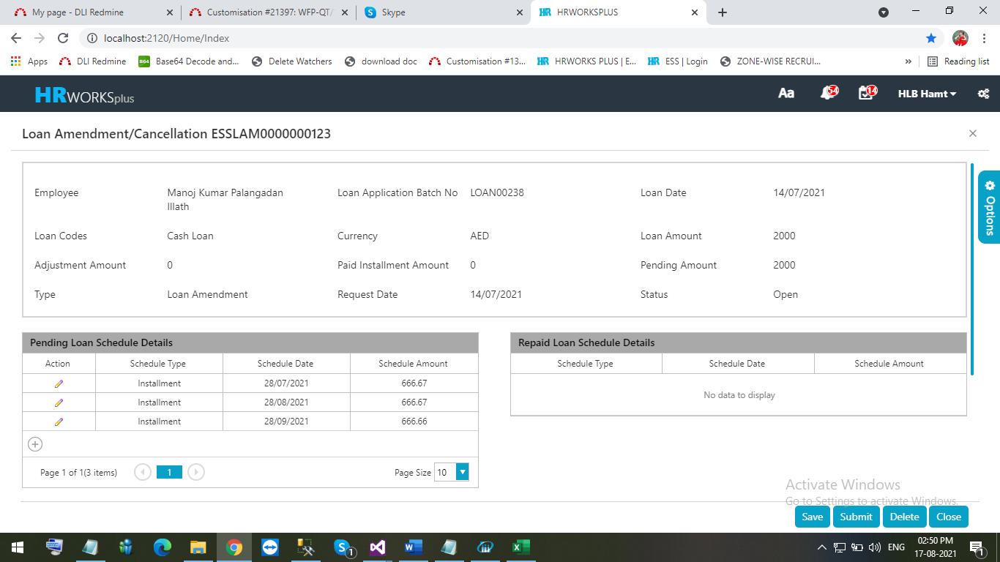
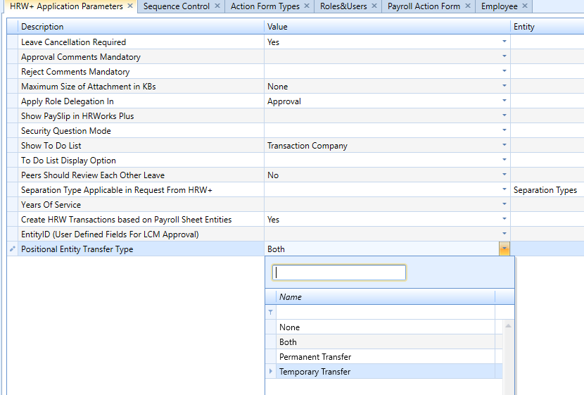
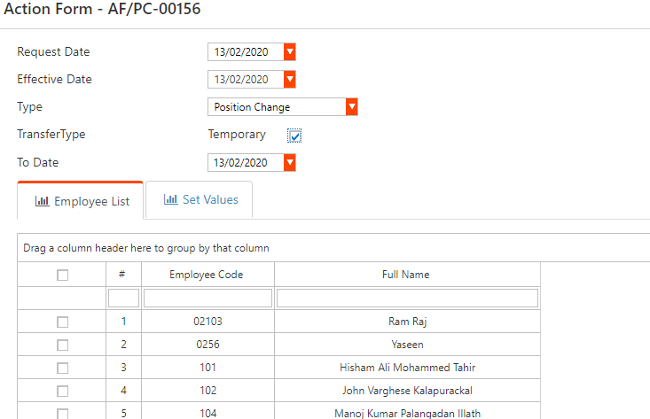

# Payroll Transactions

## Employee Transfer request screen

### Jan 2020 -  # 15180

The client required an option to transfer Employee Location and Department in the HR Works Plus with following facilities.

-   Employees and Proxy users should be able to process position change requests.

-   Employees must only be able to make request for them self. But the proxy user can make request for other employee (Possible to select only one employee at a time).

-   Current position details should be shown in the position change screen, but it should be non-editable.

-   Work flow structure must slightly differ. i.e. the managers in the proposed entities should be approver. Approval work flow structure is shown below.
    Group Head-\>Current Department Head-\>Current Function Head-\>proposed department Head-\- Proposed Function head>HR.

-   System should provide a report in request and all approval levels. This report should be available in Arabic interface also.

In order to implement the change, follow the steps below.

1.  Execute two queries to enable the workflow settings.

## Action form for payment details in web application

### July 2021 -  # 21983

Developed Action form for payment details in the web application

To implement the feature, execute a script.

## Loan Amendment in web

### July 2021 -  # 19610

Developed new screen for Loan Amendment functionality in web application

To implement the feature, execute a query which enables the menu.

## Employee Transfer Request

### Dec 2019 -  # 14738

Currently, in employee transfer requests, department manager requests for employee transfer by Location or Department.

Now the client required the following changes:

-   Add selection options "Permanent Transfer" and Temporary Transfer". If temporary transfer, there should be an option available to enter From and To date.

-   It should have Site (Current Site + New Site) + Unit (Current Unit + New Unit) + Department (Current Department + New Department) options to select.

To implement the changes, follow the steps below.

1.  Execute a script to make the value type Active, that enables this feature.

2.  Execute a query to Enable  Positional Entity Transfer Type in HSS-1 tab.

