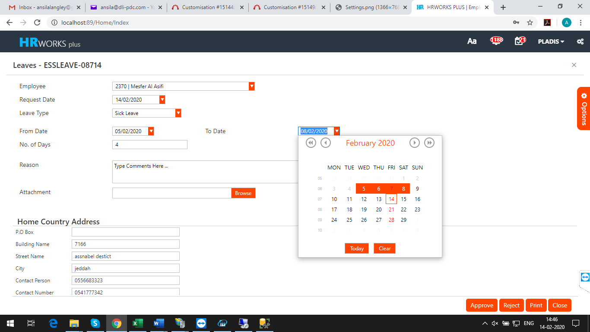

# General

## Option to select the Recent Menus

### Jan 2022- # 23001

The client required an option to display the recently used menus during
current session.

In order to implement the feature, execute a query for enabling the
recent menu.

## New Dashboard

### Nov 2021- #23686

Developed new dashboard in the dashboard viewer

This widget is mainly intended for use in HRWorks Plus, so alignments in
HRWorks may not exactly match with HRWorks Plus version.

There are limitations to amount of data that can be passed as JSON.
Currently it is designed for handling the requirements of a company with
100-150 employees.

All other widgets in the dashboard are using consolidated records, so
JSON limitation is not applicable to those widgets. But this widget can
break if you pass huge volume of data in JSON format.

Colours of each leave types and absent are defined in Dashboard
Viewer/Index1.cshtml in HRWorks Plus and styles.css in Dashboard Scripts
folder in HRWorks. Currenly only Present and Absent styles are defined
it. Other leave styles should be added to above locations as per client
requirements.

## Single URL for HRWorks Plus & PWA

### Dec 2021- #23680

The client required to use a single URL for accessing HRWorks Plus and
PWA. Based on the screen display size, the corresponding portal should
be loaded. For example, if the user opens the new URL from mobile device
or tablet, PWA version should be loaded. If the new URL is opened from
laptop or desktop, HRWorks plus portal should be loaded.

In order to implement the change, add a specified key in web.config file
and provide the PWA URL for redirection in value section.

## Cross company approval in ESS

### Feb 2020 -  # 17509

The client required the cross-company approval feature in ESS. It must be possible to approve other company user's request from the parent company of the approver in the transactions such as Leave application, Loan Application, Business travel, Benefit claim, Air ticket, General Expense and Clearance form.

In order to implement the change, execute a query and set  Cross Company Approval in 'Show To Do List' parameter in HSS-1 tab.

## Showing Employee Entities in request and approval screen

### Nov 2019 -  # 15144

The client required to show Employees Entities in request and approval screen & reports.

To implement the change, execute a query to enable the visibility of employee entities in screen and reports.

## Option to edit all requested data in all approval level

### Nov 2019 -  # 15149

The client required an option to edit all requested data in all approval level. This option should be available in leave request, leave return request, General Expense and Travel Expense requests screens.

To implement the change, execute a query.

## Block user from using mobile app on multiple devices

### Oct 2019 -  # 16956

Earlier, when the mobile app is configured on a second device by entering the admin credentials, the user will be still able to use the app on the initially configured device. This feature was blocked in the new system.

## Export option to XLS File

### Oct 2019 -  # 13889

The client required the export option file format in xlsx rather than pdf.

In order to implement the change, execute a script for enabling xlsx export option in all reports.

## Show Last Approver Comment

### Aug 2019 -  # 15944

Currently the last approver comment was shown in the transaction history. Now, the client required to view the last approver comment in the approval screen. Similarly, the previous approver comments need to view in the main popup screen while approving a transaction.

For implementing the change, execute a query.

## ESS Workflow Escalation

### Aug 2019 -  # 14616

The client required a workflow escalation feature in HR Works Plus.

If a request is pending with a user for a specific number of days, the following actions should be taken automatically by the system

1. Provide a provision to enter the number of days to start the escalation task\
2. A reminder email must be sent to the approver after some specific number of days to the approver and other higher authorities (CC to next approver & HR manager) referring that the requests are pending to approve.
3. After the specified number of days, the request should be auto-approved and forward to the next approver with usual notifications and CC email to the HR Manager.

To implement this change, execute a query.

## Auto Rejection Option in Workflow Escalation

### Aug 2019 -  # 16018

An auto-rejection feature is developed in workflow escalation. The two types of auto rejection developed are

1.  Auto rejection with notification

2.  Auto rejection

In a workflow with auto-rejection with notification, after the specified number of days the notification will go to the concerned approval authority and CC to the HR manager and reject the request after the specified number of days.

In a workflow with auto-rejection, after the specified number of days the request is rejected.

To implement the feature, execute a query to activate Workflow Escalation.

## Restrict the attachment size in all request page to 100 KB

### July 2018 (#6350)

Normally the attachment is ESS can hold size less than or equal to 8kb. Now, the attachment size in all request page can be specifically given by assigning a value for a **Maximum Size of Attachment in KBs** parameter in HSS-1 tab of HRW+Application parameter screen. The parameter includes values like 100kb, 200kb, 300kb.

## Print option in ESS requests for Approvers

### July 2018 (#7163)

Print option is implemented for all Approval level users also. Approvers can print with all approver s comments after his approval. Currently this is implemented only in Leave Application and General Expense screen.

## HSS-HLB/224- To include intermediate letters and words in proxy name filter

### July 2018 (#10954)

The requirement here is to list out the name of the employee even when it is searched with an intermediate word wherever search functionality is implemented. This functionality works fine with strings and texts but not applicable in case of numerals as well as dropdown lists.
