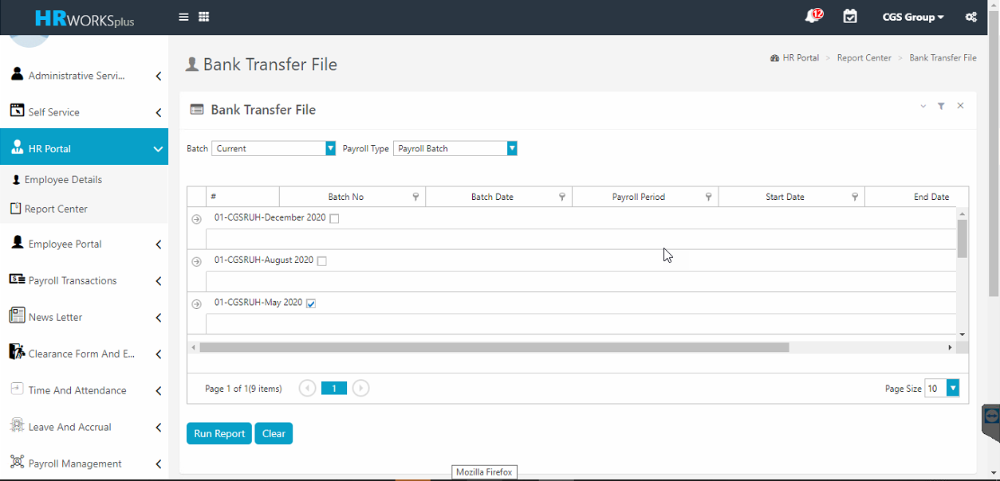
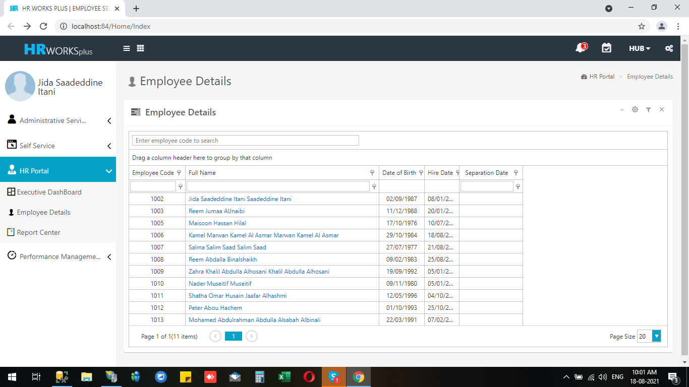
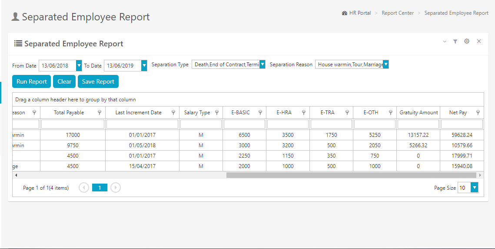
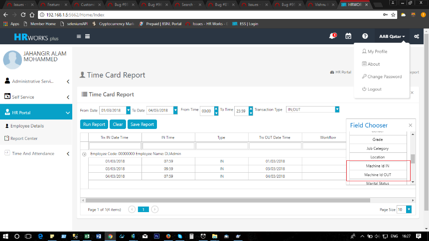
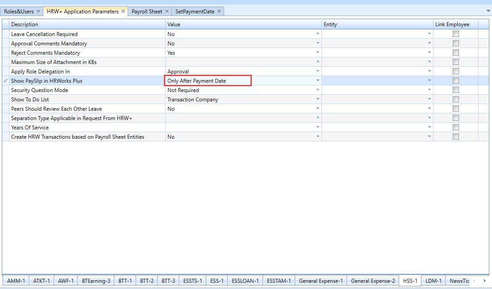
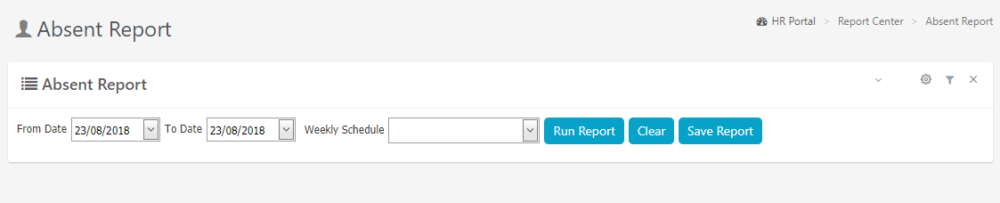
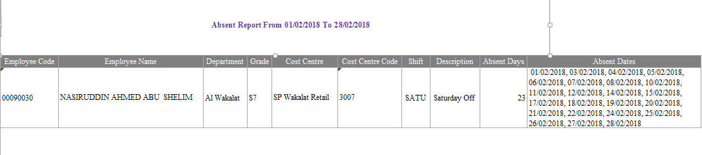

# HR Portal

## Bank Transfer File in HRW Plus

### Jan 2021 -  # 6505

A new screen 'Bank Transfer File' was developed in web application.

For implementing the new report, execute an sql for inserting and enabling the menu.



## Development of Employee master in Web Applications

### July 2021 -  # 21938

Developed new screen for Employee master in Web Applications



## Separated Employee Report in HRW+

### May 2019-   #13927

A new report for showcasing the details of the separated employees are created in ESS.

Execute a query for enabling the report.



*Fig: Separated Employee Report*

## Export option in pay-slip

### Jan 2019## 13470

Users were not able to export pay slips from ESS. As per client's requirement export option has been brought in for pay slips in ESS. Now the users can export the pay slip into PDF and/ or excel file formats.

## Reports to be added in ESS

### July 2018 (#7951)

Added the following reports into ESS.

-   Employee Master Report

-   Document Expiry

-   Salary Audit

-   Salary Register

-   Salary Increment

-   Loan Enquiry Report

-   Final Settlement

-   Leave Report

-   Leave Balance Report

-   Salary Transfer Details Report

## Need more fields in  Field Chooser of HR works Plus

### July 2018 (#9400)

Earlier Time IN and Time OUT fields were not shown in the Field chooser, now this functionality is implemented in  Time Card Report  Screen.



## Option to show pay slip in HRW+

### July 2018 (#11057)

Earlier only approved batches were able to view or generate payslip. Now even unapproved batches can be viewed in ESS with the help of a new parameter in HRW+ Application Parameters ** Show Payslip in HR Works Plus ** (HSS-1) with options, **None/Always/Only for Approved Batches/Only after Payment Date**. Display of Payslip is controlled based on this Parameter, However, default option will be  Only for Approved Batches . This parameter will be hidden by default.



## Absent Report

### July 2018 (#9272)

A new report called as Absent report is integrated in the TAM Reports category of ESS.





## Need Day name column in HR works plus Consolidate report

### July 2018 (#10305)

The Day Name column can be introduced into the consolidated report by using template in the following manner.

``` xml
<FIELD NAME= DayName SHOWDEFAULT=  />
```

## Logo option for TAM reports

### July 2018 (#9406)

Logo option is implemented in all HR Worksand HR Works Plus reports.