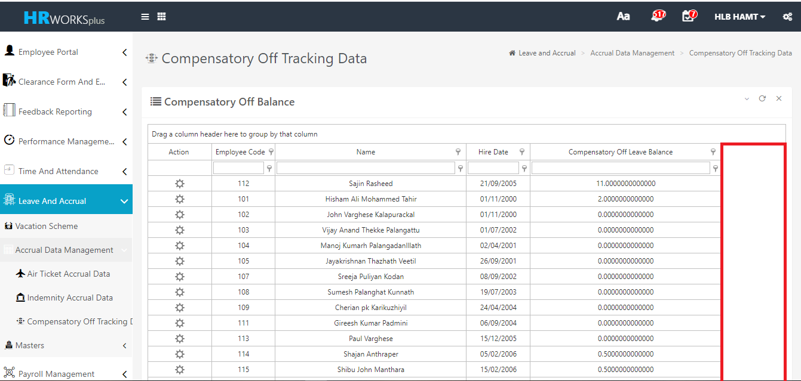
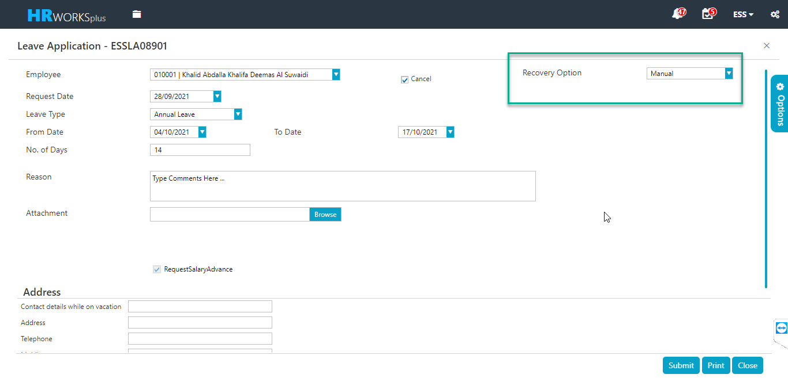
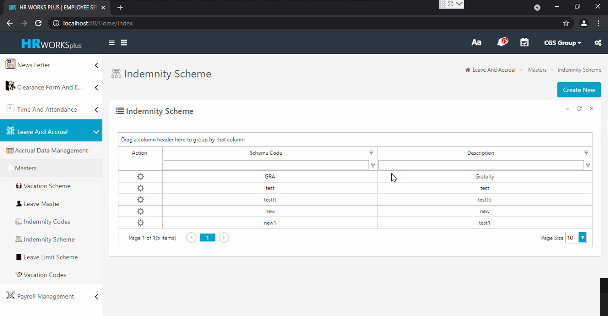
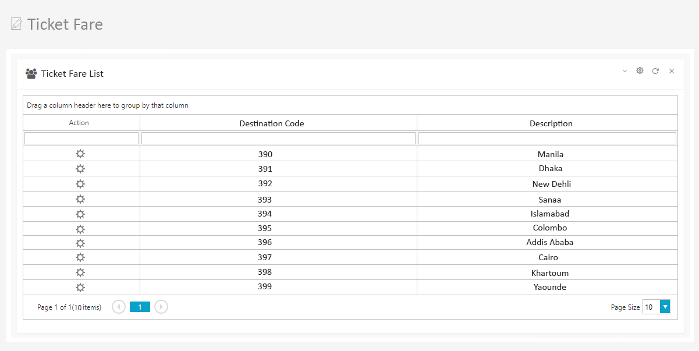
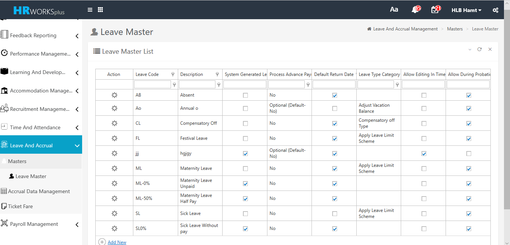

# Leave and Accrual

## Compensatory Off Tracking Data in web

### Nov 2021- #22625

Developed Compensatory Off Tracking Data in web application

To enable the feature, execute a script.

## Recovery Option during Annual Leave cancellation

### Oct 2021- #23218

The client requires a solution in HRW plus for HR to define the recovery
option during Leave cancellation where the leave settlement for the
leave has already been approved.

In order to implement the change, execute a script to enable new
Parameter 'Amend Recovery Option for LS On Leave Cancellation'

## Indemnity Scheme in the web applications

### April 2021 -  # 21444

A new screen "Indemnity scheme" was developed in web application.

In order to implement the new feature, execute the query to enable the menu.

## Ticket fare in the web application

### Jan 2021 -  # 21204

Developed new screen ticket fare in the web application that helps to set destination, fare and age.

In order to implement the new screen, execute a query to enable the menu.

## Leave master in the web application

### Jan 2021 -  # 21202

A new screen 'Leave Master' was developed in web application for creating different types of leaves.

In order to implement the change, execute a query to insert the menu.

