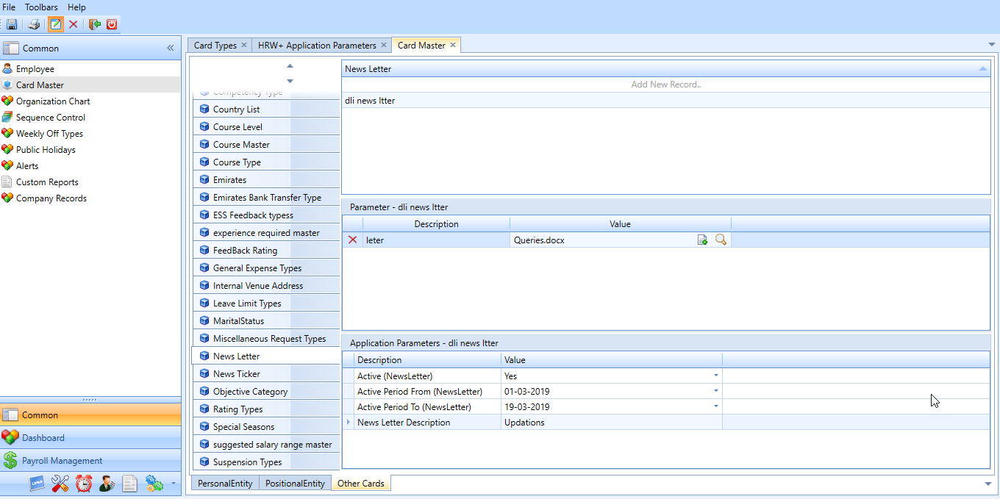

# Newsletter

## Attachment option in Newsletter

### March-2019 -  # 14582

Currently in Newsletter there was no option to attach any files. Thus, the client required to customise the newsletter to add the attachment.

For this,

1.  In the Newsletter Entity, add a new parameter with data type as File in Card Types.

2.  The attachment for the corresponding Newsletter could be attached in the Card Master screen which will be visible in the Newsletter Screen in ESS.

*Fig: Settings in the Card Master*