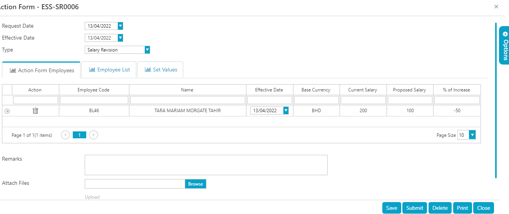
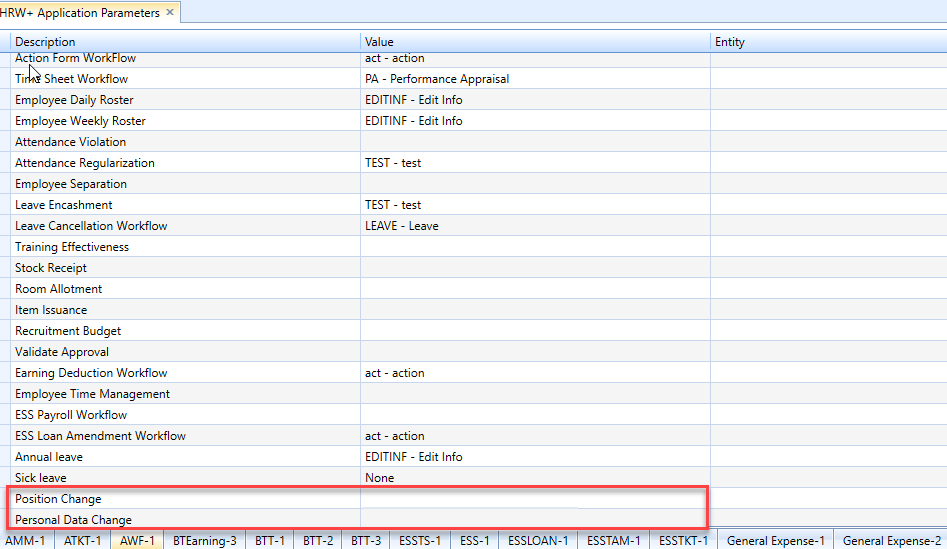
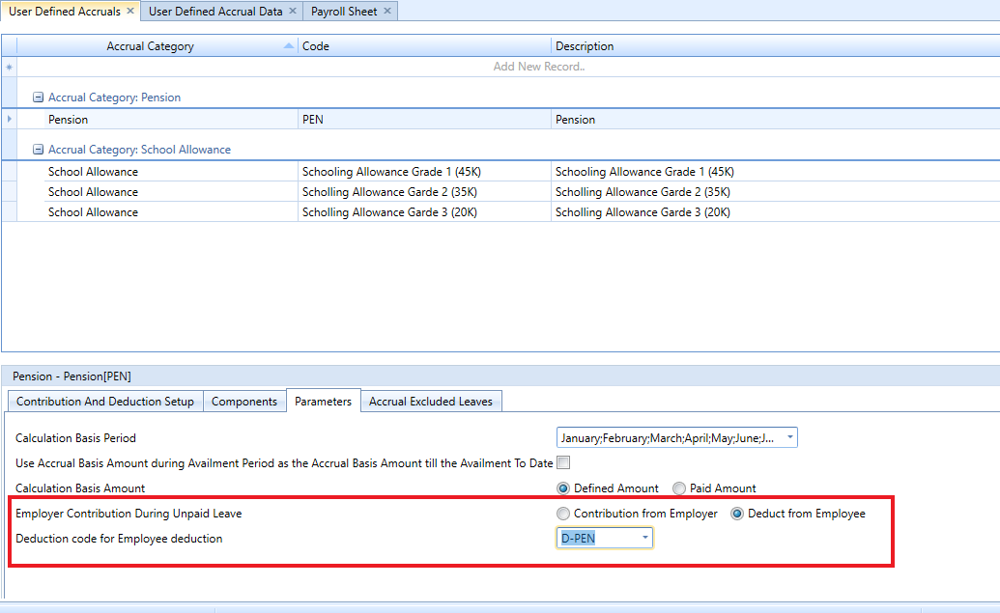
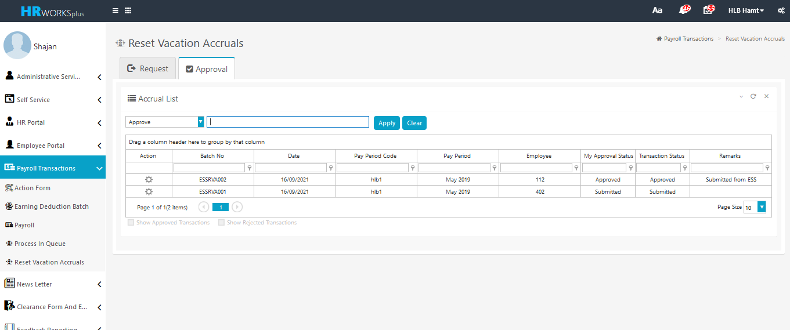
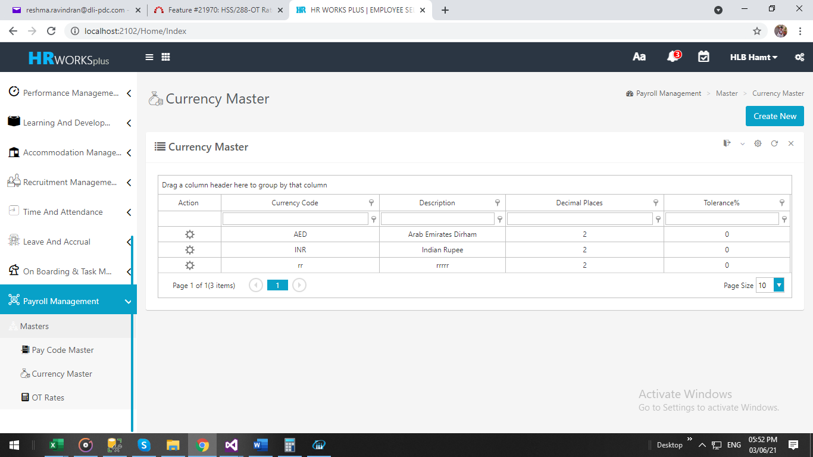
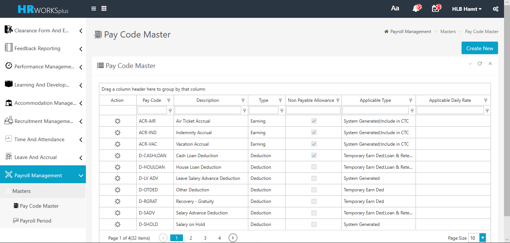

# Payroll Management

## Salary Increment report from PAF

### Mar 2022- # 24604

The client required to generate the salary increment report form payroll action form. 
the client required to print the report, When the salary revision is updated from PAF and is in saved status.

To implement the feature, execute a script.

## Different workflow settings for Payroll action form types

### Jan 2022- # 23182

The client required a provision to apply different workflow settings for
payroll action form types in HRWorksPlus.

In order to implement the feature, follow the steps below:

1.  Execute a query to find **PAFTypeID** for Different Action form
    types.

2.  Execute the script as given below for required action form types

## Default Loan Disbursal method to be defined at Loan master

### Jan 2022- # 23725

The client requires an option to link the default loan disbursal method
at loan master level. If the default loan disbursal is outside the
payroll then Payment code must not be required to submit the loan
application.

## Pension employee contribution during unpaid leaves

### Nov 2021- # 23367

As per the pension law, if an employee takes unpaid leave, Employer
contribution will be deducted prorated wise from employee salary.

For example, if an employee is on unpaid leave for 10 days, the employee
has to pay his 5 % of his share and 15% of employer share for 10 unpaid
leave. Employer contribution will be 15% of remaining 20 days.

In order to implement the change, execute a script to activate new
fields

## PDF encrypted format Payslip 

### Nov 2021- #23480

The client requested to Enable an encrypted format payslip view and
download PDF only (employee should not be able to edit the payslip).

In order to implement the feature, execute a query to enable PDF format
only.

## Vacation accrual reset in web application

### Nov 2021- #23103

Developed vacation accrual reset in web application.

To implement the feature follow the steps below:

1. Execute the script to enable the screen

2. Execute the script to enable workflow

3. Execute a script to enable sequence control.

## Currency Master in Web Application

### April 2021 -  # 21199

A new screen "Currency Master" was developed in web application.

In order to implement the new feature, execute an SQL to enable the menu.

## Paycode Master in the web application

### Jan 2021 -  # 21201

A new screen 'Paycode Master' was developed in web application for creating different types of paycodes.

In order to implement the change, following steps were executed:

-   Execute a query to insert the menu.

-   Execute three queries to enable the module 'Pay Code Master' in ESS.

