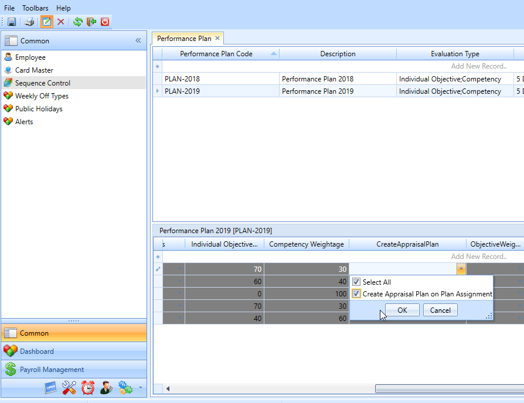

# PMM Module

## Provision of  Request page in Interim Review & Performance Appraisal for Line Manager from Cross Company

### Dec 2019 -  # 18128

The client required to develop a provision in PMM system to have  Request page for

1. Interim Review, and
2. Performance Appraisal into all the company. The rights to these request page will be governed by  Roles & Users >> Program Access Right.

 

##  Review Comment in Interim Review >> Competency Section, should not be a mandatory

### Dec 2019 -  # 17924

The client required to remove  Review Comment mandatory option from Interim Review Page (only in Competency side).

## Development of Interim Review Report option

### Nov 2019 -  # 13974

As per the client requirement, a new report option was developed in PMM with the name  Interim Review Report". This report will showcase and present the data of various Interim Review Transaction against the Appraisal Plan.

To implement the change, execute a query to enable the menu.

## Auto creation of Appraisal Plan on Plan Assignment

### Nov 2019 -  # 17303

The client required an option to create Appraisal Plan automatically on Plan Assignment for all the  Assigned  employees.

This automatically created Appraisal Plan:

-   Should populate the default Objectives / Competencies (along with their weightages) applicable for the employee.

-   Should be in Saved mode and should be possible to further edit the same before Submitting.

-   Further, the editing of the automatically created Appraisal Plan should be possible only from the  Proxy  tab.

## Equal Weightage  for Competencies

### November 2019  #17311

The client has equal weightage for all competencies, and will not assign individual weightage for each competency separately.

As per the new requested change, it needs to have an option for  Equal Weightage for Competencies . In this option, the Weightage field associated with each competency will be  fully hidden  in the system, and the score calculation during Performance Appraisal can be modified in  Equal Weightage  method.

For implementing the above changes, a query needs to be executed in the database. After that in, set Competency Weightage in **HR Works >> Appraisal Plan** to ***Equal Distribution Between all Compentency (Hidden)\-\-- See the table below for*** settings in Appraisal plan:

<table class="TFtable" border="1">
    <tbody>
   <tr>
     <th>
         
Objective Master

      </th>
      <th>
         
Default Button - Obj

      </th>
      <th>
         
Default Button - Core

      </th>
      <th>
         
Create Appraisal Plan on Plan Assignment

      </th>
      <th>
         
Objective Weightage in Appraisal Plan

      </th>
      <th>
         
Amendment of Default Objective

      </th>
      <th>
         
Competency Weightage in Appraisal Plan

      </th>
      <th>
         
Amendment of Default Competency

      </th>
   </tr>
   <tr>
      <td>
         
Yes

      </td>
      <td>
         
No

      </td>
      <td>
         
No

      </td>
      <td>
         
Yes

      </td>
      <td>
         
Default from Objective Assignment

      </td>
      <td>
         
Add/Edit/Delete

      </td>
      <td>
         
 Equal Distribution between all Competency (Hidden)

      </td>
      <td>
         
Add/Edit/Delete

      </td>
   </tr>
   </tbody>
</table>

## Auto creation of Appraisal Plan on Plan Assignment

### November 2019  #17303

As per the changes required by the client, an option is required to create Appraisal Plan automatically on Plan Assignment for all the  Assigned  employees.

This automatically created Appraisal Plan should have the following feature/ functionality:

-   It should populate the default Objectives / Competencies (along with their weightages) applicable for the employee.

-   It should be in Saved status and has to be editable before Submitting

-   For the client, the editing of Appraisal Plan shall be done by HR as a Proxy user, and not by the employee. Therefore, the editing of the automatically created Appraisal Plan should be possible only from the  Proxy  tab.

To implement the above changes, a query needs to be run in the database. And the following settings has to be made in HRW >> Appraisal Plan

Set the **Create Appraisal Plan** field value to ***Create Appraisal Plan on Plan Assignment***.

## Replicate the enhanced features of  Interim Review &  Employee Review to  Performance Appraisal 

### November 2019  #16691

The client needs the following changes in Performance appraisal.

1.  When a performance appraisal is submitted by the main appraiser, all objectives and competencies will be in Agree status.

2.  If the employee wants to agree with the appraisal, he/ she must provide comments in the employee can then add his/ her comments in the Comments box and then click the Agree button. The agreed records will be sent for approval and all objectives and competencies will be changed to Agree status.

3.  If the employee wants to disagree, the employee must disagree with either objectives or competencies or both.

- To enable the above functionality, ***Performance Appraisal*** has to be selected as the value of the **Employee reviewon** parameter (**HRW+ Application Parameter >> PMM-01**).

##  Employee Record Snapshot in Interim Review - Approval page

### November 2019  #17275

The following changes have been made in the **Interim review**.

Before implementing the changes, when an employee agrees with the interim review of the reviewer, the respective record can be seen only by the first approver as per the workflow. The next level of approver can view the record only after the preceding approver approves it. Now when an employee agrees, the respective record is made visible to all levels of approvers in the Employee Record Snapshot menu.

The details will be shown in the following respective tabs in the Employee Record Snapshot once the approver/s select the corresponding employee.

1.  Employee profile

2.  Interim review

3.  Employee review
