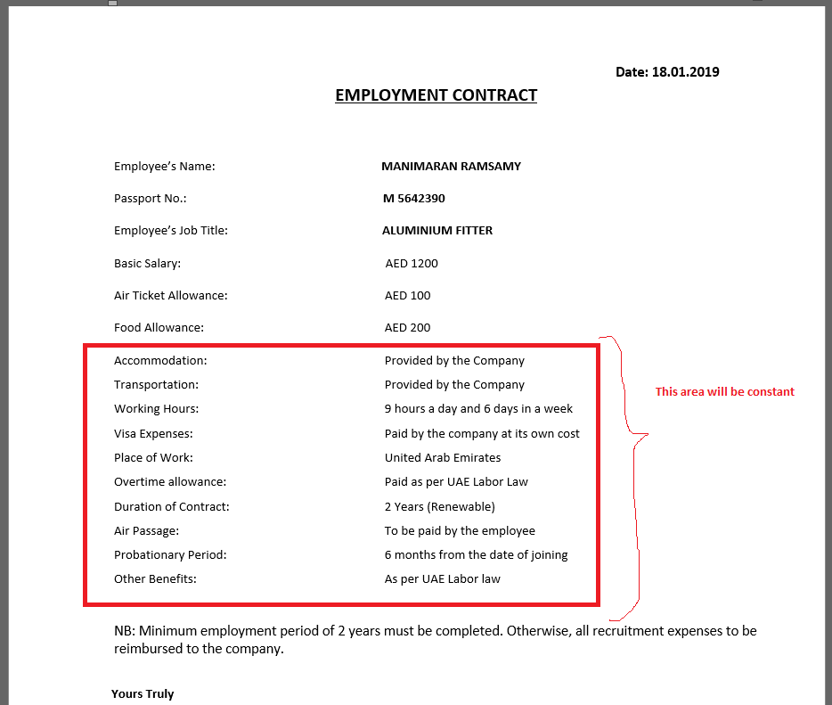
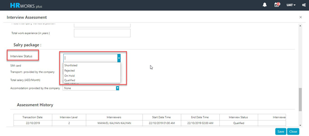

# RMM Module

Recruitment Management System includes following sub modules:

-   **Recruitment Budget Period** will be created in the HR Works in which users can create different Recruitment Budget periods, which defines the periods for which Recruitment Budgeting for recruitment are performed. The time period for Recruitment Budgeting can be specified using the fields "Start Date" and "End Date".

-   **Recruitment Budget** functionality facilitates the process of allocating Budget for various designations as a part of Recruitment in a company. Budget needs to be prepared before the commencement of a Budget Period.

-   A **Job Description** template is a master which carries various designation related information. For Example, "Job Description Template" will contain -- (a) Job Description (b) Suggested Salary (3) Qualification Required (4) Experience required, etc. In addition, it can be created for specific Location, Department etc.

-   **Manpower Requisition** enables a department to create a new vacancy request against the budget created.

-   **Publish Vacancy** is a transaction for converting approved vacancy requests into advertisement.

-   All activated vacancies from Publish Vacancy will be populated in the **Current Opening** section.

The System Process Flow of Recruitment Management System is given below:

## Enhancement in Offer Letter print for Bosco RMM

### Dec 2019 -  # 17762

The client required the below changes in the RMM module.

-   Currently in the increment section, even if there is no increment, this line is still getting displayed in Staff offer letter which should be avoided.

-   Currently in Labor offer letter all the points are required to type manually. But the fields such as candidate name, passport no, designation and salary are only variable and all other points remain same for all labours, hence, this information is required to display automatically.

-   One-line space is compulsory after the point, 'Other Benefits'.

## RMM-BOSCO/30: Recruitment Manager should also be able to update standard UDF meant for Non-Recruitment Manager

### Nov 2019 -  # 17599

A new feature was added in interview assessment screen as per the client requirement.

 In interview assessment, all the standard User defined field viz -  Interviewer Comments  (or whatever been created for Non - Recruitment User) should be available to be updated by the Recruitment Manager also.

Additionally, this comment will appear in the table structure of Print of Interview assessment as per the sequence.

Further, please note if there are more than one Recruitment Manager, the entries done by the first recruitment manager in Recruitment manager related UDF should be able to seen and updated by the next Recruitment Manager as so forth.

Also, only the last updated entries in Recruitment Manager UDF should overwrite all the previously entered entries in Recruitment Manager UDF by the Recruitment Manager. 

HR Interviewer also will have Interview Status option,  Qualified . If the HR interviewer puts Qualified status, the candidate will remain in Assessment form for further assessment and it will not go to Candidate selection until shortlisted by another HR Interviewer.

To implement the changes, follow the steps below.

1. Execute a query to enable a new status named qualified.

## Multiselect option in RMM Fields in Job Description, Manpower Requisition & Auto Filtering

### November 2019 #17078

The client needs the following changes:

1.  Option to select multiple values for the Preferred Nationality, Preferred Language Spoken, and the Qualification Required fields in the Job Description and Manpower Requisition screen.

2.  Auto Filter option in the Sampling screen.

To implement these changes, an XML query is executed.

## Upload facility is required in Job Description

### November 2019  #17081

The client wants an option to upload Job Description Master in bulk through excel. This is implemented by running an SQL query.

For this a template is created and users can download the excel template, fill in the fields of the excel template with corresponding data, and then upload onto the Job description master in ESS.

## Designation, Division & Department dependency in Manpower Requisition vis-a-vis Job Description

### November 2019  #17278

The client wanted the following changes in Manpower Requisition and Job Description.

1.  The *Designation*, *Division*, *Department* and *Location* fields have to be made mandatory in the **Manpower requisition**.

2.  Although all those four fields are mandatory in Manpower requisition, In Job Description only designation will be mandatory.

**For Example**: If Sales Manager with Division = Glass is available in Job Description. And, in manpower, if any user selects (**Designation** = *Sales Manager*, **Division** = *Aluminium*), then the **Job Description** with combination of Sales Manager & Glass will be picked up.

However, if Combination of Sales Manager & Division = Glass is available, the same will be picked up in Manpower Requisition.

## Development of Cross Vacancy Functionality

### Oct 2019 -  # 16000

The client required a "Cross Vacancy" transaction in RMM Module which allow Recruitment Manager / User to apply a candidate against a vacancy different from what he initially applied for.

To implement the change, execute a query.

## Design Issue with  Candidate Selection 

### Oct 2019 -  # 16139

The client required to resolve the design issue in the "Candidate Selection" screen regarding the applying analytics and regenerating/ reprinting offer letter.

### Development of  Bulk Upload functionality

### Oct 2019 -  # 16131

The client required the Bulk Upload functionality which allows to upload the candidate profile and their resume in Bulk. The candidate so uploaded could be uploaded to Sampling screen or Candidate Selection screens.

To implement the change, follow the steps below:

1.  Execute a query to enable bulk upload menu.

2.  Execute a query to create sequence number.

## Access restriction based on the usability of UDF

### Oct 2019 -  # 17158

The actual number of level of interview is decided on the run basis, for example once a candidate is through from one round of Interview, only then HR will decided if another round of interview is required , if yes - with whom. Hence, while addressing the number of the interview level, the client required the RMM system to allow the Interviewer to enter comments only in the field dedicated ( marked) for the respective person. (Viz Interviewer 1 Comments, Interviewer 2 Comments, Interviewer 3 Comments). Further, no other interviewer should be able to edit the comments of other interviewer.

Currently, in the Interview assessment section, Interviewer 1 is able to fill the comment section of Interviewer 2, & this should be restricted.  

In order to implement the change, the unwanted user defined fields (ex: interviewer 1,2,3 comments) was removed and just one field named  Interviewer Comments  was kept.

## Access right for action in Interview Assessment

### Oct 2019 -  # 17083

In interview assessment form , the client required an option to give access ( usage) right of  Shortlist action only to certain user (such as Manager, Recruitment manager who will be sitting at the last level of Interview process) in RMM >>  Interview Assessment form. Further, the client required to deactivate  On Hold action from Interview Assessment.

