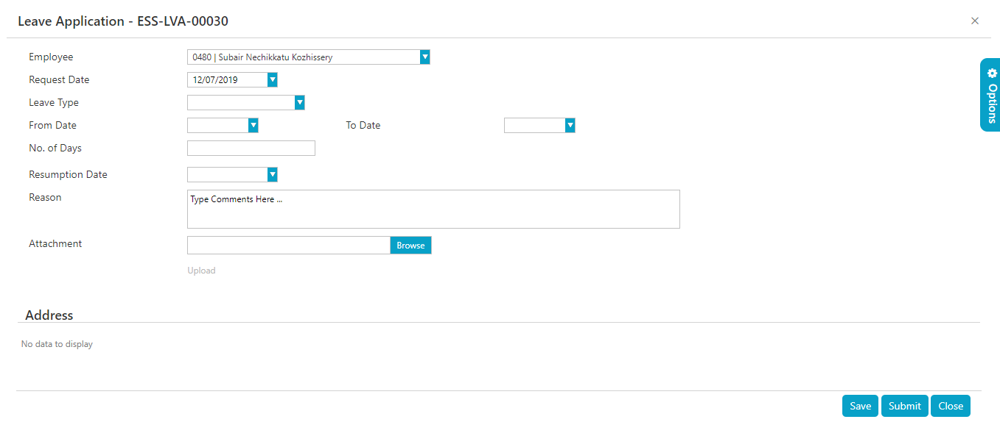

# Self Service

## Option for HR to update hidden or view fields in personal records

### Mar 2022 - # 22744

Currently, certain fields in employee personal records are hidden or will have only view rights for employee (setup at Card type).
HR will require a provision to update or enter these fields.
For example, in Dependent details "Air ticket eligibility" and "schooling eligibility" field will not be allowed by employee or proxy (supervisor) to update where as HR will require these fields to be updated.
A provision for the same is provided in the software.

In order to implement the change, execute a script.

## Auto Approval for benefit claim

### Mar 2022 - # 24467

The client required an option for Auto Approval of UDA availment in HRW for the benefit claim requests.

In order to implement the change, execute a script to enable new parameter "Enable Auto Approve(Benefit Claim). 

## Compensatory Off Entitlement in web  

### Feb 2022 - # 22624

Developed Compensatory Off Entitlement function in web application

To implement the feature, follow the steps below:

1. Execute a script to enable the feature
2. Execute a script to enable the auto approval parameter in company parameters

## Auto Approval Option in BTT and Benifit Claim

### Jan 2022- # 23499

The client required an option to Auto approve the BTT and Benefits
Claim. Once fully approved by the Final approver, the transaction needs
to be auto-approved and available for the Off-cycle payroll process.

In order to implement the feature, follow the steps below:

1.  Execute the scrip to enable the parameter 'Enable Auto Approve
    (Business Travel)\'.

2.  Execute the scrip to enable the parameter 'Enable Auto Approve
    (Benefit Claim)'.

## Air ticket availment to show travel details

### Dec 2021- #23691

Currently, if an employee makes an air ticket request where the claim
type is "Company air ticket" the approvers are not able to see the
Travel dates and destination in the approval screen. The client required
to add the travel dates and destination in the approval screen.

In order to implement the change, execute a script that shows the travel
date (From Date and To Date) and Destination columns in the form grid.

## Action Form for Probation details in the web application

### Oct 2021- #22725

The client required some changes in the Probation action form as it is
not showing any fields to make changes in HRW Web.

## Probation Alert with attachment

### Oct 2021- #22618

The client required probation alert to be generated 30 days prior to 3
months (Interim Review) and 30 days prior to 6 months (Probation
evaluation). Along with the notification respective forms also needs to
be send to the Line Manager and HR. Employee's basic details in the form
need to be filled before sending.

In order to implement the feature, follow the steps below:

1. Execute the script after providing the IDs of Department,
Designation, Line Manager and HOD which are required in the form.

2. Use the REPXs to create custom reports.

3. Execute the script to select Probation Report for Custom Report
Designer

4. Execute the script to enable Probation Alert Based on Hire Date in
Alert Type selection

## Changes required in the WTB Time Sheet Report of HR Works Plus

### Jan 2021 -  # 20689

Currently, the WTB time sheet report can be generated as per the Payroll Period. Now, the client required to generate the WTB timesheet report according to the timesheet interface period.

In order to implement the change, execute two queries to view multiple projects and to sort order the uploading timesheet.

## Allowance Request

### Jan 2021 -  # 14743

In the Allowance request screen, the client required some additional features which are mentioned below:

The client required to display different allowance types such as Car allowance, Education Allowance, Mobile allowance and other allowance.

**Education allowance** is eligible only for the manager and department heads.

In **Education allowance**, an option to mention student name, Age of Student, Year, School name and fees is required.

Provisions to attach two documents which are admission copy and fee receipt are required in **Educational allowance**.

Maximum two kids must only be eligible for **Educational Allowance**.

When the employee is terminated or resign from the job, the educational allowance will be deducted from the final settlement amount.

The employee could request for the educational allowance only after completing the probation period.

Education allowance could be requested once in six months only.

In order to implement the changes, following steps were executed:

-   Create a user defined parameter and corresponding fields in User Defined tab of Card Types.

-   Set value of parameter "Entity ID(UDA Details)" in UDA-1 tab of Application parameter to the created user defined parameter.

## Option to show Disclaimer in Leave Application Screen

### Feb 2020 -  # 18417

The client needs to show the company Leave Application policies in leave application screen.

Execute an xml file to execute the change.

## Business Travel Expense Claim

### Jan 2020 -  # 14728

The client required the provision for employees to request for business expense claim separately from the Business Travel Expense Claim screen after the business trip. Hence, there should be a link between business travel plan and business travel expense claim requests. The employee must be able to request for business travel expense claim based on the approved business travel plan and must be able to edit the travel information with actual data from the expense claim screen if required.

In order to implement the change, execute a query to enable the parameters.

## Business Travel Plan

### Jan 2020 -  # 14727

The client required an option to request for business travel plan before the employee goes for Business Trip and get it approved for travel.

In order to implement the change, the execute the query to provide a message to all approval levels.

## Loan Application Request/Approval Changes

### Jan 2020 -  # 14740

The client required some features in the Loan Application Request/Approval screen which are pinpointed below.

-   Loan request /Approval screens must display basic salary, gratuity amount, Hire date and last year performance.

- (Last year performance is a score entered in employee's personal records.
>
- The gratuity amount will be actual payable as per Resignation policy)

-   For all outstanding loans, the system should pop up/show a message in both request and approval screens.

-   Loan repayment amount should not exceed more than MOL maximum Salary deduction. If exceeded it should show as a message in the screen.

-   HRA advance request also needs to apply through loan application.

-   Number of instalments for HRA advance should be either 6 or 12. It can be linked to employee via parameter. By default, the option should be 6.

-   HRA advance request must be possible only after 5 months of loan repayment.

-   Option must be provided for approvers to edit loan amount and repayment schedule.

In order to implement the change, follow the steps below.

1.  Execute a query to enable the application parameter 'Show loan details'.

2.  Execute an SP for enabling the request HRA advance through loan application.

## Changes to be made in General Expense screen

### Dec 2019 -  # 15767

Initially in general expense screen there were different buttons for each tab. Now, as per the requirement, the single button is redesigned to multi button.

## Option for attachment for Approver in L&C

### Dec 2019 -  # 17603

The client required an option to attach a file while approving the request in L&C module.

To implement the change, execute a query to enable the application parameter settings.

## Loan Limit and Instalment limit Validation

### November 2019  #17191

The client needs the following policy to be applied in Loan application. This change is particular to HRA Advance.

1.  Employees can apply for HRA Advance only in their first year of service.

2.  Employees are eligible to get HRA Advance for the number of months that succeed the month of application.

3.  The system will show validate these conditions and will show validation message in the loan application form where applicable.

- **Example scenario**: If an employee applies for loan in first month then employee is eligible for 12 months of HRA Advance as loan amount and no of instalment will be 12, if employee applies in 2nd month then eligible for 11 months of HRA Advance as loan amount and no of instalment will be 11 and so on.
>
- In order to implement this, an SP needs to be run in the HRW database.

## Future Leave Cancellation option to be available in ESS

### November 2019  #17400

In HRW leave cancellation period can be set to **Future Days only**. When going to Leave cancellation in HRW only future leave are seen but in HRW plus back-dated leave are also available for cancellation. The client wants the **Future Days only** option in **HR Works Plus** as well.

In order to add this option, execute a query in the database.

Once the above script is executed the **Future date only** option appears in the **HRW Application Parameter >> Allowed Leave Cancellation Period** selection dropdown.

## Salary Transfer Validation with Loan Application

### Oct 2019 -  # 14211

If an employee has got Salary Transfer letter active then employee should not be allowed to apply Loan through ESS. Once the company gets the clearance letter employee shall be eligible for applying for loan. The validation must be based on loan types.

To implement the change, execute an SP.

## Approver should have Option to upload document in Airticket

### Oct 2019 -  # 16275

The client required an option to the approver to upload the document in ticket request screen from ESS.

To implement the change, execute a query to enable the application parameter.

## Option to exclude business leave type from leave application

### Sep 2019 -  # 16288

Currently, the client was applying for the business leave in ESS while entering the business claim. And the default leave type is configuring in the application parameter. Now the client required an option to deactivate the business leave type from the leave application.

Execute the query to implement the changes.

## Business Travel Plan

### Aug 2019 -  # 14584

A new feature was added in the business travel plan request and approval.

-   The Business travel plan request was integrated as paid leave days in payroll

-   In business travel plan request, an option to select the type of travel was introduced.

-   Provision to add multiple plans was included in the request screen.

-   Each plan should have options to enter the following details

    1.  Purpose of Travel -mandatory
    2.  From Place & To Place -mandatory
    3.  From date & To date with time -mandatory
    4.  Vehicle Type
    5.  Comments and attachment

For implementing this change, follow the steps below:

1.  Execute a query to enable the business travel plan menu

2.  Execute a query to activate Amount Handling Param In BT

3.  Execute a query to activate Amount Handling Param Values In BT.

4.  Execute a sql to work flow and sequence creation.

5.  A new parameter added in HRW + Application Parameters,  Amount Handling In Business Travel Plan  (BTT-1, 100) with options Hide Amount/ Show Amount/ Allow Advance Request

## Business Travel Claim

### Aug 2019 -  # 14614

As per the client requirement some changes are made in the business travel expense screen.

The changes are listed below.

1. There must be an approved business travel plan for each business travel claim request.

2. A provision to select the business travel plan from the claim request screen.

3. While selecting the business travel plan, all the details entered in the plan must be filled with the claim request screen fields

4. Provision to edit these fields.

5. Provision to user to enter the actual amount of expenses.

6. The policy amount as per the grade of the employee is shown in the screen and option to enter the actual amount against each type with attachment option is provided. (not necessary for the request screen, but mandatory for approval screens)

7. The approver can view the policy amount and the actual amount.

8. The approver can edit the actual amount against each type.

9. The amount in the actual amount columns are required to paid to the employee after final approval.

For implementing this change, execute a query which enables the settings required for the changes.

## Maternity /Sick Leave Limit Scheme -- Calendar

### Aug 2019 -  # 14706

A following customisation was introduced in the annual limit checking period of sick leave and maternity leave.

-   Annual limit checking period of sick leave must be started from the first sick leave start date to one year.

-   Annual limit checking period should of maternity leave must be started from the first maternity leave start date to one year

-   It is required to keep the sick leave and maternity leave of each employee separately.

To implement this change, execute a script to list  Based on First Leave Date Every Year  option in Annual Limit Checking period dropdown in Leave Limit Scheme screen.

## Leave Balance details in approval email

### Aug 2019 -  # 16092

A new column was introduced in the email to show the leave balance of the employee.

For implementing this change, execute a query.

## Option to print the L&C request details

## July 2019-   #15428

The client required to print the Letter and certificate instance form details and the approval details.

For implementing the change, execute a query.

## Show Sub Company Value on Prints

### July 2019-   #9179

In some organisations, different companies are separated by using an entity named Sub Company. In such companies, the client required to show the Sub Company details while printing the Loan, General Expense and Air Ticket.

In order to implement the change, the parameter named  Default Report Header Entity  in RPT-1 of HRW Application Parameters was introduced in the ESS also.

## Next Approver column in Leave Application

### July 2019-   #12979

The client required to add a new column in the Leave Application Widget of Request, Approval and proxy tabs in the leave Application Screen.

## Loan Budget Feature

### July 2019 -  # 14583

A loan budget feature is introduced in the system. The loan budget amount of the organisation is saved in the system. The approvers have the option to view the loan budget amount and total outstanding loan amount of the company. While approving a loan request, approvers must check whether the existing loan budget of the company is enough to meet the loan amount. Thus, approver can determine whether to approve the request or to keep pending the request.

For implementing this change, follow the below steps:

1.  Execute a query to enable the Application Parameter. New parameters are introduced in the LOAN-1 Tab of Application Parameter which are 'Individual Loan Wise Limit' and 'Loan Budget Exceeding Validation'.

2.  Execute a SP for implementing the validation feature.

3.  Execute a query for enabling the parameter All Loan/Requested loan.

4.  Execute SP for showing the company budget details.

     

## Set Ceiling amount for General Expense request screen

### July 2019 -  # 15148

The organisations will have several types of general expenses and each expense will have ceiling amount. The HR admin have the provision to set the ceiling amount for each general expense. The client required to show validation when the expense exceeds the ceiling amount.

For implementing this change, a new parameter named 'Ceiling amount for General Expense' was introduced in the 'General Expense-2' tab in HRW + Application parameters.

Execute a query to enable the parameter.

## Option to edit the Ticket Cost

### June 2019- #  15050

For the client, employees are availing the ticket as Company ticket. By default, the amount specified in the destination slab will be considered as the ticket cost. Unlike from HRWorks, there is no option to edit the amount and provide the actual ticket cost in ESS.

The following changes have been made by running a query in the DB in order to make the ticket amount visible and/or editable for either the requestor or for the approver or for both.

1.  A new Parameter '**Amend Air Ticket Availment**' is added onto the HSS-1 tab of the **HRW+ Application Parameters**. Users can select the following options as required:

    1.  Not Required

    2.  All Approvers

    3.  Final Approver

    4.  Air ticket amount should not be visible for Requester and for the Approvers who do not have Amend right.

## Option to print L&C before the final approval

### June 2019- #  15233

The client needs to enable print option for Letters and certificates, even if the request is not fully approved. To enable this change a script needs to be run in the HR Works DB and then from the **HSS RPT** tab of the **HRW+ Application Parameters** screen print option needs to be enabled.

## Ticket Print Detail **June 2019- #  15267**

The client required to show the travel details such as From Date, To Date and destination details in the ticket request while printing from ESS.

For implementing this, execute a script.

*Fig: Print of Air Ticket Request with travel details*

## Option to escalate the request approval pending for time period

### June 2019 -  # 14371

Currently there is no option to escalate the pending approvals in HR Works or ESS. Hence a new feature to escalate the pending approvals is requested by the client. Now, in ESS, if an employee application request remains pending for approval for a long time, the employee can escalate the issue to the next approver.

For implementing this change, a new column is added in the 'Approval Workflow Settings' Screen named "Escalation Type".

Execute a query for enabling the column.

*Fig: 'Escalation Type' column in Approval Workflow Settings*

## ESS Leave Approval Change from/to/Resumption Date by HR

### June 2019 -  # 14486

The client required to edit From / To/ Resumption date of the employee's leave request by the supervisor dept head, HR officer and manager. Moreover, if the Resumption Date exceeds than the To Date, the leave days till the Resumption Date are considered as LOP. After the Resumption Date. Leave days are considered as Delayed Vacation.

For implementing this feature, a new parameter named 'Leave Type Between Leave To Date and Resumption Date' is introduced in the LV-1 tab of the Application Parameter.

Similarly, a new parameter named 'Amend Leave Application' is introduced in the HRW+ Application Parameters in which you can set who all can edit the leave application.

Execute a query for enabling the parameters.

*Figure: Leave Application screen with Resumption Date field*

## Employee Basic Info in All screen

### March-2019 -  # 14082

The client required to view the basic information of the employees such as division, department and designation in the leave application.

For this, a new tab named 'Profile' was generated in the Options next to the Workflow and Transaction history. Execute the query for activating this Profile tab.

*Fig: Leave application displaying employee details*

## Leave Encashment

### April -2019 -  # 14488

It was not able to edit the details regarding the leave encashment of the employees. The client required to edit the number of days and to approve the leave encashment through the off-cycle payroll.

1.  For this, two new parameters were added in the HSS 1 tab of the HRW + Application Parameter named 'Amend Leave Encashment' and 'Default Settlement method for Vacation Encashment'.

2.  The options included in the 'Amend Leave Encashment' are Not Required, All Approvers and Final Approver and the options included in 'Default Settlement method for Vacation Encashment' are Off-cycle payroll and Payroll sheet.

3.  Run the query for enabling these parameters.

    

    *Fig: HRW + Application parameter Settings for Leave Encashment through Off-Cycle payroll*

## Need to show the employee details in MISC request Print

### March-2019 -  # 14105

The client required to view the employee details while printing the MISC request.

1.  Execute the four views for displaying the details such as division, location, department and designation.

2.  Also, execute a query for getting the report ID.

    

    *Fig: MISC print showing employee details*

## Block Loan Application during Probation

### March-2019 -  # 14210

Initially, it was able to apply for loan for all the employees including the employees in probation. However, the client needs to block the loan application for the employees in probation.

For this, a new parameter named, 'Block Loan During Probation' was added in the LOAN-1 Tab of Application Parameter which is linked at loan level. When this parameter value is set as Yes, a validation message will appear while applying for the loan.

Execute a script for enabling the newly created parameter.

*Fig: New parameter in Application Parameter*

## OFF Day Validation

### Feb-2019-   #13437

In HR Works Plus, there was no any validation with respect to the minimum number of days that is required between two off days while creating Employee Daily Roster. As per the client's requirement, a new option for setting a minimum gap between the OFF days of the employees is introduced.

For this a new Parameter named '**Minimum Days Gap Between Off Days**' is added in the **ESSTAM-1** tab of the **HRW + Application parameters**. Users can enter the required minimum gap between the OFF days as the value of this parameter.

*Figure: Setting 'Minimum Days Gap Between Off Days' in HRW + Application parameters*

### Text in loan request screen

### Jan2019 #13397

As per clients request changes were made to display the following text in the ESS Loan Request page.

"I hereby accept the T&C of this loan"

## Leave Application

## Role delegation through leave for all employees

### Jan 2019 #13605 application

Currently Role delegation option in leave application is appearing for transaction approvers only. The client wants the Role Delegation details to be displayed for concerned employees as well in view only mode in the leave application record.

This is now implemented in the following manner:

A new parameter (Role Delegation Validation in Leave Request) is added to the **HSS-1** tab of the **HRW+ Application Parameter** screen in HRW.

Role Delegation option can be enabled for all employees by setting  Mandatory At 1st Approval  as the value of **Role Delegation Validation in Leave Request** parameter. For all other selections, Role delegation in Leave Request will be displayed only for approvers.

## Leave Application template changes

### Jan 2019 #13492

In the leave application template view in ESS, the client wanted to have some new fields and to remove some other fields.

Two views are executed in the DB to make this change

## Role delegation through leave application

### Dec 2018 #11127

When role delegation request is placed with and through the leave application transaction, the leave request is approved first, then the role delegation request is sent to the delegate for acceptance.

The client needs to have control over the sequence in which the leave and role delegation requests are processed as follows:

When an employee places role delegation request with and through the leave application request:

1.  The delegate should accept role delegation request.

2.  Leave Request should be approved through work flow.

3.  If leave request is rejected by approvers, the role delegation should be cancelled.

To implement these changes, the following are done:

-   A new parameter (**Role Delegation Validation in Leave Request**) is added to the **HSS-1** tab of the **HRW + Application Parameters** screen. Users can set any of the following values for this parameter:

    -   **Not Mandatory**: When this is selected, approvers can approve the leave application transaction regardless of the acceptance or rejection of role delegation request.

    -   **Mandatory At 1st Approval**: When this is selected, it becomes mandatory that the role delegation request be accepted before the first-level approver can approve the leave application. The system displays a validation message whenever the first-level approver tries to approve the leave application if the role delegation is not accepted.

    -   **Mandatory At Final Approval**: When this is selected, all approvers other than the final-level approver can approve the leave application regardless of the status of role delegation request. But it becomes mandatory that the role delegation request be accepted before the final-level approver approves the leave application. The system displays a validation message whenever the final-level approver tries to approve the leave application if the role delegation is not accepted.
        \
        **Note**: In case if the role delegation request is not accepted or rejected by the delegate, the leave application too will be rejected.

## Hide Save option in Leave Application

### Dec 2018 #12963

The client does not require the Save option for leave application transactions in ESS. Users should only be able to submit a leave application for approval after providing the required information.

To get this working, a new check box field (**Allow to save Leave Applications**) is added to the **ESS Leave Parameters** tab in Leave Master. ESS users can save the leave application form only if this check box is selected. Otherwise they won't be able to save the form but can submit the form for approval or cancel it.
\

### Option to print leave application before approval

### # Nov 2018 - #11762

The client wanted to print the leave application record from ESS in a specific template. This allows all approvers to take print out of leave application before final approval.

For this, an REPX file was created and it is then imported into the Custom Report Designer in HR Works. The user can now modify the template as required from the Custom Report Designer menu in HR Works.

### Attachment Option for Approver in Leave application

### # Nov 2018 - #11760

The client wanted to have attachment option on leave application so that approvers can attach files while approving/ rejecting the leave application of employees. For this, a new parameter '**EntityID (User Defined Fields For Leave Approval)**' is added to **HRW+ Application Parameter >> HSS-1** tab. Users can create user defined field group on the Card Types >> User Defined tab where they create and define fields and their data types and then set that user defined field group as the value of **EntityID (User Defined Fields For Leave Approval)** parameter**.** Refer to the screenshots below**:**

The above image shows the user defined fields, which are created on the **Card Types >> User Defined** tab**.** Note that three Attachments fields viz Attachment, Attachment2, and Attachment3 are created with 'File' as their data type.

The above image shows how the user defined field group that was created on the Card Types screen is set as the value of **EntityID (User Defined Fields For Leave Approval)** parameter in **HRW+ Application Parameters >> HSS-1** tab.

Once the above settings are saved, the approvers now will have the above-mentioned user defined fields on the leave application form. See the image below:

### Sick Leave Settlement changes

### # Oct 2018 - #11531

When an employee selects the leave type on the leave request form in ESS, he/ she can view his/ her leave balance and related information as follows:

1.  Clicking on the **View Details** link will show the leave balance and related information in a popup window as follows.

\
**Note**: The **View Details** link appears after the employee selects the leave type from the **Leave Type** drop down field.

Before implementing the changes requested by the client, when employees apply for any leave such as sick leave for which leave limit scheme is set, they can only view the split up of leave days (Entitled, availed, and balance) based on the previous leave requests. The data shows was not updated on the leave data (From date, To date, and/ or number of days) entered on the current leave request form.

A new parameter (**Show Leave Days Split up for Leave Limit Scheme**) is introduced in the **ESS-1** tab of the **ESS Application Parameter**. Users can set the parameter value to **Yes** or **No** which tells whether to allow the employees to view the split up of leave days (Entitled, availed, and balance) against the days of leave specified in the leave form.

When set to **Yes**, employees view their leave balance against the applied leave day(s) as well as the split up of leave days based on the leave limit scheme as follows.

-   In addition to the **View Details** link, a new link (Leave Days Split Up Details) appears on selecting the leave type.

-   Clicking on the **Leave Days Split Up Details** link will show the split up of leave days against the number of leave day the employee has specified in the current leave request form. This means that the leave split up details are updated dynamically based on the Leave Type, From date and To date selections made by the employee.

### Select All Option in Leave Return

### # Oct 2018 - #10910

On the **Proxy** tab of the **Leave Return** screen, from the **Select Employee** dropdown above the **Leave Application Pending Return Date** grid, users had to select the employees for whom he/ she is acting as proxy so that the **Leave Application Pending Return Date** grid lists the leave application records (without return date) of the selected employee/s. As per the new requirement this selection is removed and instead of that the **Leave Application Pending Return Date** grid now lists all leave application records (without return date) of all employees for whom the logged in user is acting as proxy.

## Change in miscellaneous application

### Oct 2018 - #11385

Based on the client's requirement, miscellaneous application menu in Works plus need to be redirected to a new link in a new tab. That is, when the user clicks on the miscellaneous application menu, a new tab needs to be open instead of the standard menu.

## HSS-HLB/170d-Amendments in Loan Application

### July 2018 (#7782)

Payment History which was not present earlier is now shown as a last widget in the Loan Application screen, similar to those in Business Travel and General Expense. Now, the Employee can view when the loan has been disbursed, type of Settlement Method like Payroll/Off cycle/Outside and the Bank information too. Same is done in Approval & Proxy- Employee Record Snapshot.

## HSS-TKF/05 - Revoke the Delegated Role

### July 2018 (#7333)

Earlier in Role delegation we have options such as Submit and delete only.

Based on client requirement new feature is added in Role Delegation as --

-   Revoke: This option can be used to cancel a role delegation transaction performed.

-   Change To Date: This will update the "To Date" in an existing role delegation transaction.

-   Change From Date. This will update the "From Date" in an existing role delegation transaction.

These options are made available in the bulk action drop down. Once the action is selected, only those transaction will be filtered out which is fully approved and accepted by the Delegate.

## Annual Leave and CME Leave Validation

### July 2018 (#10641)

On applying for AL or CME leave certain validations need to be checked with in a Branch and within a Category. Validation should be shown for following scenarios:

-   Annual leave **needs** to be applied at least 2 weeks in advance of leave start date else leave application to be blocked. **Similarly,** CME leave needs to be applied at least 1 week in advance.

-   Doctors can only apply for Annual Leave maximum of 14 calendar day at a time.

-   Not more than 3 doctors can **avail** AL or CME on a **same** day.

-   Rule for doctors to take leave during same period is

    -   1st doctor who applies can take 14 days.

    -   2nd doctor who applies in the same period can only take 7 days.

    -   3rd doctor who applies in the same period can only apply less than 7 days.

-   The rule applies only if the leave falls on same date.

-   The Validation shall be applied within a Branch within a category.

-   The rule shall be only applied for specific category of employees.

-   The rule shall not be applied during off peak days. i.e. June last week to Sep first week and Dec last week to 1st week of Jan.

**The solution approach is done in the following manner:**

-   Five new parameters are added in T00-1 tab in HRW + Application Parameters

-   AL Application Advance Period (Days) Parameter to validate AL request to be applied before a specific period.

-   Max. Leave Days for 2nd staff Application

-   Max. Leave Days for 3rd staff Application

-   (2 & 3 determines the rule to be applied for various applications)

-   Off Season for Leave Validation. A season can be set for which the rules to need not be applied.

Parameters to be set through Application **Parameters (**Multiple Entity). Validation to be applied through back end additional validation function while applying the leave.

## Export option in Time Sheet Requests

### July 2018 (#11087)

Following option are introduced in the Time sheet Menu.

-   Export to Excel option is implemented in the following Widgets of "Request, Approval and Proxy" pages- Employee List, Time Sheet Requests and Payment History.

-   In the Request, Approval and Proxy Page "Next Approver Column" is added in Time Sheet Requests Widget.

## Print option in ESS screen

### July 2018 (#9741)

Print options in ESS screens are achieved by introducing a new tab HSSPRT-1 in HRW + Application Parameters with values as  None/All Stages/ Approved Only' (tab). If the parameter is set to None, print button to be made hidden. If it is set as All Stages, print to be enabled for all Stages and if it is Approved only, print to be enabled only for approved records.

Print option in main screen for Leave Application screen has been removed.

