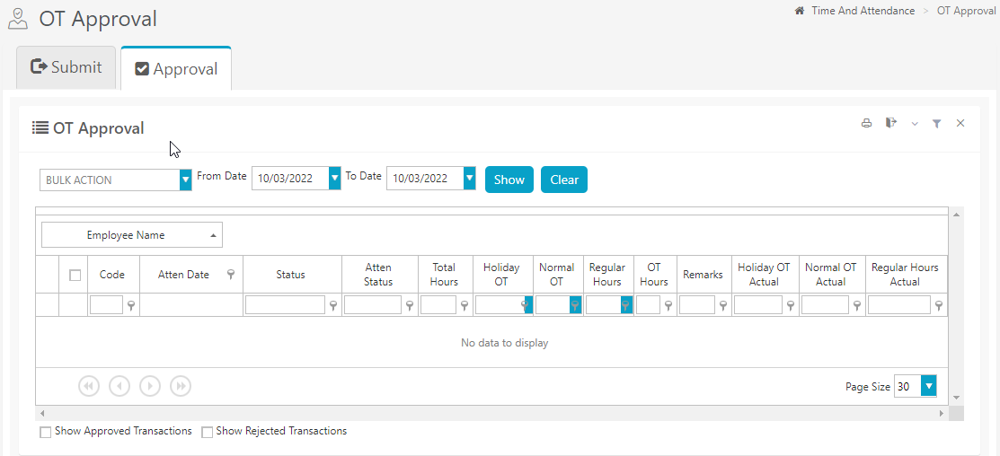
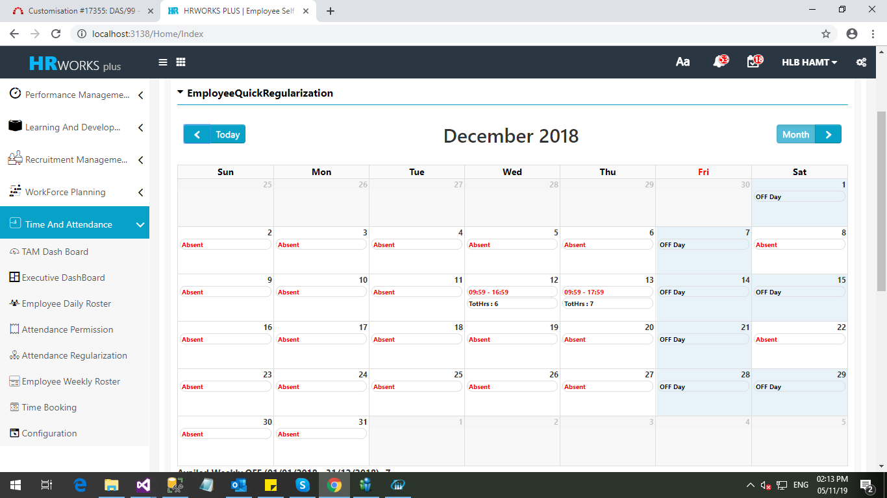

# Time and Attendance Module (ESS)

## Change the week start in Attendance Regularization

### Feb 2022- # 24335

The client required to set the week start as Monday. The change was made by setting a parameter so that the existing customers will not be affected.

To implement the change, execute a query.

## Approval Workflow redirection Policy in Attendance Regularization

### Feb 2022- # 23659

The client required to add the following features in Attendance regularization workflow.

* Option required to set up the monthly limit for attendance regularization request approval.
* If the approver go beyond the limit, request should re-direct to next approver level.
* While validating the request approval limit should consider the sum of all types of approved attendance request of the approver.
* Approval limit should consider Attendance date. For example, if an employee requested for the attendance regularization for the attendance date '05-Sep-2021' on '20-Aug-2021'(request date), then while considering the approval limit in August, this request will not be counted, it should consider for the month of September.
* This Approval limit option required only for selected levels (As per Alsafi policy it is first level)

In order to implement the change, execute a query to enable the three application parameter.

## Hide Fields from OT Approval grid

### Feb 2022 - # 23660

The client required an option to hide the following feilds from the OT Approval grid.

* Shift hours
* Time IN
* Time Out
* Shortage Hours
* Settlement type

To implement the change do the following:

1. Execute a query to hide the visibility of the columns such as Shift Hours, Time IN, Time OUT and Shortage hours.
2. Execute a query to set settlement type as Payment only.    
    
    !!! note

        Settlement Type column will be visible only when there is more than one active Data values available in the Database.

  

## Shift information in View Calendar

### Feb 2022 - # 23957

The client required to view the shift information like shift start time and end time in each cell of view calendar along with actual punch IN and punch OUT.

To implement the change, execute a script to activate the value type.

## Policy Codes in the web application

### Jan 2022 - # 21977

Developed Policy Codes screen in the web application

In order to implement the feature, execute a script.

## Default the Permission Type in Regularization Request

### Jan 2021 -  # 20710

Presently, while creating new attendance regularization request in ESS, it is required to select the permission type even if it contains only a single defined permission type in the system. Hence, now, the client required a provision to set the value default in Permission Type while creating a new Attendance modification request.

## Team View in Attendance Regularization Approval Tab

### July 2021 -  # 22335

The client required to display the Team's Attendance information such as the Team View in Leave Application. An option to configure the required criteria will also be added. Only the selected criteria will be listed in the Team View which is Present Days, Leave days, Absent, Late In, Early Out, Holiday and Reprocess.

In order to implement the functionality, execute an xml.

## Showing Exceptions Based on occurrence In Consolidated Attendance Report

### Feb 2020 -  # 18152

The client required to show to exceptions in consolidated attendance report based on occurrence of Late IN, Early Departure, Missing IN/OUT and Absent.

For example, if the employee is Absent for n days during the selected period, those records only should be filtered in the report. The value n should be accepted as a parameter. Some option to select whether it is consecutive or non-consecutive should be available.

In order to implement the change, do the following.

1. Execute a report template.
2. Execute an xml file
3. Execute four queries to enable the filter option.
4. Set Report Template for Standard, Late IN, Early Departure, Missing IN/OUT & Absent Select Filter Options (Late IN, Early Departure, Missing IN/OUT & Absent)

## Monthly Roster Option

### Feb 2020 -  # 15503

In HR Works Plus a new feature was added for setting up the monthly roster. An option was provided for selecting the employee, Month and Year for the Monthly Roster. Once selected, you can select the weekly roster for each week in the selected month and submit the request. An option for Approval workflow was also included.

In order to implement the change, do the following.

1. Execute the query to enable menu status.
2. Execute a query to enable sequence control and workflow settings.
3. Execute the query to get Employee Monthly Roster screen menu under Applicable Menus.

## Displaying shift details in view calendar screen

### Dec 2019 -  # 17927

The client required to view the shift code and description for each day as a tool tip in the corresponding cell in view calendar screen. The shift details for future dates also should be shown. If the employee has got OFF/Leave/Public Holiday for future dates, that also should be shown in the corresponding cells (not as tool tip).

To implement the change, execute a query.

## Doing attendance calculation for nearby dates also for records from TAM_AutoCalcLogs table

### Dec 2019 -  # 17928

Currently posting is done for the single date only. instead of this, the client required to do posting for -n to +n days. The previous days and future days should be accepted as a parameter in Application parameters.

Currently when the shift for a date is changed or when time bookings is added, a record will be written to TAM_AutoCalcLogs for automatic posting.

To implement the change, 2 new keys was added in appConfig which are  AutoCalcStartDay to consider previous days and  AutoCalcEndDay to consider future days in attendance calculation.

## Cancel Approved Requests in Attendance Regularization

### Dec 2019 -  # 16351

The client required an option to cancel the approved permission requests in Attendance Regularization. In case, the user has used the allotted break buffer defined against the permission type, the deducted minutes should be returned back to the break buffer upon cancellation.

To implement the changes, follow the steps below.

1. Execute a query to enable the cancellation checkbox.
2. Execute a query to enable the workflow of break permission cancellation.

## Weekly Schedule settings - Entity wise option in HR Works Plus

### Dec 2019 -  # 16719

The client required an option in HR Works Plus to set entity wise weekly roster and should have workflow approval.

## Template download option for Shift Schedule Upload

### Nov 2019 -  # 17407

As per the client requirement download option for shift schedule upload excel was introduced in the employee daily roster screen.

## Issues in Check In/Check Out button in view calendar screen.

### Nov 2019 -  # 17308

The client required the following changes in Check In/Check Out option in view calendar screen

- Currently, if Check In/Check Out is done, the transaction is not updated in Time Bookings, which must be changed.
- Currently, after submitting the request, the text  Missing IN/OUT or Regularization is shown in the corresponding cell. Instead of this, system should allow to create a separate type and show in the cells, or else the cell can be shown as blank.
- Currently the Check In/Check Out button is available to all employees; this should be configurable at employee/entity level.

To implement the change, execute a query to enable application parameter.

## Comments in Attendance Regularization

### November 2019  #16480

The client wants to make the Comments as a mandatory field in the Attendance Regularization request screen. To implement this, the user defined field settings for comments is removed and a query is executed in the database.

## To add new field in the attendance regularization screen

### November 2019 #17332

Changes have been made based on the client's requirement that in the **Attendance Regularization** screen, it should show the total number of employees whose attendance regularisation task is assigned to the logged in user. This should appear next to the **Select Employee** dropdown against the label **Total Employee Count**.

## New Daily Shift Schedule Screen

### Oct 2019 -  # 16064

The client required the below pinpointed requirements to manage the employee daily roster and leaves.

1. Based on the month selected by the User, the Employees should be listed on the screen based on the Users Access rights. If the roster for the Employee is already assigned, the corresponding shift code or the leave type should be listed against the respective days on page load.
   A drop-down in the screen should list the Shift Code masters and the Leave Masters. The assignment process must be as follows.

- Select a Shift/Leave Type from the drop-down list.
- To assign the shift for a day, click on the respective Date Cell.

Each shift code will be tagged with colour and the same colour will be applied to the date cell upon clicking the cell.

1. Two off days in the same week should be blocked, however additional days off are allowed but should be listed as "Authorized Leave"). A parameter should be set in the application which would specify the minimum no of days to be worked after the last off day. Further, provide an option to link the functionality at the Employee and Entity level. An Option to lock the rostering for previous months. However, the last 7 days of the previous month could be edited.
2. Validation must be added to check if the off-days are assigned in case the employees are on continuous leave. The application should block the request submission if the off days aren't assigned.

To implement the change, follow the steps below.

1. Execute a SQL to enable the functionality.
2. Execute a query to set the length of the value of the data return.
3. Execute a SQL to lock the rostering for previous months

## To add Employee work duration feature in attendance regularisation

### Oct 2019 -  # 15111

The client required an option to see the time an employee worked and half day Leave type for the day in Attendance regularisation.

## Disable Click Events in Attendance Regularization

### Oct 2019 -  # 9019

Client required to view the attendance information in Attendance Regularization screen and doesn t require the regularization functionality. Further needs to disable the click events if the approval workflow is set to none. Currently, it notifies the user to set the approval workflow.

Further the Transaction grid listed below the attendance calendar needs to be hidden. (Eg: Hide the list if there aren t any transaction at all).

To implement the change, follow the steps below.

1. Execute an XML.
2. Execute a query.

## Absent Report in HR Works Plus

### Oct 2019 -  # 16716

Absent report was added in HR Works Plus.

To implement the change, execute a query.

## Additional Functionalities in Daily Roster Screen

### Oct 2019 -  # 16663

The client required some additional functionalities in the daily roster screen which is explained below.

- Week wise frame in Roster screen: The start day of each week needs to be highlighted with different colour. Please provide an option to select the Start day and link this at Entity and Company level.
- List Public Holidays in different colour
- Option to Export the data.
- Rostering period to be set as 21-20 of each month: Users should be restricted from editing the data before and after this period. However, an admin user must be able to override the roster during the locked period.
- Users should have an option to assign their own roster (In case the Employee Master Assignment is set to Approval Workflow).

To implement the change, follow the steps below.

1. Execute a query to enable extended access right option.

   

## Changes in the consolidated attendance report

### Oct 2019 -  # 17140

The client required a new column in the consolidated report which show the remarks in the regularizing request.

In order to implement the change, execute the report template.

## Buffer Time for Break Permission

### Oct 2019 -  # 16350

The client required an option to set a buffer value for the break permission. The break permission requests should be blocked when the user has exceeded the allowed limit. If a user applies for 60 mins permission, the value should be deducted from the break buffer. The buffer limit should be a configurable parameter as this value would differ for each permission type.

Further, an option to limit the maximum applicable duration for each day was also included. (Configurable parameter against the permission type)

In order to implement the change, execute a query.

## Monthly Close Option

### Sep 2019 -  # 15507

A new option was introduced to set up the monthly close. Once monthly close is done with a specific date, the attendance transactions such as Time Bookings Entry, Weekly, Daily, and Monthly Shift Assignments and Leave application, before the monthly close will be validated and blocked from the system.

To implement the change, a new parameter named 'Transaction lock period' was introduced in the TAM-1 tab of the Application parameter.

Execute an xml to implement the change.

## Entity wise filter option in Daily Roster, Weekly Roster and Monthly Roster

### Sep 2019 -  # 15502

An option to filter the Daily roster, Weekly roster and Monthly roster on the basis of the Personal and Positional entities is introduced in HR Works Plus.

## Duplicate Time Bookings validation

### Sep 2019 -  # 15510

Currently, the system does not validate the duplication of the time bookings. Hence, a validation was introduced in the duplication of the time bookings.

To implement the changes, two new parameters was introduced in the ESSTAM-1-tab of the HRW+ Application Parameter.

Execute xml to implement the changes.

## Attendance Logs (Check in and Check Out) bulk upload.

### Sep 2019 -  # 15508

The client required the provision to upload the Check In and Check Out Logs though Excel template and an approval workflow for the same.

Execute xml to implement the changes.

## List Total Hours Worked in Attendance Calendar

### Sep 2019 -  # 16354

The total hours worked during each day was not noted in the attendance calendar. Hence the client required to list the total hours worked by the user for each day in the Attendance Calendar Date Cell.

Execute an xml file to implement the changes in the attendance calendar.

## Break Information in Attendance Calendar

### Sep 2019 -  # 16281

The following changes are introduced in the Attendance Calendar

- Listing the break information in Attendance Calendar (Break Out-Break In).
- When the break duration is greater than 60 mins, the text is highlighted in red.
- An option to validate the breaks to users. Once validated, the text colour change from red to black and only then the Validate button will be visible on the screen.
- An exception shown in cases where the Break-Out or Break-In is missing.

To implement the changes, execute an xml.

## Option for defining employees to multiple groups and assigning the permission for the selected group to work on public holiday

### Sep 2019 -  # 15127

A provision to set the permission for employees to work on public holidays is introduced. If an employee who doesn't have the permission to work on Public holidays work on a public holiday, the system will not calculate the attendance for them.

New options are added in the 'OT Pre-Approval Requirement Parameter For' parameter in ESSTAM-1 tab of HRW+ Application Parameter.

Execute a query to implement the changes.

## Option for break permission on selected week days between a data range

### Sep 2019 -  # 15126

The client required to set the permission for selected week days between a data range in break permission.

A new field named  Applicable Days  is added in Attendance Regularization Screen in break permission section.

Execute a query to implement the changes.

## Overtime and Weekly Total Hours in Attendance Calendar

### Sep 2019 -  # 16272

The client required to view the overtime hour worked by the employee in the respective date cell of the Calendar. Moreover, the total weekly hours worked by the employee must be displayed against each week in the calendar.

Execute an xml to update the changes.

## Overtime Request

### Aug 2019 -  # 14741

The client required a new overtime request functionality which is a pre-approval process for getting OFF day overtime.

1. Employee s OT request/approval is only for Weekly off days.
2. If the employee has requested to work on Off day, then he/she, must get approved his OT request through self-service. Then he/she will be eligible for OT on off day. Otherwise, the system will reject the employee's off day OT.
3. All other days OT is calculated without any approval. (Normal day OT)
4. The supervisor can request on behalf of his employees (Proxy).

For implementing this feature, the following changes are made.

1. A new parameter,  OT Pre-Approval Requirement For  was added in the ESSTAM-1 tab of the HRW+ Application parameters.
2. Execute a query to enable the screen.

## OT Upload Screen

### Aug 2019 -  # 15290

The client required a provision to upload the overtime hours into the application. After uploading the OT hours, the data is populated into the screen. From the screen, the user could edit the uploaded content, filter the data based on entity and date, list out the actual OT worked by the employee against each entry and export/print the data. The uploaded overtime should be considered only if the data is less than the actual OT, i.e. whichever is lesser should be taken into payroll. These data should be reflected in the attendance reports.

For implementing this change,

1. Execute a query to enable the application parameter.
2. Execute a query to enable the upload option.

## Attendance/OT Approval

### July 2019 -  # 14576

A new feature to approve the Attendance/Overtime/Shortage of employees by the supervisor till the last approver to get it paid through payroll is introduced. If it is not approved, the OT or Attendance are not considered for payroll calculation.

For implementing this change, follow the below steps:

1. Execute a query for enabling the screen

   

## Option for setting up the Daily and Monthly Limit for Excuse hour

### July 2019 -  # 15125

The client required an option to set up the Daily and Monthly limit for Attendance regularisation request.

Validation options are included in the Attendance Regularisation screen for break permission.

For implementing the change, execute a query.

## OT Approval Screen

### June 2019- #  13438

The client requires that the OT Approval screen similar to the one in eTAS should be added in HR Works Plus also. An option for converting the OT hours to Compo OFF should be added in this. If the employee applies for Compo OFF through the View Calendar Leave entry option, the balance against the accrued Compo OFF should be validated.

The following needs to be done in order to get these changes:

1. A query needs to be executed in the HRW DB
2. Create wage type for present days and set the **Wage Type Present Days** parameter on **Application Parameter >> TS-1** tab.
   
3. After final approval from ESS; wage type-based time sheet batch will be created for each employee in submitted status, which in further needs to approved from HR Works wage type base time sheet screen.

## Availed Weekly OFF Count in View Calendar

### March-2019 -  # 13545

In the Attendance Regularisation screen, in the Time and Attendance Module, the calendar view of the details was included in the screen. Now the client required to add the details of the availed weekly off details in the screen.

Therefore, the number of Availed Weekly Off till the selected month is included in the Attendance Regularisation screen.

*Fig: Attendance Regularisation screen displaying Availed Weekly Off*

## Automatically create break permissions in view calendar

### March-2019 -  # 13431

In the Attendance Regularisation screen, Break Permission was enabled manually by the employees. The client required to automatically create the break permission the view calendrer screen.

1. A new parameter is added in the HRW + Application Parameter in the ESSTAM-1 tab named 'Enable Auto Break Permission'.
2. Run a query for enabling the Parameter.
3. When 'Enable Auto Break Permission' parameter is set to true, a new button named 'Create Break Permissions' appears in the Attendance Regularisation screen near the 'Add New' button.
4. While selecting the 'Applicability' as Break Permission, the break permission records will populate automatically.

   

Automatic Break permission button in Attendance Regularisation Screen*

## Shift Search Option

### Feb-2019-   #13436

In ESS, users were not able to search the **Shift List** grid for shifts with shift parameters/ data such as such as sift code, description, shift start time and shift end time on the **Employee Daily Roster**. This functionality is introduced as per the requirement by the client.

Now a new parameter (**Show Shift List in Employee Daily Roster**) is added in the **ESSTAM-1** tab of the **HRW + Application parameters**. If the value of this option is set As True, then the shift search Option will be enabled in the **Shift Lists** grid on the ESS **Employee Daily Roster** page as follows.

*Figure: Shift list in the Employee Daily Roster*

## Shift Schedule Upload

### Feb-2019-   #13433

In the Daily Roster Grid, the option for assigning the shift schedule for each day were provided, but assigning the shift for each working hour was not present. The client required the option for assigning the shift for each hour through an excel sheet. The steps for the same is explained below.

In the **Daily Roster** grid of the **Employee Daily Roster** page, a new combo box named '**Roaster Type**' is added.

1. While selecting 'Shift Schedule Upload', select one Date and Upload the created Excel File.
2. The shift timings are entered in the Excel sheet in the **xlsx** format.

*Figure: Updated Daily Roaster Screen*

*Figure: Excel Sheet of Shift Schedule Upload*

## Time sheet

### Feb-2019- ## 13330

The client required employee timesheet option which they didn't have in the ESS. They also need the following customizations in their timesheet:

- Employees require to fill their Time sheet for a month based on which Cost Allocation report will be generated.
- Validation and conditions are require for the data entry.

To implement this,

1. In the HR Works, in the **TS1** tab of the Application Parameter Menu, a new selection named '**Time Sheet Entity 4'** is added.
2. In the **ESSTS-1** Tab, make the appropriate selections.
3. In the **Wage Type Master** screen, create the Wage Type for Full Day, Half Day, Leave, Holiday and Off Day.
4. A query needs to be executed in the DB by specifying the Wage Type ID.
5. In the **TS-1** tab of **Application Parameter**, the corresponding value for Wage Type of Weekly Off and Public Holiday should be specified.
6. Execute the [script](https://dli-apps.sourcerepo.com/redmine/dli/attachments/download/38138/AppParamEnablingQry.sql) to enable the following two parameters in the **Application parameter** >> **ESSTS-1** tab and set the corresponding value to them.
7. In ESS, **HR Portal >> Report Centre**, Run the Time Sheet by entering the From Date and To date.

*Figure: Time Sheet Report*

## Cost Allocation Report

### Feb-2019- ## 13332

Refer to Redmine ticket## 13330 to know more about the particulars of time sheet mentioned in this section.

The client requires the cost allocation report generated for the employees from the data entered in the Time Sheet.

To implement this,

1. A query needs to be executed to enable the menu.
2. Select the Cost Allocation Report, Enter the From Date and To Date. You can run the report, clear the report, and save the report.

   

*Figure: Cost Allocation Report*

## View Calendar Request Validations

### Jan2019 #13432

The client requires that the following validations be added in View Calendar Request transaction while submitting Break Permissions/ Regularization requests. These validations should be enabled or disabled based on some flag in the **Request Master**.

• Missing IN/ OUT request should not be submitted for Absent Days

• If the selected date is back dated and attendance status of that date is "Absent" or "ReProcess", Break Permission request should not be submitted. The existing option of submitting break permissions request for future dates should be available.

## Auto Marking

### Jan2019 #13429

Client wants to show Absent entries in View Calendar as Auto. For this, a new parameter (**Auto Marking**) is added in **HRW+ Application Parameters** (**ESSTAM**-). Users can select True/ False. If set to True, all absent entries in View calendar will be marked as Auto.

Users can set this parameter at entity-level and employee- level.

## Hiding Day Type in View Calendar

### Jan2019 #13430

As per the client's requirement, In **View Calendar Request \- Break Permissions** transaction form, "Start Day Type" & "End Day Type" should not be visible if both the Start Day Type and End Day Type configured in **Shift Master** is "Today". If the employee is trying to select future dates, either daily, weekly or company level roster should be considered for finding out the shift code for the day.

For this, a new checkbox field (**HideDayType)** is added in **Attendance Permission Types** screen, under the **Break Permission Parameters** section. If this checkbox is selected for any permission type, Start Day Type & End Day Type fields will be hidden in the break permission area.

## Color change for modified transactions in attendance regularization

### Jan 2019 #13744

The **Approval** tab page of the **Attendance Regularization** page shows all original transactions as well as the modified ones. The client required that the font color of all modified transactions needs to be changed to red so that the users can distinguish between the original transactions and modified transactions.

## Executive Dashboard

### July 2018 (#6251)

An executive dashboard is designed as per user requirement. By default, the record is filtered on the basis of location. Sample Executive Dashboard will be as shown below:

It consists of fields like Required Hours, Total Hours, Regular Hours, Total Wasted Hours, Overtime Hours, Approved Hours, Violation Hours, Absent Employees, Late IN Employees, Early OUT Employees, Approved Requests, Rejected Violations, Productivity, Violations.

## To have an option to export the transaction list data to excel from Attendance Regularization screen

### July 2018 (#10831)

As per the requirement, an export option is implemented in proxy tab of attendance regularization screen for the transaction list widget and added next approver column in the grid.

