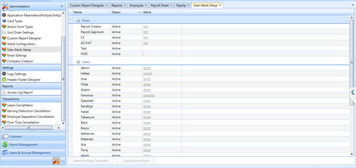
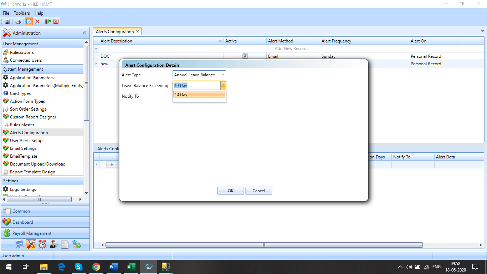

# Administration

## Option to upload user alert setup

### Feb 2022- #22349

Upload option was implemented in the user alert set up screen.

## Child Allowance as per the dependent details

### Jan 2022- #24492

The client required an option to cease allowance of a male child when he
reaches the age of 24 and a female dependent when gets married. The
eligibility must be restricted as per the dependent flag against the
employee.

In order to implement the feature, execute three custom SP's.

## License manager configuration Company Wise

### Nov 2021- #23537

The client required to block the employee count based on the company
code in a multi company DB.

## Transaction Information in Attendance Regularization Email

### Jan 2020 - #16481

The client required transaction request information to list in the Attendance
Regularization email alert. At present, only minimal information was shared in
the email. 

Included transaction details (Date, Time, Transaction Type, Remarks) for Absent,
Missing In/OUT and Break Permission

- Missing IN/Missing Out - List the newly added transaction with datetime,
  transaction-type and Comments
- Absent - Display the In and Out information with datetime, transaction type
  and Comments
- Break Permission - List the Break From and Break To data, include the break
  duration and comments

## Alert on Annual Leave balance threshold

### Jan 2020 - #16643

The client required a system to send alert notification mail to employees when
his/her accrual get more than or equal to 40 days, mentioning that his/her
accrual leave will expires if leave balance exceeds 45 and therefore to plan the
vacation accordingly.

To implement the feature, execute two scripts to enable the value types of new
Alert type and Day selection on screen. Title for Email Alert can be customised
using XML

## Email Template For Attendance Violation Report-Department Wise

### Nov 2019 - #16464

The client wants to send the report format as an email attachment. The
attachment must be sent to the managers/HR with the data of their respective
subordinates.

To implement the change, follow the steps below:

1. Execute the new REPX created for Attendance Violation Summary Report -
   Department Wise.
2. Create custom report by using the REPX and select the same in Email Settings
   screen
3. Execute the script for selecting Custom Report in Email settings.
4. Execute the script for creating/importing Custom Report in Custom Report
   Designer.
5. The Email Settings can be configured as required.

## Email Template For Attendance Violation Report-Employee Wise

### Nov 2019 - #16465

The client requires to send the attached report format as an email attachment.
The attachment must be sent to the managers/HR with the data of their respective
subordinates.

To implement the change, follow the steps below:

1. Execute the new REPX was created for Attendance Violation Report-Employee
   Wise
2. Execute the script to get violation report data from Consolidated Attendance
   Report.
3. Create a custom report using the REPX and select the same in Email Settings
   screen.
4. Execute the script for getting the custom report for selection.
5. Execute the script for selecting Consolidated Report in Custom Report
   Designer.
6. The email settings can be configured as per the requirement.

## Option to Change the Email Sending Day

### Sep 2019 - #16326

Currently, the previous month attendance report is sent to the employees only if
the Email Sending Day is set to 1st day of the current month. Now, the client
required a provision to select any day within the existing month to send the
previous month report. Similarly, to send the previous week attendance data
(Sun-Sat), currently, the sending day must be set to Sunday. Provision to set
this to any day within the week is provided.

Execute a script to enable the changes.

## Option restrict duplication of MOLID and IBAN

### Sep 2019 - #16090

The client required an option to restrict the duplication assignment of same
MOLID and IBAN for employees.

This customisation is added by introducing a new column in the Card Type for
Bank Parameter linked at Employee level to Data Type String.

## Dependent Age Limit Notification

### Aug 2019 - #14721

An alert notification was introduced in the system which will generate alert to
the user when the age limit of the dependants exceeds 18 years.

For implementing this feature execute a script to enable Ageing alert type.

## Missing document Notification to employee and HR

### June 2019 - #14555

The client required to send notification to HR and employees in case of missing
documents.

For implementing this the following steps were followed.

1. Added a new category named "Missing Personal Record Notification" in Email
   settings.
2. Execute the REPX file for the Custom Report.
3. Run three scripts for displaying the custom report created in the email
   settings and for displaying the new category created in the email settings.
4. 

*Fig: Email settings*

## Option to copy master and application details from existing company

### Dec 2018 - # 9976

The client wants to clone the following items (data, fields, settings, etc.)
from an existing company to the new company they are creating.

- **Data, fields and settings to be cloned**: card types, card master,
  sequence control, action form, application parameters etc.

For this option to appear in HR Works, two different scripts have to be executed
in the HR Works database.

1. Script to create **Company Creation** menu. This will insert a new screen
   (Company Creation) in the **Administration** module \>\> **System
   Management** section.
2. Script to create new value types (screen selections)

Once the above scripts are executed, can make a clone of the existing company
from the **Compony Creation** screen. From the **Data to Copy** dropdown field
of the **Company Creation** screen, users can select the items they want to copy
from the existing company to the new company they are creating.

On successful completion of the company creation process, the following message
appears: 
