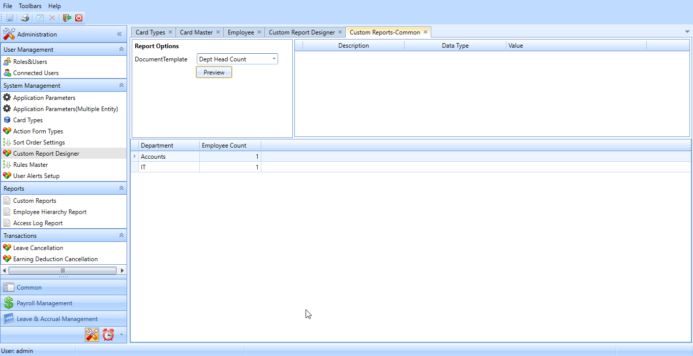
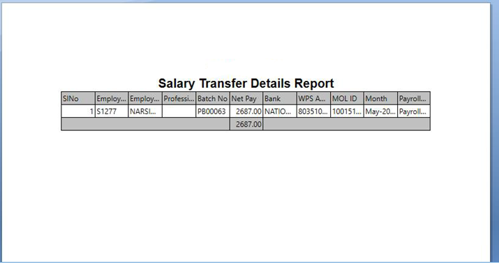

# Common

## Employee Master Report

### Jan 2021 -  #15338

The client required an option to print the master reports in HR Works.

In order to implement the feature, follow the steps below:

-   Execute two scripts to enable the custom reports menus.

-   Execute the custom SP.

## Letter and certificates Sequence format

### Nov 2019 -  #17192

Generate Sequence number based on certain conditions such as include generation date, doctype, employee code along with sequence while showing in Personal Records

Execute the customized stored procedure for Sequence no Generation.

## Employee Detail report without Salary

### July 2019 -  # 16094

In some companies, some of the members in the HR team do not have the access to salary of the employees. Hence, the client required to view the employee detail report without the salary information.

For implementing this feature, execute an SQL.

## Send ICT form on Employee creation

### May 2019 -  # 14851

The client requires to send an ICT form to the IT department head while a new employee is created in the system. In this format we are not sending employee details.

For this, a new view is created. Execute the view.

In Card Types >> Other Cards, create the fields to Upload and attach the files in the Card Master and name the action form as NEWEMP.

Crete the workflow for sending the email and link it with the action form.

## Dashboard Items

### March-2019 -  #13835

The client required to view the below details in the Dashboard window.

-   Pending Leave details upon which leave settlement is not processed.

-   Pending separated employee details, whose final settlement is not processed.

-   Upcoming Leaves of 30 days, where leave start date is within 30 days from today.

-   Alert Details of Company Document.

-   Alert details of Employee Document.

Changes based on the customised SP

*Fig: Dashboard Viewer*

## Transaction Period option (as same feature available in TAS)

### March-2019 -  #14031

The transaction period of the reports is customised in this point. The requirement of the client was to view the transaction period in three different ways such as Today, Previous working Day and Period. However more options for selecting the transaction period has added in this point. This change is applicable in both HR Works and HR Work Plus in the general transaction screen and report screens.

The changes are made as follows.

1.  Three new parameters named 'Default Date Range in Transaction & Reports', 'Default From Date' and 'Default To Date' are added in the TAM-1 tab in the Application Parameter.

2.  Execute a script for enabling the newly added parameters and its selections.

*Fig: Application Parameter Settings*

## Company Wise Employee Strength Report

### March-2019 -  #12954

The client requires to view the Company wise employee strength indicating the number of employees working, absent, on annual leave and E-Leave. Follow the below steps.

1.  Run the SP (In the SP you can change the leave which you need to filter.)

2.  In the Custom Report Designer, create the Template and set Report Source and set the parameters.

     
>
- *Figure: Report showing employee strength*

## Employee Head Count Report

### March-2019 -  # 12953

The client required to view the number of employees working in each project separately.

Therefore, a report was developed showcasing the project name, project manager and number of employees by grouping the employees based on the destination.

1.  Execute the SP for getting the head count details.

2.  In the Administration Module, in the Custom Report Designer, create the Template and set Report Source as the Custom SP and set the Custom Report Module with required module.

3.  Set the required parameters of Custom SP and the data types in User Entry Values.

4.  To view the report, Select Document Template and set parameters for the template and Preview.

- *Figure: Report showing employee strength in each project*

## Additional Field in Employee Profile Report

### March-2019 -  # 14269

In the Employee Profile Report, there was no option to add the photo of the employee. As per the client requirement Employee Profile Report was customised by adding the option to add the Photo of the employee, gratuity as on date and leave balance as on date.

In order to implement this, an XML file and REPX file must be executed.

The fields required in the Report Template screen is saved through the XML file.

The format for the report is designed in the REPX file.

*Figure: Employee Profile Report*

## Entity Headcount Report

### Feb-2019 -  # 13464

The client maintains Designation, Department and Grade as the positional entities. There was no provision to get the head count of the employees by these entities in form of a report. Therefore, a new report named Entity Headcount report in which entity wise head count can be viewed is introduced.

Changes based on view and xml

*Figure: Custom Reports- Common*

## Dash Board to show Pending Approval Items

### Feb 2019 -  # 12361

Initially, Pending Approvals were listed in the Pending Action Screen in the Administrative module on the basis of the access rights. Now, the client needed a dashboard that shows pending approval items with the user, when logged into the HRWorks. Need to show the dashboard as landing page. These changes are made as below:

1.  A new menu '**Dashboard Pending Actions**' is added to HRW

2.  Changes based on SP

*Fig: Dashboard viewer*

## Employee Report with specific format

### Dec 2018 -  # 13628

The client needs to generate employee report in specific format in HR Works. A new field (Date of birth) has been added to personal record report.

## File upload restriction in document upload

### Dec 2018 -  # 12051

The client wanted to set the maximum upload file size for the following:

1.  Employee photograph upload (in Employee Master data screen)

2.  Fields with its datatype set as file in Personal Records fields

For employee photograph upload, a new parameter named **Maximum Size of Employee Photo in KBs** is introduced on the **Application Parameter >> HRW-1** tab. Users can specify the maximum upload limit for employee photograph in kilobytes.

For the fields on the personal records field groups for which you want to have file upload size limit, do the following:

-   A query needs to be executed in the HR Works DB, in which the type and size of the file to be uploaded can be specified.

-   Once the query is executed, an appropriate value will be available for selection in the **Validations** dropdown field against any of the personal records fields provided it's data type is set as *File*.

## Employee status Oct 2018 (#11056)

Currently the status of employees such as terminated, separated, absconding, and on leave are system generated statuses meaning they are generated by the system based on the respective transaction. In order to track employee's current and last status, the client requires additional statuses such as Cancelled, Left country, Run away, and Police case to be set for their employees.

For this, a new field is provided in the Employee master for users to update the status with effective date. Status needs to be updated even if the employee is separated. The Employee list now shows employee's system generated status as well as the status that is set manually.

Based on XML change

## Service day in employee Master

**Oct 2018 (#11912)**

Employee master should show service days as of the current date in Year/s Month/s Day/s format. Date should be displayed on the employee's master screen below his/ her age.

A new parameter is added so that users can specify the format in which service days is displayed (**Application Parameter >> HRW-1 >> Service Days Display Format**).

If an employee is terminated or is included in employee separation transaction (Payroll Action form) and if the effective date on the separation record is less than the current date, then his/ her service period is calculated and displayed as follows:

No. of service days (Current Date - Hire Date) + 1) till the effective date .

## Select all option in the personal record change action form

### July 2018 (#10647)

Implemented Select 'all' option for personal record action form on employee list grid. Maximum 5 Employees personal records can be updated through manual entry. The user can generate excel template for all employees and upload the personal record.

## Organization Chart Design

### July 2018 (#7971)

-   Added new column named 'Organization Chart By' in Organization Chart Types screen.

-   Entities with 'This Employee' data type is shown in this column.

-   The value of this column is used for the new JSON Organization chart.

-   Setting the 'Organization Chart By' value will also enables you to filter the data that needs to be shown in Chart by different Entities within an Entity Type. (Image 1)

-   These selections are shown in Selected Values column.

-   We can show / hide the nodes by clicking on the green arrows in the organization chart. (Image2)

-   Entity Type with Sort order 1 is shown in the organization chart.

Image 1

Image 2

## Reports

## Option to show Salary history in Employee Profile Report

### Sep 2019 -  #16374

A customisation was made to view the salary history in the Employee profile Report of the employee.

To implement this change, follow the steps below.

1.  Execute an sql

2.  Import a repx file to custom report.

## Missing Document Report

### July 2018 (#10782)

New Report has to be generated for obtaining missing document of employee based on document type. We have added a new report Missing Personal Records. Here, on selecting corresponding document types missing cases will be displayed on previewing.

## Company name in reports with Export Friendly option

### July 2018 (#10111)

Company name and report title are now included for the following screens where export friendly print option is used:

-   Attendance Integration

-   Cost Allocation Report

-   Payroll Sheet

-   Employee Details

-   Indemnity Accruals

-   Leave Report

-   Air Ticket Accrual

-   Period Summary Report

-   Salary Register

-   Salary Transfer Details Report

-   User Defined Accrual Register

-   Vacation Accruals

     

## Company document in expiry report

## July 2018 (#10141)

We have provided a new screen for company records and in this screen the Company Document Expiry details will be displayed and in Document Expiry report the Employee Document Expiry details will only be displayed. The setup and configuration are all the same as that of Employee document expiry screen and the data are displayed based on alert in each report screen.

The format of the report is embedded here:

