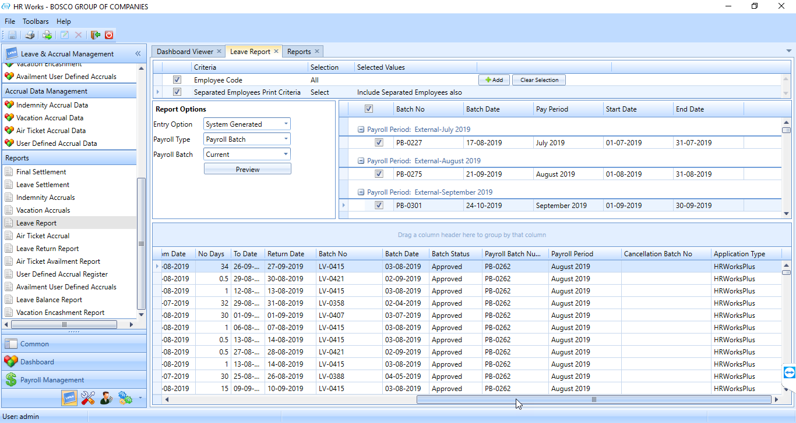
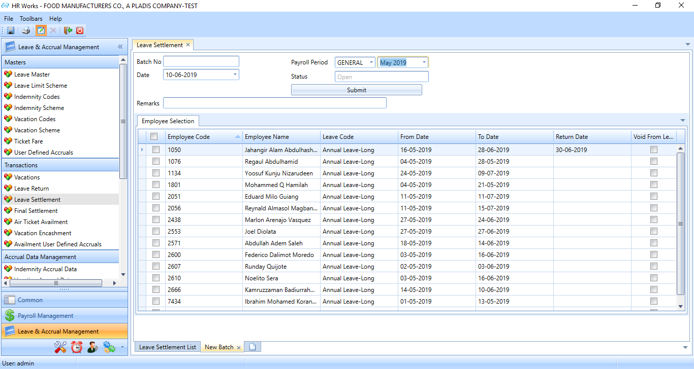

# Leave and Accrual Management

## Cancelled leave in vacation accrual report

### Nov 2021- #23509

Cancelled leaves are showing along with manual adjustment in adjusted
days column in vacation accrual report. Client required an option to
show it as a separate column in vacation accrual report.

## Leave Return for continuous leave

### April 2021 -  #21699

The client require to update the Leave return of the last leave application for any continuous leave applications instead of applying return date for individual application. For example if the employee has got an AL followed by UP then when user returns from Leave user will update return date for the UP leave only and return date for AL needs to be updated automatically. The change is applied in both HRW and ESS.

In order to implement the change, execute a query to enable the parameter.

## Accrual summary report

### Jan 2021 -  #20346

Reports for indemnity accrual summary report and air ticket accrual summary report were developed.

In order to implement the change, execute the query.

## Generate a single report to show leaves from HR Worksand ESS

### Feb 2020 -  #17451

The client required to generate a single leave report from HR Workswhich include all leaves applied from ESS, HRWorks, delay leave and Absent leave uploaded through time sheet.

In order to implement the change, execute an xml file.

## Provide public holiday salary through the leave settlement

### Jan 2020 -  #15231

The client required some changes in the vacation pay calculation.

For implementing the change a new application parameter was added in Vacation Scheme in Vacation Scheme Details tab as 'Settlement Amount Calculation For', with options "Leave Days" and "No.of Days between Leave Dates".

While selecting 'Leave Days', normal leave settlement calculation is done based on vacation pay corresponding leave days and while selecting 'No. of Days between Leave Dates', vacation pay corresponding to No. of Days between Leave Date is considered.

Execute a query to enable the application parameter.

## Final Settlement changes

### Dec 2019 -  #17782

The client required to view the Sponsor Company of employee instead of company name in the report.

To implement the changes, follow the steps below.

1.  Execute an REPX file

2.  Execute an XML file.

## Leave Return notification

### Dec 2019 -  #16705

The client required to send the notification to Line Manager and HR on employee to be returning next day and today. Employee without Leave return date only need to be considered.

To implement the changes, follow the steps below.

1.  Execute a script to enable the alert type.

2.  Execute a script to enable the value type of new alert.

## Final Settlement Changes

### Nov 2019 -  #17431

The following changes are introduced in the final settlement report.

-   Designation, Department, Category and Nationality was added between the service details and salary details

-   Salary transfer letter yes/no are linked to employee which is shown in between the service details and salary details.

-   Air ticket allowance is shown twice in the report.

To implement the change, follow the steps below:

1.  Execute the REPX file

2.  Execute the XML file

## Option for Summary report in Indemnity Accrual

### Sep 2019 -  #16227

The client required the provision to take the print out of the Indemnity accruals summary and an option to group the report as per the entity.

Execute an xml to implement the changes.

## Option for Summary report in Ticket Accrual

### Sep 2019 -  #16226

The client required the provision to take the print out of the ticket accruals summary and an option to group the report as per the entity.

Execute an xml to implement the changes.

## Option for Summary report in Vacation Accrual

### Sep 2019 -  #16228

The provision to take the print out of the vacation accruals summary and an option to group the report as per the entity was introduced in HRWorks.

Execute an xml to implement the changes.

## Benefit Claim Request Change

### Aug 2019 -  #15138

Currently in HR Works, it is possible to avail amount which is more than the eligible amount in a year. Therefore, the client required to restrict the amount as per his/her eligibility. Moreover, if the amount is not fully utilised, the balance must be carry forwarded to next year.

For implementing this,

1.  Execute a query

2.  New application parameter named 'Air Ticket Lumpsum amount' was added in the TKT-1 tab

3.  New option named 'Unlimited With Annual Limit Amount' was added in the ticket frequency parameter in TKT-1 tab.

## Option to avail the ticket accrued till last working day during Final Settlement

### Aug 2019 -  #15581

Currently, during the final settlement, the system has option to avail ticket that accrued till last payroll. Now the client required an option to pay out full ticket balance, that employee have accrued till the last day.

For implementing this change follow the steps below:

1.  New options were added for the parameter 'Max. Request Ticket for Claim Type - Air Ticket'. Execute a query to enable newly added options.

2.  New Column 'Balance As On' is added in Air ticket availment screen.

## Year End leave balance in Vacation accrual report

### July 2019 -  # 15626

The client required to add additional field in the Vacation Accrual Report named Pending Leaves and Year End Leave balance.

Pending leave displays the leave that need to be deducted for the year.

Year End Leave Balance displays the balance leave for the selected year.

For implementing the change, execute a SQL query.

In the RPT-1 Tab of Application parameter, Set the value for 'Additional fields in Vacation Accrual Report'.

*Figure: Vacation Accrual Report showing Pending leaves and Year end leave balance*

## Training cost recovery through Final Settlement

### June 2019 -  # 14554

The client required to deduct the training cost during the final settlement. The training provided to the employees are tracked in the HR Works under the Personal Records. When an employee resigns before one year of training taken date, the amount of training cost is deducted during the employee's final settlement.

The training details stored in the HR Works are Effective Date, Training Type, Training subject and Training cost.

In order to implement the feature, execute the custom SP.

## Show Leave From Date and Leave To Date in the leave settlement screen

### May 2019 -  # 15232

Initially the Leave Settlement Screen did not showcase the From Date and To Date information regarding the leave. Therefore, the client required to include the Leave From Date and Leave To Date in the Leave Settlement Screen.

*Fig: Leave Settlement screen*

## Two levels of approval during leave settlement.

### Feb 2019 -  # 12491

In HR Works, there was a parameter (Multilevel AWF) by which users can set approval workflow for all common transactions.

The client requires a different workflow to be set for leave settlement transaction. For this a new parameter ' M**ultilevel AWF on Leave Settlement** ' is added in Application parameter AWF1 Tab.

## Air ticket encashment report

### Feb-2019 -  # 13263

Initially, air ticket encashment report was not generated.

The client required to avail the Air ticket encashment report through the pay slip.

For implementing this change, import REPX file and execute XML file.

For creating the Air Ticket Encashment report, follow the steps below:

1.  In the Air Ticket Availment screen, Select the 'Off Cycle Payroll' as the Availment Option. This will allow to complete the availment process through the Off-cycle screen.

2.  While printing Pay slip select the report type as Air ticket Encashment and select Type as Off Cycle.

*Figure: Payslip screen*

## Vacation eligibility based on service days.

### Dec 2018 -  # 12943

For the client, for a few employees, vacation days or eligibility will change as per the service days of employee.

Below lists the slab for accrual.

-   0-3 Years \- 22 working Days

-   3-6 Years \- 24 working Days

-   6-10 Years \- 26 working Days

-   10-20 Years \- 28 working Days

20 Years and above \- 30 working Days

Leave Days will be accrued on Pro-data basis, which means if an employee's slab changes at the mid of a month. His/ her balance should be calculated pro-data basis.

**Example**: If an employee completes the 3 years by 15th of June, his leave accrual should be 15 days with 22 working days and rest with 24 working Days.

In both ESS and HR Works Leave application, leave balance need to show as per the above accrual method. The client needs to show the leave balance as of leave start date

For this, a new parameter (**Apply Prorata Calculation in Vacation**) is added to **Application Parameter \>\>LV-1**. If the value of this parameter is set to 'Yes', leave days will be accrued based on pro-data basis. Leave balance in leave application will be shown as per this accrual method.

## Leave Settlement pay on Calendar days

### Dec 2018 -  # 11866

Vacation pay is calculated based on the calculation criteria set in vacation codes alone. The client requires that it should be calculated based on the daily rate policy applicable to the employee.

To customize the system as per client's requirement, a new application parameter (**Leave Advance Pay Calculation**) is added to the **LV-1** tab of the **Application Parameter**. If its value is set as **Daily Rate Basis Till Leave To Date**, then the vacation pay calculation in leave settlement will change and new calculation will be as follows:

Vacation pay = sum (salary for pay components in vacation pay from leave start period to leave to date) - sum (salary for pay components in vacation pay from leave start period to leave from date)

## Leave settlement Recovery changes

###  Oct 2018 (#11068)

In HR Works, when an employee goes on vacation and requests for Leave salary advance, he/ she will be paid the salary till the leave start date and leave salary for the leave days. The leave salary consists of gross salary excluding COLA, OTHER and MOBILE allowance. These allowances will be paid for the leave days along with month end payroll. Leave salary paid to the employee will be considered as leave salary advance and it will be recovered from the subsequent payrolls. 

In case if an employee has got any additional payments such as OT, Bonus or allowances (COLA, OTHER and MOBILE), those payments will be made only after recovering the leave salary advance paid to the employee. The client now requires that the recovery be made only from the paid leave salary components and if any additional payments are there, they should not be touched and have to be paid as usual.

Example:

**Employee Salary**- Basic: 500, HRA: 200, TRA: 50, OTH: 50

**Leave** -- 16th May 2018 to 19 June 2018 (25 days)

**Off days** -- FRI-SAT



**Summary of Changes**

The following changes are made

1.  **Application Parameter\
    **A new parameter '**Enable Pay Codewise Leave Advance Recovery Setup**' is added in the **LV-1** tab of the **Application Parameter** screen. Default value will be '**No'**. In order to meet client requirement and to enable the **Pay Pay Code-wise Leave Advance Recovery Setup** tab, the parameter value should be set to Yes.
    

2.  Vacation Codes screen:
    The **Pay Code-wise Leave Advance Recovery Setup** tab displays the following:

    1.  All payable earning codes which are not a part of Accrual Components will be displayed

    2.  An additional component named 'Salary Arrear'.

- For each earning code, any of the following Recovery Amount options can be set

1.  **Full Amount** (this will be the default option. If this is selected, then the full amount corresponding to the pay code will be subject to recovery).

2.  **Amount up to the amount Paid in Leave Settlement.** (if this option is selected then only the amount paid in the corresponding leave settlement will be subject to recovery)\
    

**Note**: The **Pay Codewise Leave Advance Recovery Setup** tab will appear only if the ***Recovery Amount*** options are active in the db.

## Vacation Availment Based on Accrual Average

### **Oct 2018 (#10176)**

Currently the daily rate calculation method for vacation encashment is based on the **Daily Rate Calculation Basis** selection on the **Vacation Scheme** menu. The client now requires an option to set daily rate calculation method for vacation encashment based on vacation accrual average (ie Daily rate = total accrual amount/ total accrual days). For this a new dropdown field (**Vacation Encashment Calculation Method**) is added to the **Vacation Scheme** settings. Users can select any of the following two options from the **Vacation Encashment Calculation Method** dropdown field**.**

1.  **Based On Current Daily Rate**: current functionality/ default setting

2.  **Based On Vacation Accrual Average**: Daily rate = total accrual amount/ total accrual days

Another requirement of the client is to have an option to specify how arrears are recalculated against salary revisions. For this, a new dropdown field (**Accrual Amount Arrear Recalculation on Salary Revision**) is added to the **Vacation Scheme** menu from which any of the following options can be selected as required:

-   **For Full Accrual Days Balance:** current functionality/ Default setting

-   **From Salary Revision Effective Date**: recalculate accrual only from salary revision period

-   **No Calculation**: no recalculation of accruals on salary changes\
    \
    

## Leave split up based on leave balance

### July 2018 (#10175)

Normally, if an employee is delayed from annual leave, system will be extending the leave with annual leave itself. But, if the employee doesn't have sufficient annual leave balance, then the system will split up the leave extension in to two- one with available annual leave balance and the rest with unpaid leave (salary will be zero and accruals are excluded for these days).

This functionality is achieved by introducing a new parameter **Default Leave Type in Leave Return Screen for Delayed Return if Balance Exceeds** in Leave Master for leaves having leave type category 'Adjust Vacation Balance' 

While creating Leave Return, the user can create a new leave based on 'default leave type in leave return screen for delayed leave' if employee have enough leave balance. Otherwise, return leave will be split in to two leaves, first leave days will be leave balance days, second leave will be difference between total leave days and leave balance. User will not be able to modify this leave data.

## Time Lieu Expiration

### July 2018 (#8245)

There was no expiry for employee's Time in Liew hours. On the **Application Parameter>LV-1 tab,** a new parameter (**Cut-off for availing Compensatory Off Balance)** is added to set a cut-off value so that the Time in Lieu hours will expire after a predefined value (Days).

\
The values available for selection are listed below. These values refer to the time period for the expiration of the compensatory off. For instance, If the value is set as 30 days, the employee will have to avail this compensatory off within this 30 days' time, otherwise it will get expired and so it will not be available for him.

-   30 Days

-   60 Days

-   Till end of Next Month

-   Till end of next 2 months

-   Till end of Current Month 

**Max -ve allowed Compensatory-Off Balance** parameter in **Application Parameter>LV-1** tab is used to validate the leave days while taking the compensatory off Type Leave.

For instance, on assigning a value 5 for this parameter, while applying for compensatory off, even though the leave balance is 17, an additional 5 leaves also can be applied.

## Probation notification with Attachment

### July 2018 (#9955)

Here the customization requirement was such that an email notification should be send to the Line Manager and head of department 30 days before the probation end date with Probation evaluation form. The header details of Probation need to be filled based on employee's data. The probation notification to Managers should only be send once.

The solution approach is done in the following manner:

-   This feature is handled by introducing a new alert type in Alert Configuration screen - 'Probation Alert Prior to

-   Probation End Date'.

-   The custom report should be made for Probation Report and this will be available for selection in Alert

-   Configuration.

**Note:**

-   Alert functionality is moved from **HRW License Manager** to **Email Attendance Details** service.

-   A new key is added in HRW License Manager and Email Attendance Details -- **EnableAlert** which will be **true in former and false in later (by default**). This parameter, if set as true, Alert functionality will be working as usual. This key **should not be** set as true in both services.

-   The probation report uses **Report Emailer** application for mail sending, like the Attendance Report emailing functionality. So the URL to Report Emailer exe should be set in service's config file.

-   The key **TimeInterval** used in License Manager is also added in Email Attendance Details service (default as 1)

## Dashboard

### July 2018 (#5266)

Development of Dashboard Module in HRW. This include the following sub modules:

-   **Widget Creation**: This screen is mainly used to create a dashboard widget of any type.

-   **Dashboard Designer**: Once the widget is created, the user can design the dashboard.

-   **Dashboard Viewer**: Finally, the dashboard can be viewed from Dashboard Viewer screen.

    -   The dashboard viewer working is based on the settings in widget creation and the design in the dashboard designer page.

    -   The filter option in Dashboard viewer is based on the filter option of each widgets in widget screen.

    -   The dashboard user can filter the dashboard from the filter option set in widget screen.

    -   If the filter selection is checked in 'Is user overridable', then the user can select all available filter options otherwise user can apply only the selected filter options in the widget screen.
