# Payroll Reports

## Time sheet validation for Approved leave days

### April 2021 -  #21807

The client required the following validations in both HR Works and HR works plus Timesheet if approved leave application exist for the day.

-   If an employee have an approved leave application for a day then the Time sheet is not required for that day.

-   Exemption of Time sheet entry must only be applicable for applied/approved leave and must not be applicable for delayed leaves.

-   Leave days' Time sheet must not be considered in Missing Time sheet.

-   If employee cancels the Leave for the current month then Time sheet must be mandatory for the day.

-   Leave Days Project, Subproject and Team in TS must be taken from Employee master.

In order to implement the change, execute an SP.

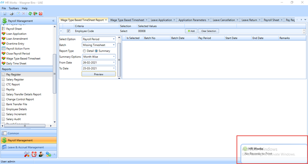

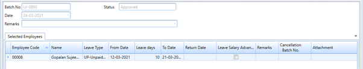

## New report format to be added in salary register

### Jan 2021 -  #16446

The client required some format changes in the new salary register. Moreover, in the present system, if a mid of month salary revision in a current month occurs, then it is showing as LOP in the system. Rather, than showing LOP, it must be shown as negative arrear.

In order to implement the change follow the steps below:

-   Execute the report template xml

-   Execute the query to enable the application parameter menu.

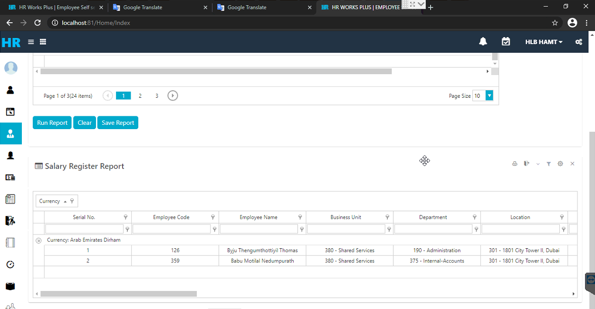

## Non payable allowance not to show in the Employee profile report

### Nov 2019 -  #17433

The client does not require to show the non-payable allowance for the employee in the salary details while printing employee profile report from Common-\- Employee.

To implement the change, follow the steps below:

1.  Execute the Report Template script.

2.  Execute the xml

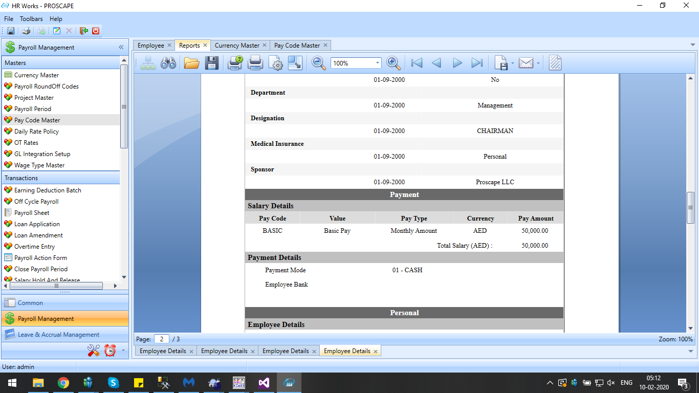

## Changes in bank Transfer file

### Dec 2019 -  #17806

The client required the below changes in the bank transfer file.

-   To remove the bank code column

-   Change transaction type to 'SAL' for Payroll and Leave Settlement batch, 'EOS' for Final Settlement batch and 'ALW' for Off cycle batch.

Execute a view to implement the change.

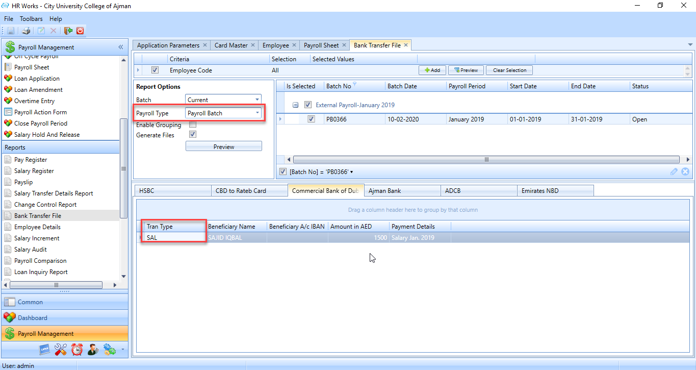

## Salary Transfer Summary Report

### Dec 2019 -  #17606

The client required to provide an option to take Summary report of Salary Transfer. Further needs an option to group with 'Payment type' and 'Bank' and must provide total as per grouped items.

To implement the changes, follow the steps below.

1.  Execute XML file.

2.  Execute 4 REPX file.

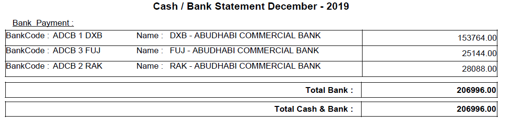

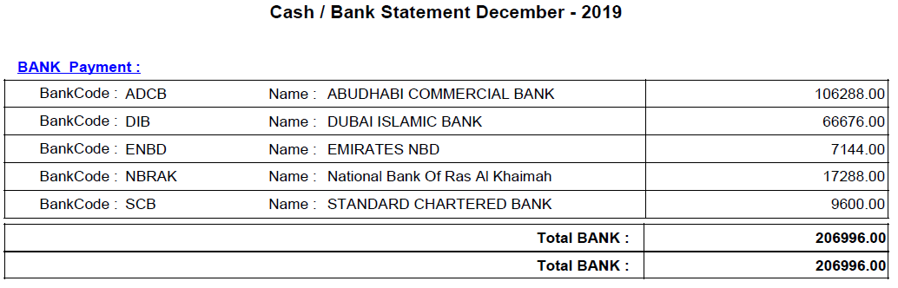

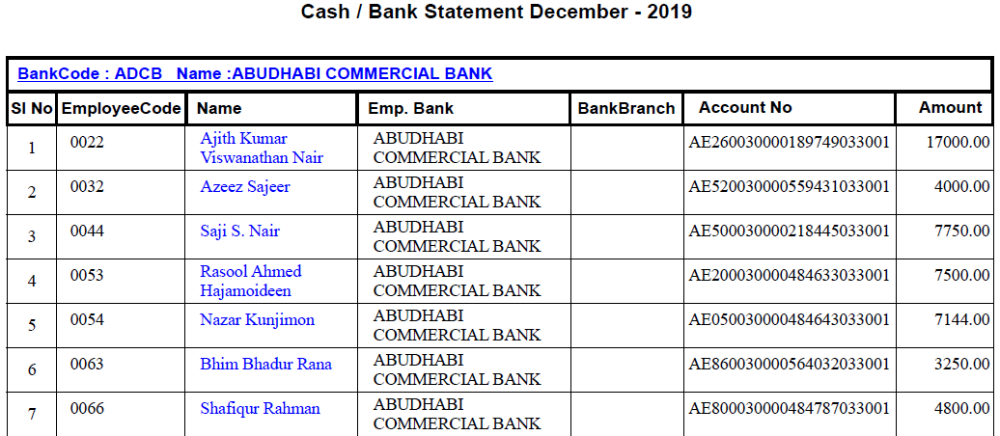

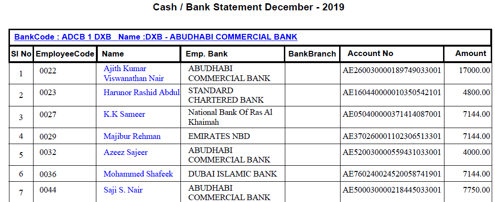

## JNJ Data Comparison Report for Temporary Earnings

### Dec 2019 -  #16862

The client required a report that lists all the temporary/one time payments provided to employees in a payroll period.

In order to implement the change, execute the XML.

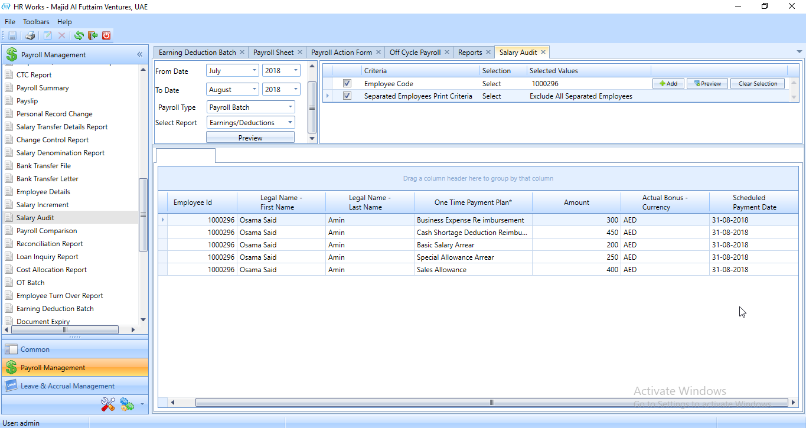

## Option to suppress values without account number

### Sep 2019 -  #16608

A new feature to suppress the values without account number was introduced in the GL Account statement.

To implement the change, execute an xml file.

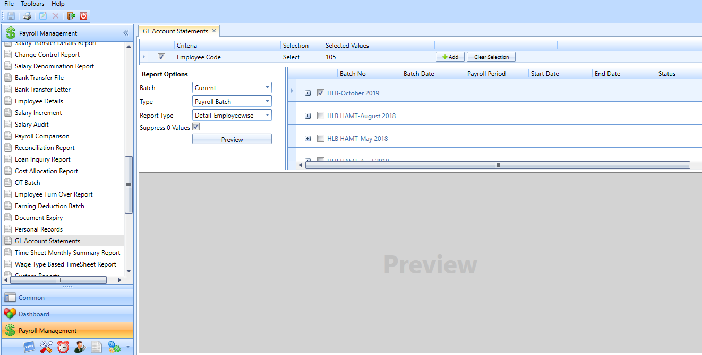

## Entity changes related corrections in payroll reports

### Aug 2019 -  #15830

Currently the access rights for payroll and user has been given in the entity level - payroll location. Therefore, while transferring an employee from one payroll location to other, the existing payroll batch disappears and the users were not able to view the previous batches in the system. Hence, a new feature was added to view the previous payroll details of the employees even after changing the location.

For implementing this change, follow the steps below

1.  In the PRL-1 tab of Application Parameter set the entity values based on batches.

2.  Run an SP.

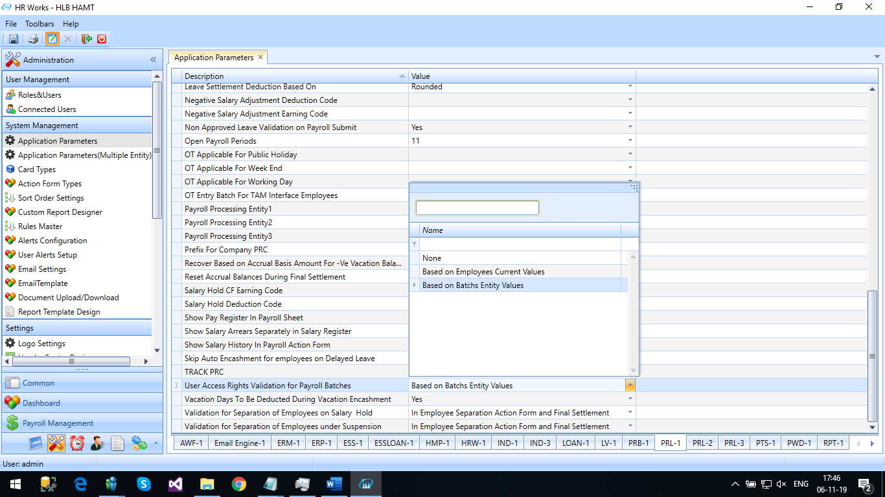

## Option to show paid annual leave salary in salary register

### Aug 2019 -  #16001

Currently, in the salary register the salary paid during the annual leaves are not shown. Hence, the client required to view the salary paid during the annual leave in a separate column in the salary register and the corresponding deductions must be reflected in the remaining components.

For implementing this change, execute the xml.

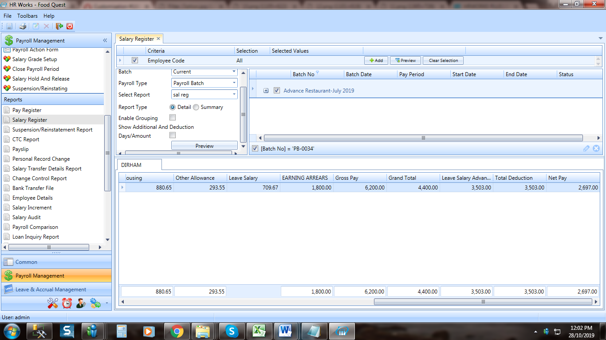

## Employee Distribution Report

### May 2019 -  # 6948

The client required a new report named Employee Distribution Report which is a two-dimensional entity report where the entities are taken from the positional and personal entities.

Execute a query for enabling the report.

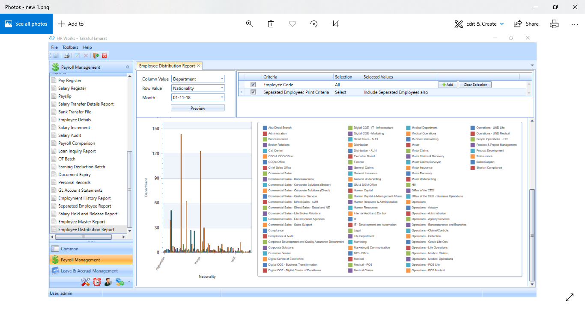

*Fig: Employee Distribution Report*

## Account No and remarks in pay slip

### Dec 2018 -  # 14045

Client requires that the following two more details be shown in their pay slip

1. Account no (entered in the employee \- Payment details \- Account No

2. Loan Remarks in the deduction part (remarks which is entered through loan application)

This is implemented by executing xml script in the db.

## Budgetary Report for Company Records

### Dec 2018 -  # 12535

The client has a field for displaying amount, which they maintain as the expiry document budget amount, for all items on their company records menu. These data can be viewed as a report when they generate the **Company Document Expiry** report from the Payroll Management module >> Reports section. The client wants to have the total amount for each item on the Company records displayed in the **Company Document Expiry** report which shows the total of all the values in the respective **Amount** field.

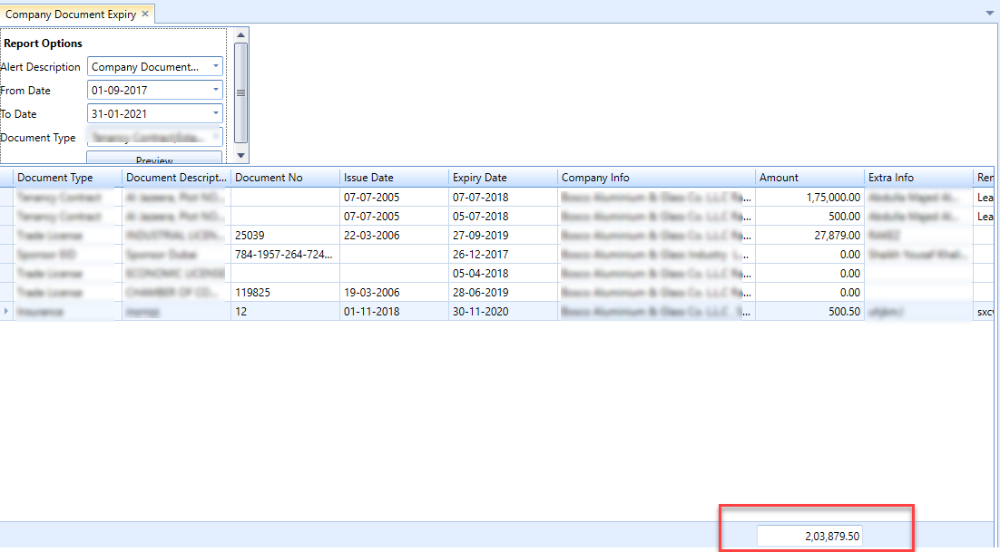

## All company Consolidated report

### Dec 2018 -  # 12677

The client who has multiple company set up in their DB wants the following:

Now, on the Common >> Company Records menu, users can view the company records of the company they have logged into. The client requires that the users should be able to view the company records data of all the companies in the database regardless of the company they have logged into. For this, user can now configure the Custom Reports in the following manner:

-   A few Stored procedures need to be executed in the HR Works DB. Separate SPs are created for every item on the Company Records menu. Only when you execute the SP meant for an item, the respective view will be available for selection in the **Report Source** dropdown field on the **Custom Report Designer** screen.

-   On the **Administration >> System Management >> Custom Report Designer** screen, a new report will be created by selecting appropriate values from the **Report Source** field. The values that you select here appear as result of executing the respective Stored Procedure in the HR Works DB.
    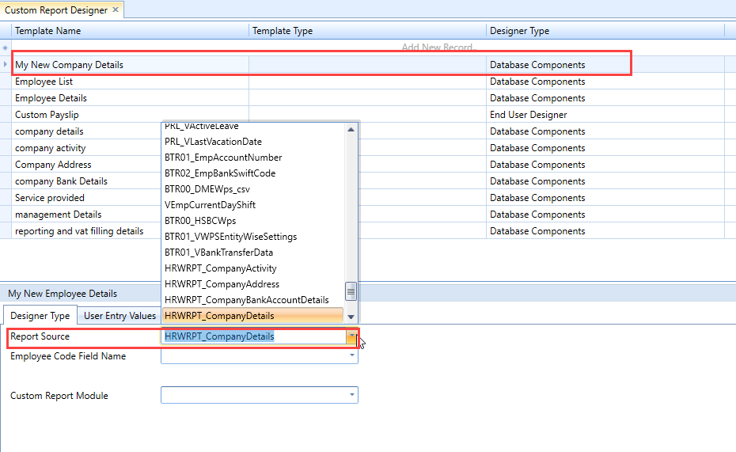

-   From the Custom Reports Module dropdown field, select the module in which you want to have the **Custom Reports** menu appear.

     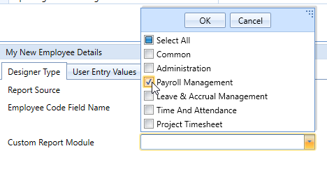

    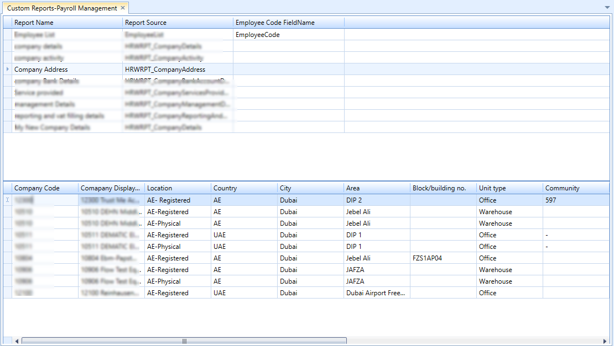

## Absent details in pay slip

### **Oct 2018 (#12250)**

For one of the clients, the interface period is set as *21st of previous month to 20th of current month* (see **Application Parameter >> TAM-1 >> Absent Leave Integration Period** parameter). The client requires that the reprocess records also be treated as absent. Changes have been implemented so that for whichever date the employee has reprocess (missing IN/ Out), those dates will be shown as absent in his/ her pays lip. The system will show the from date and to date of the days having reprocess as absence in employee's pay slip in its leave section.

## Salary Pay-out report

### July 2018 (#10489)

Added new report "Salary Pay --out"

The report is included in existing Payment Summary Report. It is done as an XML change. Data will be shown in two grids which can be printed in Excel document.

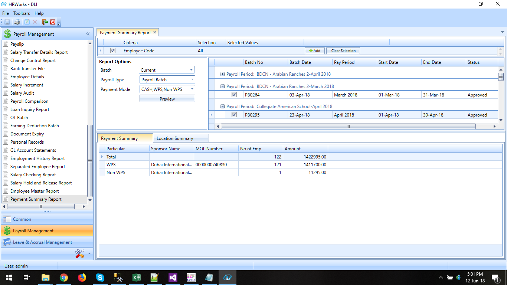

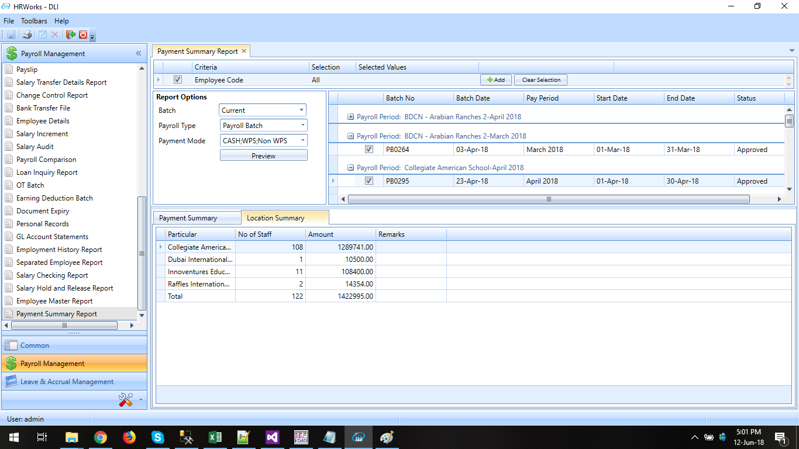

## Custom Separated Employee Report

### July 2018 (#10487)

New Custom report is added through Report Template Designer. Execute the xml in order to include this report.

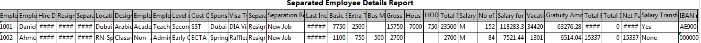

## Header/Footer data with/without column headers - WPS

### July 2018 (#10727)

Usually in case of reports like WPS, report format for Header-Footer were pre-defined and couldn't be changed. Now with this feature we can make changes using XML file.

## To implement Printable Version of Change Control Report

### July 2018 (#8259)

Added new **Change control report** Format.

In this format Company, Business Unit, Division and Department details (show only code) will show after the employee name column.

-   In Earning Deduction Batch, add New Column  Type to show the Pay Component type Earning or Deduction. Rename the Existing  Type field as  Component 

-   In Overtime Entry, please show the amount also

-   Please show the destination in Air Ticket Availment

All these requirements have been implemented in the report. Changes are done using XML and customized SP.

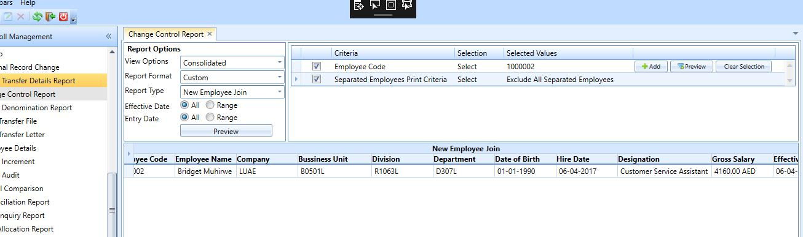

## Employee document for all companies in single report

### July 2018 (#10143)

Now we have an option to print the employee documents and company documents for all companies from the login company. Two customised SPs are used to show all Company document and Employee documents through the Custom Report Designer. On selecting the required SPs from the combo selection and by enabling respective menu Reports can be viewed.

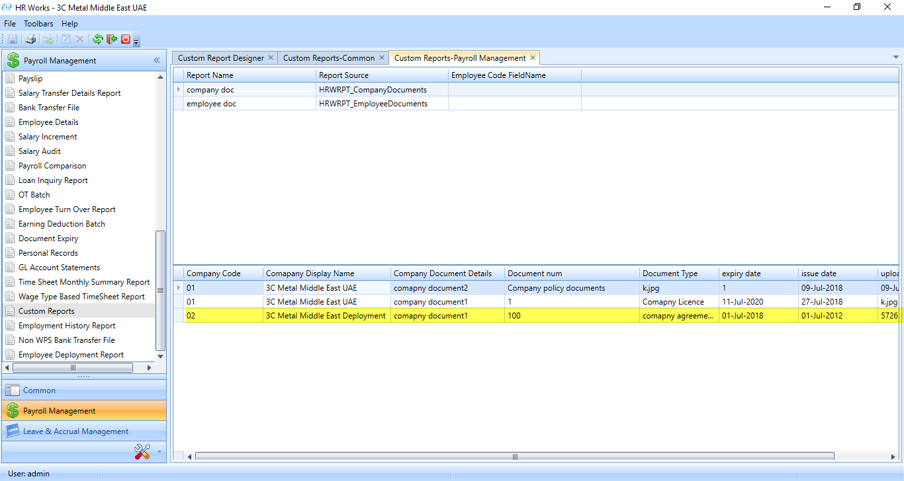

## Configurable separator for CSV and Text file formats

### July 2018 (#10726)

Usually in case of reports like WPS, the report format along with the separators used for differentiating items where pre-defined and couldn't be changed. But now, by implementing this feature, the separators can be configured for both csv and text file. This is done by executing xml.

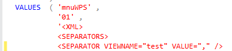

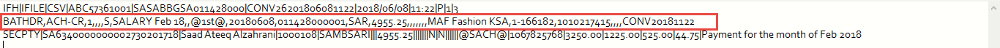

## Position Entity Codes to be added in column chooser

### July 2018 (#11032)

The requirement is to add Position Entity Codes in column chooser for the following reports:

- Salary Audit Report -- Variance
>
- Overtime Report
>
- Loan deduction List Report
>
- Indemnity Accrual Reports
>
- Air Ticket Accrual Report
>
- Vacation Accrual Report
>
- UDA Accrual Report

The feature is implemented in all of the above reports except salary audit report.

## To show the contents of remarks field of an Earning Deduction Batch in the Payroll Comparison report

### July 2018 (#10882)

Earlier in payroll comparison report comment field for earning deduction record it will display comment 'EarningDeduction.

Now it will show the actual remarks we have entered through Earning deduction screen.