# Payroll Management

## GL account statement in base currency

### Nov 2021- #23472

Client require the GL account statement reports to be generated in Base
currency of employee. Provision to generate in functional currency must
be maintained.

In order to implement the change, a new combo box was added.

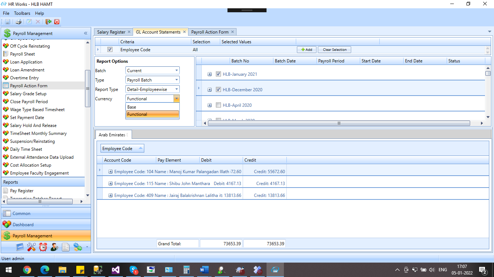

## Log fie writing while using the HRW screens

### Oct 2021- #23390

The client required to write log files while using the below screens and
make it as flag based.
1. Payroll Calculation
2. Wage type based time sheet
3. Salary Register
4. Payroll Action Form

In order to implement the change, execute a query.

When this key is set as true, logs will be written for each transaction.

## P9 form in HRWorks

### April 2021 -  #21914

P9 form was introduced in the HRWorks.

In order to implement the new feature, follow the steps below.

1.  Execute a query for enabling the menu.

2.  Execute an SQL file.

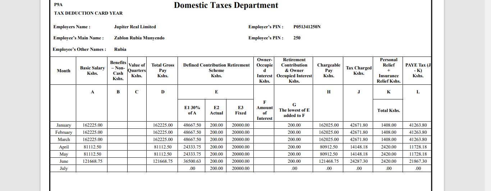

## Monthly incentive for Employee

### July 2021 -  #21935

The client required a provision to automate the current Incentive calculation in the Payroll module. The monthly incentive of each employee must be calculated based on the monthly target assigned to employee against total units completed.
Parameters for the incentive calculation is mentioned below which will be accepted at the employee level against each department.

1. Unit rate agreed with the employee

2. Daily target of an employee

3. Effective date

The following information will be entered by the HR on monthly basis,

1.  Total Units completed by the employee for the month

2. No of days worked

System calculates the Employee Incentive for the month after providing the inputs by using the logic below

Target for the month = No of days worked  Daily target\
Payable Incentive = (Total Units completed -- Target for the month)  Unit rate

Note: Unit rate agreed with the employee and Daily target of the employee will be updated once in a month with effective date. System will consider the latest value as per the effective date.

In order to implement the feature, follow the steps below:

Execute a script to enable the new Entry Types

Execute an SP

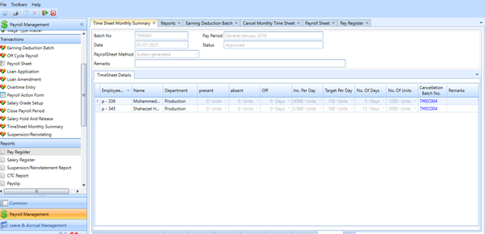

## Time sheet validation and creation with exception report

### Jan 2021 -  #20884

The client required to integrate the time sheet data from ERP to HRW. Moreover, the Timesheet data must be validated based on the Attendance in HRW before creating timesheet. An exception report was also required after completing the validation for the selected period.

In order to implement the feature, follow the steps below:

-   Execute the script to enable parameter, menu and value type.

-   Execute scripts to create payroll table and views.

-   Execute scripts to create company tables and views.

-   The parameter 'Default Time Sheet from TA' to be set as Yes to take attendance data.

-   The batch creation is implemented using DLIHRMail service.

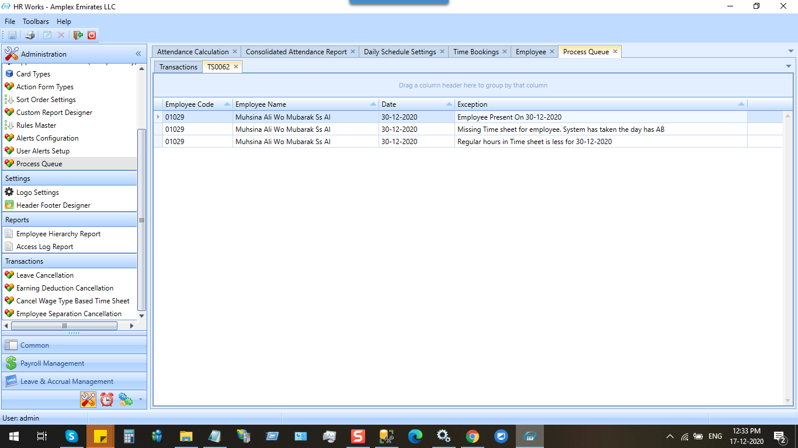

## Change in HRA Calculation

### Feb 2020 -  #17367

The client required some changes in the HRA calculation. The system has to pay full HRA amount to employee, who has worked on wage type and who at least worked one day in a month. HRA amount will be fixed for one month.

For example, consider that HRA for employee is 500 QAR.

If an employee worked on wage type for whole days in a month, the system has to pay 500 QAR as HRA. If an employee worked on wage type for 1 day (Remaining days as contract), the system has to pay 500 QAR as HRA.

In order to implement the change, set PayCodeID of HRA in custom SP and execute a query[.]{.underline}

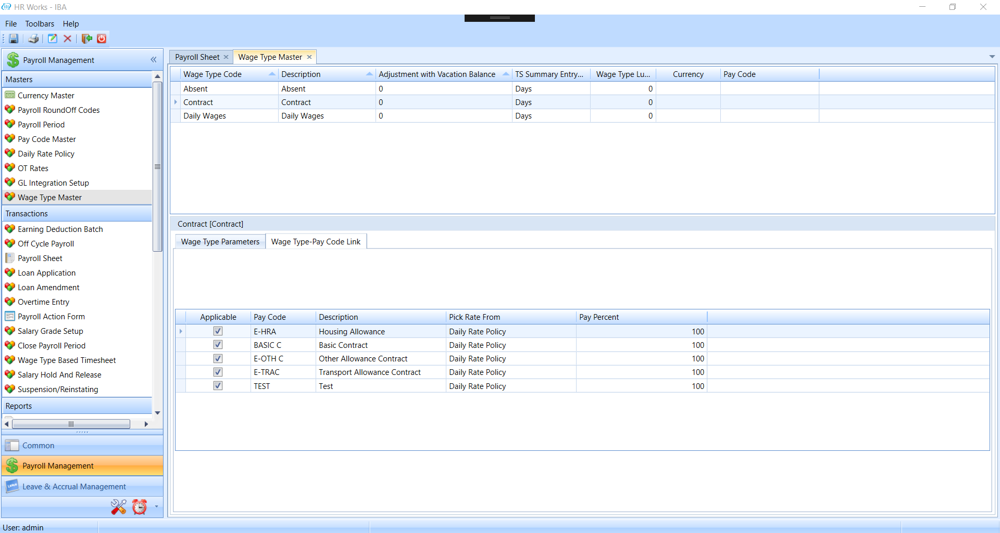

## Split Time sheet entry or Upload

### Feb 2020 -  #18184

The client required the provision for users to enter the Time sheet for only selected days or upload TS only for selected days in Wage type-based timesheet. An employee cannot have two batches with same date.

Execute a script to enable the parameter 'Monthly Wage Timesheet Entry' in TS-1 tab.

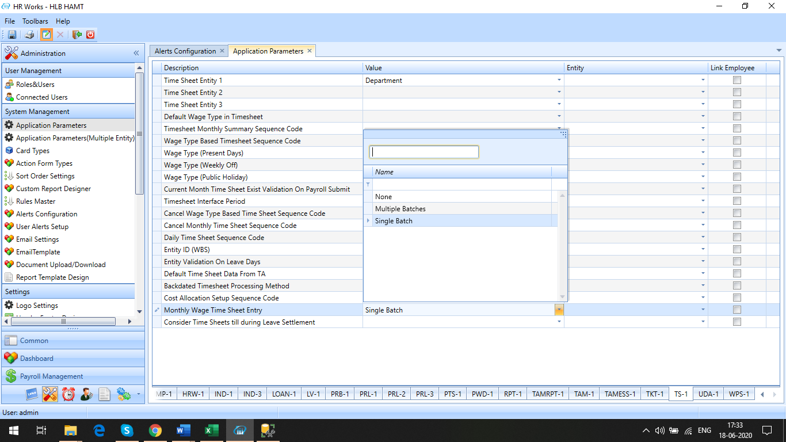

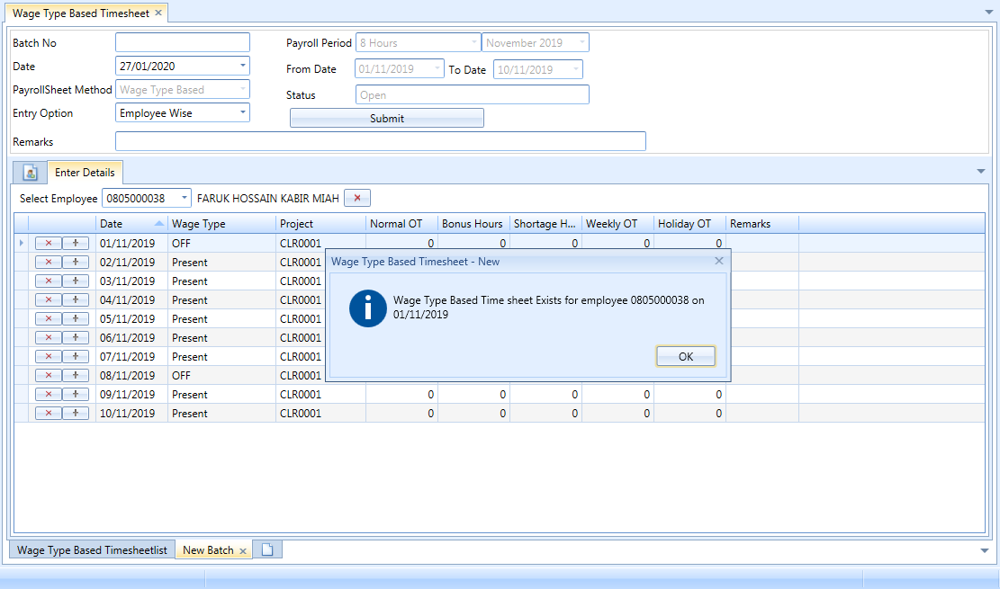

## Document upload option in the Earning deduction batch screen

### Jan 2020 -  #17530

The client required to upload documents along with Earning deduction batch entry. So an option was introduced to upload document while entering the earning deduction batch through the earning deduction batch screen. User can upload document by batch wise instead of employee wise. User will be able to view/ download each employee uploaded document via earning deduction batch report screen.

Execute a query to implement the change.

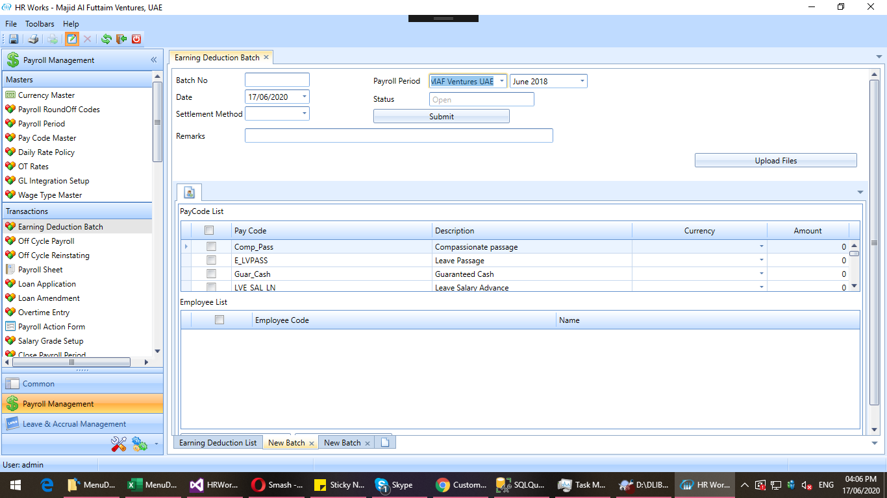

## Employee integration

### Nov 2019 -  #17355

Employee details needs to be integrated to the staging named  HRW_AXEMPLOYEE_STAGING when an employee is hired, Employee data is been updated and employee is been separated.

To implement the change, follow the steps below:

1.  Execute the SP for integrating project as per the requirements

2.  Execute two queries to add a column named termination date column and to increase the size of the sponsor company column.

## GL Integration to staging table

### Nov 2019 -  #16908

The client required to write GL entries to a staging table, using HRW standard screen and batch selection options. The features included in the screen are pointed below

-   Need to write CGS GL entries to a staging table, using HRW standard screen and batch selection options.

-   Need an option to see the status of batches, to see whether it has been interfaced or not (from the GL interface screen, against each batch)

-   While closing the payroll period, need to check whether all batches has been interfaced or not.

To implement the changes, follow the steps below.

1.  Execute two xml.

2.  Execute two SP

## Loan Eligibility Validation

### Nov 2019 -  #17190

The client required the below pinpointed validations for loans in HR Works and HR Works Plus.

-   Employee could apply for HRADV only for first 1 year from joining date. After 1 year employee will not be eligible.

-   Employees can apply only for one loan per year.

-   An employee is eligible to apply for salary advance only after one year

Execute the SP for implementing the change.

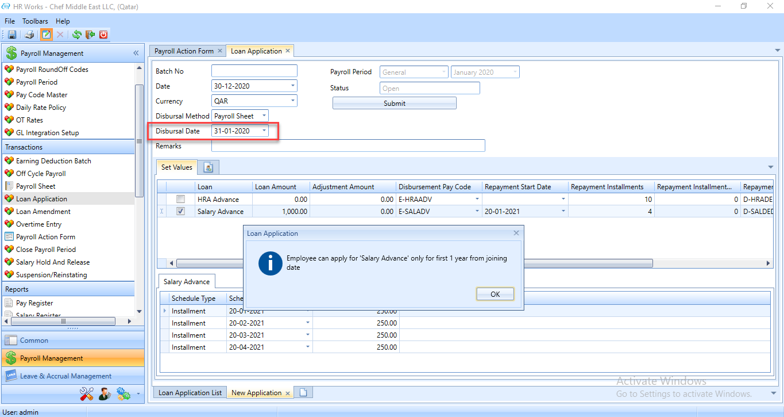

## Project Integration

### Nov 2019 -  #17356

New projects created in AX shall push the details into staging table  HRW_AXPROJECT_STAGING . Any new project update in the table needs to be updated to Project master in Position entity. Based on the company the data needs to be updated into respective company. Once the project is created in the company the status needs to be updated as  True .

To implement the change, follow the steps below:

1.  Execute the SP for integrating project as per the requirements

2.  Execute the query to add a column name identity column to the client db.

## Qatar WPS

### Nov 2019 -  #17270

The client required to generate the WPS file according to the bank code details.

To implement the change, follow the steps below:

1.  Execute three view templates.

2.  Execute xml file for bank transfer file.

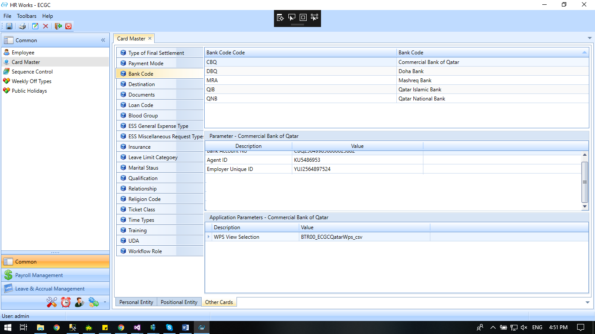

## Salary revision through Web service Utility

### Oct 2019 -  #13841

Currently if an employee has Basic, HRA and GOSI accrual Basis Amount then once there is a salary change coming from web services, then GOSI Accrual basis amount must be considered.

To implement the change, salary revision utility was changed.

Mention the pay code that must be considered in the salary revision in the XML file.

## To remove showing of separated employees from current payroll

### Aug 2019 -  #15860

A new feature to avoid listing of the employees in the monthly payroll sheet even if the employees are separated with a future date.

This feature is achieved through the introduction of a new parameter in the PRL-1 tab of application parameter with name 'Block Payrollsheet For Separated Employees'. Execute a query to enable the application parameter.

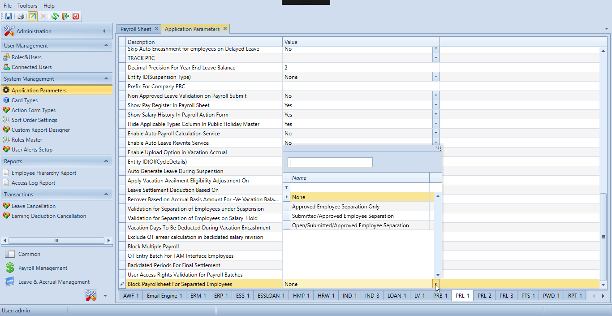

## Validation of Basic Pay with Deductions

### Aug 2019 -  #14705

In payroll calculation a new validation was introduced which validate the deduction of an employee's salary. The total deduction must not be more than 25% of the basic pay. If the deduction amount is more than 25% of basic pay including attendance related deductions like Absent, shortage etc then the system should generate an exception report of such employees.

For implementing this feature, the following steps were followed.

- Execute the script.

    A custom stored procedure was added to get validation. Validation limit is set in the customised stored procedure. Default action for the validation will be 'Do Not Process Payroll' with an option to 'Continue Processing Payroll' 

   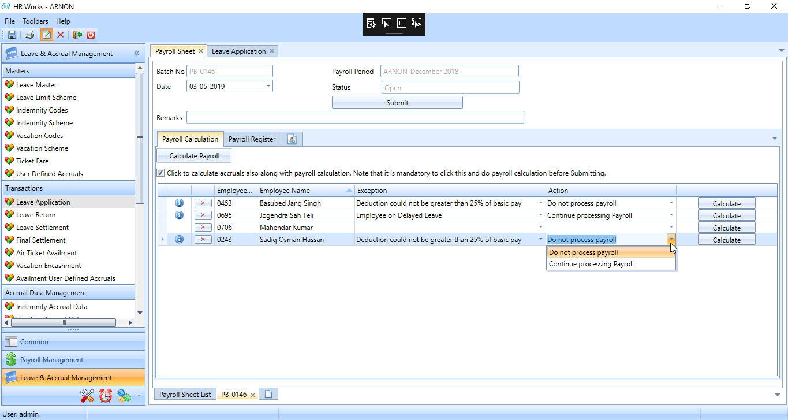

## Validation for TS on payroll process

### July 2019 -  # 15852

A new validation was added in the payroll processing. If daily time sheet of the employees is missing for any day, then the payroll for the employee must be in hold.

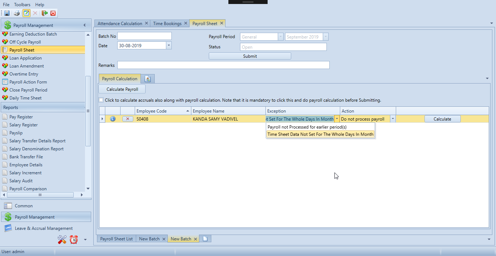

*Figure: Validation shown while processing payroll*

## Balance Compensatory Off need to payout during Final Settlement

### June 2019 -  # 14875

The client required to payout the balance compensatory off to the employee when an employee resign. Following steps are executed to implement this.

In Application Parameter, LV-1 Tab, a new parameter named "Compensatory Settlement Paycode" was introduced.

Execute a script to enable the parameter.

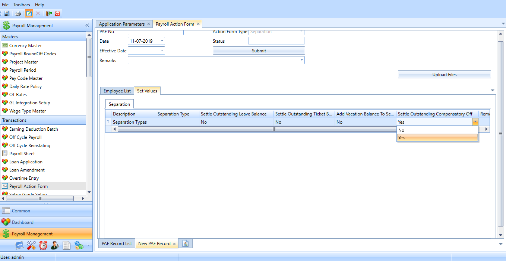

*Fig: PAF Screen showing Settle Outstanding Compensatory Off during separation*

## Loan Amount limit based on employee service

### May 2019 -  # 14551

The client required to add a validation message in the Loan Application screen to limit the loan amount based on the service period of the employees.

Execute an SP and set the Entity ID for bringing the validation message in the Loan Application Screen.

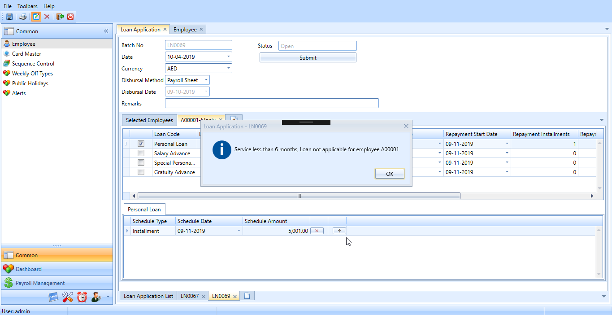

*Fig: Loan Application Screen showing the validation message*

## Approved OT to Pay through Off cycle Payroll

### May 2019 -  # 14550

Initially OT payments were processed through the monthly payroll sheet. Now the client required to approve the OT payments through the Off cycle Payroll.

For this a new parameter was introduced in the Application Parameter, named 'OT Integration From ESS' in the ESSTS-1 tab in the HRW + Application Parameters. The value of the Parameter must be set as 'OT Entry (Off cycle)'.

Execute a query for enabling the Application Parameter.

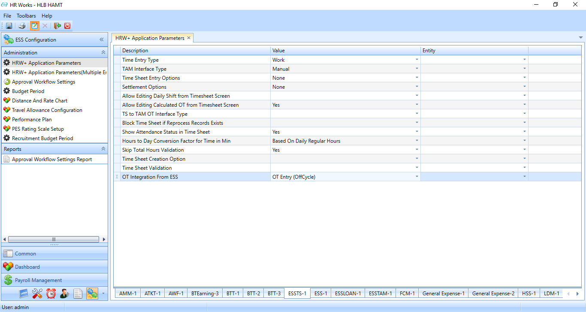

*Figure: HRW + Application Parameter Screen*

## Option to restrict payroll period visibility in the final settlement screen

### May 2019 -  # 14880

Currently in the Final Settlement Screen, pay period combo box list all the pay period starting from the system. The client required to restrict the visibility of the payroll period in the Final Settlement Screen.

For this a new parameter called 'Backdated Periods For Final Settlement' was introduced in the PRL-1 tab in the Application Parameter.

This restrict the payroll period visibility based on a flag in the system. By default, it lists all the pay periods Or else the payroll visibility will be based on the number set in the Application Parameter.

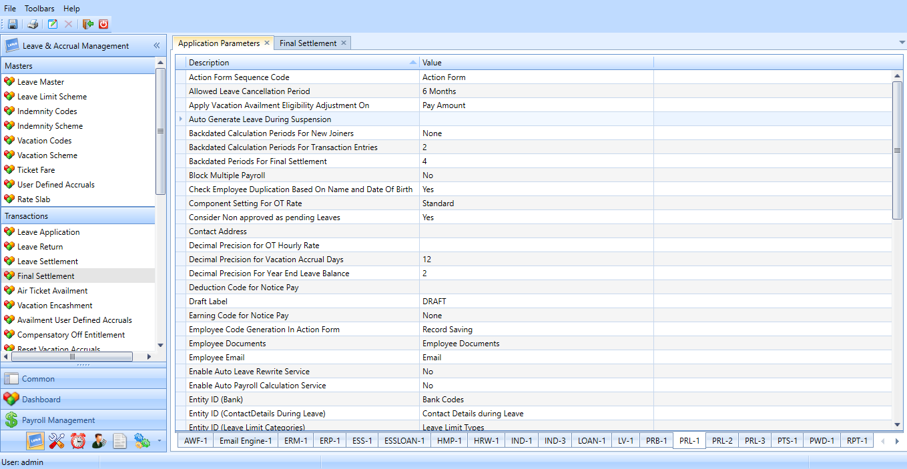

## Option to correct Attendance data from Payroll Module

### April -2019 -  #14605

In HR Works payroll module, the details regarding the attendance such as overtime hours, shortage hours etc was not able to edit and the information from the attendance module was considered. Hence the client required to add a feature which enables to edit the attendance data if required from the payroll module and thus to calculate the payroll accurately.

In order to achieve this, a new parameter is added in the PRL-1 Tab named OT Entry Batch for TAM Interface Employees.

The new parameter contains three options which are

1. Do not Allow - OT from Overtime Entry Batch will not be considered in payroll calculation.

2. Add OT Batch OT to TAM OT - OT from Overtime Entry Batch will be added to OT from attendance data.

3. Override TAM OT with OT Batch OT - OT from attendance will not be considered if OT entry exist in Overtime entry batch.

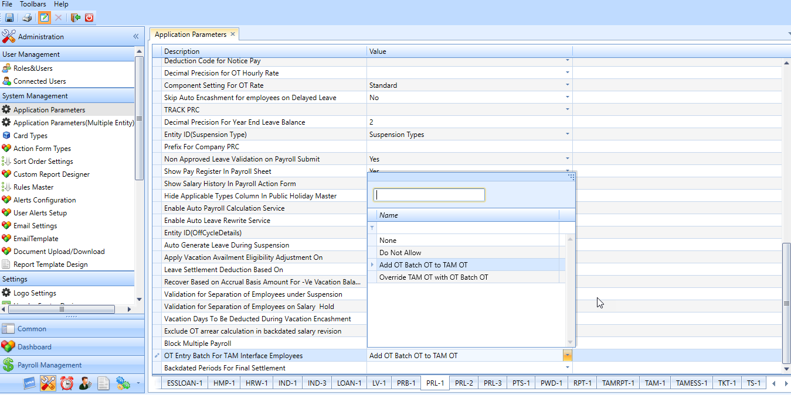

*Fig: Application Parameter settings for Attendance correction from Payroll Module*

## Separation of employees without salary information

### Mar 2019 -  # 14441

Some of the clients want to separate the employees without completing the Payroll process and Final Settlement. In such cases Termination Date is updated at the time of employee separation approval.

In order to implement this, following changes are made.

In Application Parameter, in HRW-1 tab, a new value named "Set Separation Date in Employee Master" was introduced with two options such as approval of Final Settlement and On Separation Action Form Approval if no Payroll Sheet exists for Employee.

While selecting On Separation Action Form Approval if no Payroll Sheet exists for Employee from the Application Parameter, it will check whether the employees in the employee separation Batch already have a payroll sheet and if not, it will update the Termination date or else will work as usual as the final settlement.

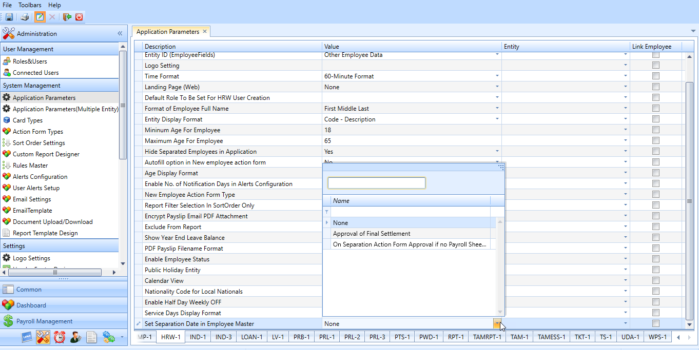

*Fig: Application Parameter Settings*

## OT Report Template

### March-2019 -  # 13897

An OT report was required for the client in the Wage type Based Timesheet report screen.

For these two additional options was added in the Summary options in the Wage Type screen named as OT Sheet and OT Summary.

For this execute a script for getting the OT options.

Only one could be selected from OT Sheet and OT Summary at once during a specific month.

The OT Sheet report will show the complete OT Data during the selected month with displaying the data of each day, whereas OT Summary shows the summarised data of the OT details.

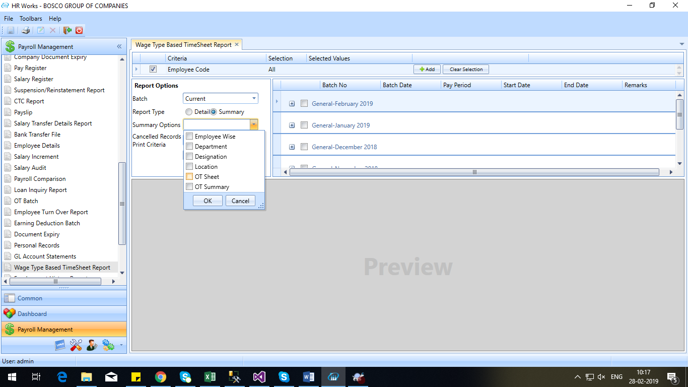

Fig: Wage Type Based Timesheet report

## Customization on Salary Hold and Release

### Feb 2019 -  # 11755

In Salary Hold and Release, initially the total salary of an employee was hold till the month where the release hold is applied. It was not able to hold a Lumpsum amount or percentage of the employee salary for a particular month.

The client needed the following changes in the Salary Hold and Release.

1.  To hold the Lumpsum amount or Percentage of Net amount of the salary of a particular month.

2.  To release the amount either through monthly payroll or off cycle payroll.

- **In order to implement this, following changes are made.**

1.  In the **Salary Hold and Release** screen, a new option to select the Hold period is added.

2.  A query is executed in the DB.

    - **Salary Hold:**

        * While selecting the Batch Type as Hold Salary, a new check box and Hold period is displayed.

        * For Holding the salary for a particular period. Click the check box and enter the hold period.

    - **Salary Release:**
        * While selecting the Batch Type as Release Hold, a new option to select the Release method will be displayed.

        * Select either Normal Payroll or Off cycle Payroll as the Release method.

    - Further, release the batches, through Off cycle payroll, if the payment option is Off cycle. Or else process the settlement through normal Payroll sheet.

        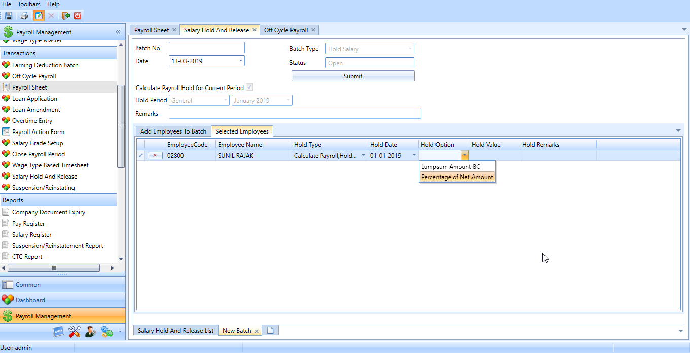

        *Figure: Salary Hold in Salary Hold and Release*

## Upload option in Cost Allocation Setup

### Oct 2018 (#11912)

Cost Allocation transaction did not have **Upload data from Excel** option. This option has been added to the cost allocation transaction screen with the following features.

-   Generate Excel Template: As with other transactions with Excel upload option, cost allocation transaction also requires that an excel template be generated into which users can add cost allocation details of employees and then upload it. The generated excel template will have separate columns for every project so that the users can enter project-wise cost allocation data. Note that Project is one of the positional entities in the client DB.

-   Upload from Excel: Users can enter employee's cost allocation details into the generated excel template and then upload it to proceed with rest of the transaction process.

## Loan Repayment Installments Amount Deduction during Leave Settlement

### July 2018 (#10375)

Usually, when an employee goes for leave, his loan repayment amount for leave start month is only deducted while processing leave settlement. But now, with this new feature, the loan repayment amount can be deducted for not only the leave start month but also for leave end month as per settings done in Application Parameter. Furthermore, there is an additional functionality where if the days in next month falls less than 15 days, then the deduction is not taken.

In order to achieve this functionality, a new parameter **Loan Installment Deductions in Leave Settlement** is added in the **Application Parameter- LOAN-1** tab. It consists of three options as:

<table class="TFtable" border="1">
  <tr>
       <th>Sl No.</th>
       <th>Parameter</th>
        <th>Description</th>
     </tr>
   <tr>
      <td>
         

      </td>
      <td>
         
Loan Deductions till Payroll End Date of Leave Start Date 

      </td>
      <td>
         
By default, the parameter is set to ‘Loan Deductions till Payroll End Date of Leave Start Date’. Loan deduction in leave settlement works as normal in this case.

         

         
For instance, if an employee is going for leave from May 15th to June 15th, then if this parameter is set, then the loan repayment amount for the month of May only is deducted.

         

      </td>
   </tr>
   <tr>
      <td>
         

      </td>
      <td>
         
Loan Deductions till Payroll End Date of Leave To Date

      </td>
      <td>
         
Loan amount is deducted till the payroll end date of the ‘Leave to date’ month.

         

         
For instance, if an employee is going for leave from May 15th to June 15th, then if this parameter is set, then the loan repayment amount for the month of May and June is deducted.

         

      </td>
   </tr>
   <tr>
      <td>
         

      </td>
      <td>
         
Loan Deductions till Payroll End Date of Leave To Date (Cutoff 15th)

      </td>
      <td>
         
Loan amount is deducted till the payroll end date month of the Leave to date only if the settlement to date falls after 15th day of the Leave to date. 

         

         
In this case, if the ‘Leave to date’ falls within 15th date of the next month, loan amount is deducted only for previous month.

         

         
For instance, if an employee is going for leave from May 15th to June 15th, then if this parameter is set, then the loan repayment amount for the month of May will be deducted and if the leave to date falls below 15th of next month, then the amount is not deducted for the month of June.

      </td>
   </tr>
</table>

The deducting of loan repayment amount while performing leave settlement will be done on the basis of the value assigned for this parameter.
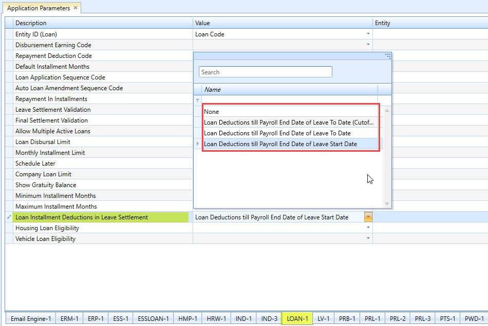