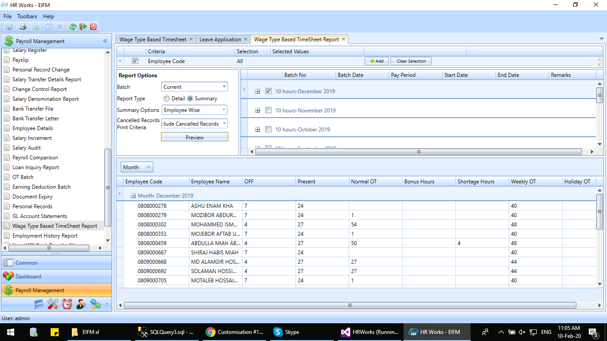
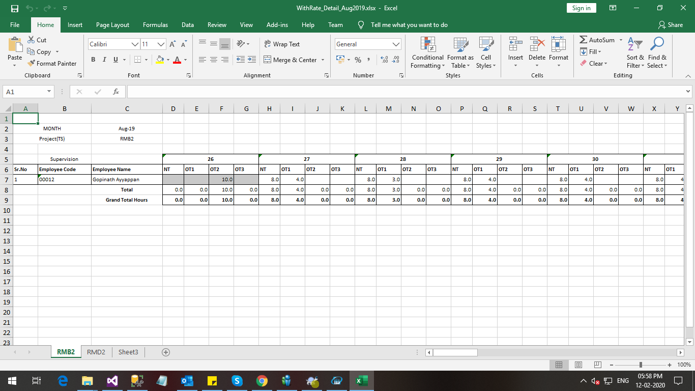
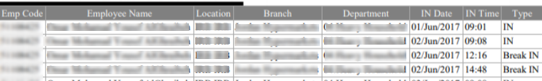

# TAM Reports

## OT Upload Report

### Jan 2021 -  # 19523

The client required an OT upload report in excel format that displays Total OT hours, Break up of total OT hours (Normal OT, weekend OT, and Holiday OT) and Approved OT hours. Further, the option to select From and To date must also be included. This report is to be uploaded in the customer s ERP system, so each column should be separate - no merged columns are allowed.

In order to implement the change

-   Execute the xml.

-   set ExportFriendlyPrinting option as true in Appconfig.

## Additional Column in Period Summary Report

### Feb 2020 -  # 18554

The client required to add a new column in the period summary report named period shortage which displays the difference between the required hours and total worked hours.

## Shift Details Report

### Jan 2020 -  # 17203

The client needs to develop a new report in HR Worksto show employees  shift details.

To implement the report, follow the steps below.

1.  Execute a view file.

2.  Execute an SP.

3.  Execute queries to enable the Custom Report Designer and Custom Report Menu.

## Missing Time sheet report

### Dec 2019 -  # 17786

The client required to add the following in the Missing Time sheet report

-   Add employee name in Missing TS summary report Employee wise.

-   Add position entity details in Missing Time sheet report summary (employee wise) and detail report.

     

## Displayed Break Duration in Attendance Report

### Dec 2019 -  # 17818

The client required to display the break duration defined in the shift codes in Consolidated Attendance Report.

In order to implement the change, execute the report template XML.

## Changes in the Attendance detail report

### Nov 2019 -  # 17623

The client required a selection option in the report screen for printing the report with break or without break. Earlier, it was possible to print the reports with break only.

In order to implement the change, execute new custom report.

## Early & Late Arrival Reports with filter option in HR Worksand HR Works Plus

### Nov 2019 -  # 16720

The client requires EARLY & Late Arrival reports with the option to filter by hours such as more than 10 minutes late, etc.

To implement the changes, follow the steps below.

1.  Execute an xml to enable the functionality.

2.  Execute the report template XML

3.  Execute two scripts for enabling the filter option.

## Time sheet report with rate

### Nov 2019 -  # 16252

The client requires to generate Time sheet report for a month based on the uploaded data.
The report will be generated Project wise and hourly rate category wise. The rate will be calculated based on the Cost centre and hourly rate category of employee.

For labour supply employee the same format will be generated where the rate will be calculated based on labour supplier and category of the employee. The report will be generated Labour supply wise.

Execute an REPX to implement the changes.

## Changes in Hourly rate allocation report

### Dec 2019 -  # 17631

The client required the below changes in the

-   Amount to be shown with coma separator.

-   Amount, rate and Hours to be formatted to number when exporting to Excel.

-   Add Report heading as  Hourly Rate Salary Allocation- MMMMM YYYY .

-   Hours and Amount sum total to be shown for each Cost centre.

-   Hours and Amount sum total to be shown for each Account.

To implement the changes, follow the steps below.

1.  Execute a report template query

2.  Execute a xml

3.  Execute two query for Hys_appParamData

## Changes in Time sheet report without rate

### Dec 2019 -  # 17630

The client required to make some changes on the time sheet report without rate which are mentioned below.

-   Add subtotal for each table.

-   Reduce the font size of tables to  8 .

-   Off days and Public holidays must be marked in Grey shade.

-   Add total no of employee in each category i.e. against the head of STAFF shown the no of employees in staff with label  No of employee= 

-   If employee does not have any data for a particular cost center, then employee need not to be shown in the project

Execute a script to implement the changes.

## Changes in Time sheet Report with rate

### Dec 2019 -  # 17629

The client required to make some changes on the time sheet report with rate which are mentioned below.

-   Add subtotal for each table.

-   Reduce the font size of tables to  8 .

-   Off days and Public holidays must be marked in Grey shade.

-   Add rate column before Cost column which is used for cost calculation.

-   If employee does not have any data for a particular project, then employee need not to be shown in the project

Execute a script to implement the changes.

## Change in Excess Hours Calculation For Strict Shift Timing

### Dec 2019 -  # 17526

The client required to change the Excess hours  calculation similar to OT computation for policies having strict shift timing. However, the Minimum required OT parameter for computing the hour was not considered.

To implement the changes, follow the steps below.

1.  Execute the custom SP to calculate Excess hours similar to OT computation for policies having strict shift timing.

2.  Execute the changed report template to display the excess hours.

## Audit Report for OT Pre Approval

### Dec 2019 -  # 16784

The client required an audit report for OT Pre Approval to identify which user had uploaded the data into the application.

Execute a query to enable the report and thus to implement the change.

## Attendance Related Violation Report-Department Wise

### Nov 2019 -  # 16367

The client requires new attendance report which lists the department wise attendance violation and overtime.

To implement the change, follow the steps below:

1.  Execute the Report Template script.

2.  Execute the script to identify Department in Consolidated Attendance Report

## Time sheet report without rate

### Nov 2019 -  # 16253

Client require to generate Time sheet report for a selected month on the basis of Cost centre wise, employee category wise (Staff/labour) and Labour supply wise. In this report rate and cost details must not be included. If employee have worked on multiple project then employee must be listed in multiple lines.

To implement the change, follow the steps below:

1.  Execute the Report Template script.

2.  Execute the XML to show multiple project for single day.

## Email Template for Attendance Report-OT Hours

### Oct 2019 -  # 16469

The client wants to send a particular format of report as an email attachment. The attachment must be sent to the managers/HR with the data of their respective subordinates.

To implement the change, follow the steps below:

1.  Execute a REPX for Attendance Violation Report - OT Hours

2.  Execute a script for creating/importing Custom Report in Custom Report Designer

## Email Template For Attendance Violation Report-Late Arrival

### Oct 2019 -  # 16468

The client wants to send a particular report format as the email attachment. The attachment must be sent to the managers/HR with the data of their respective subordinates.

To implement the change, follow the steps below:

1.  Execute a REPX

2.  Execute an XML for email settings

3.  Execute another XML

## Break Permission Duration and Machine ID in Consolidated Attendance Report

### Sep 2019 -  # 16366

The client required a new column in the Consolidated Attendance Report to list the break duration of the employee. Moreover, the Machine ID of the Time In and Out Transaction is also displayed in the reports.

Execute a xml file to implement the change.

## Non-Attendance Booking Report with Total Hours

### Aug 2019 -  # 15488

The client required a new column in the non-attendance booking report displaying the total hours. This can be used for tracking the hours worked by the employees.

For implementing this change,

1.  Execute a xml to add report template for non-attendance booking report.

2.  Execute xml to set category for the report.

## Upload Option in Daily Time sheet

### Aug 2019 -  # 16194

The client required an option to upload the time sheet entities such as Project, Sub project and Team through Excel file.

For this, the time sheet entities must be linked as Time Sheet entity in TS-1 tab of the Application Parameter.

## Day Wise OT Payable Report

### July 2019-   #15038

The client required a report that list the OT payable amount for each day. For this, a new grid was introduced in the OT Calculation Report Screen.

For implementing the change, execute a XML for enabling the Day Wise OT Payable Report.

## Total OT Payable Report

### July 2019-   #15039

The client required a report that list the total payable OT amount. Hence, in the Period Summary Report new columns named OT Amount, Total OT Amount and Basic salary was added.

For implementing the change, follow the steps below:

Execute the Report Template to enable the Total OT Payable report.

## List Terminal Information in Attendance Reports

### March-2019-   #14431

The client needed to list the terminal Information in the Attendance Reports.

In order to implement this, the following steps were followed.

For displaying the terminal information in the Consolidated Attendance Report, four additional field were added named as MachineID_IN, MachineID_OU, MachineID_IN_2, MachineID_OU_2 in the xml template. The header named could be changed according to the need of the clients. Moreover, the IN terminals and OUT Terminal details were introduced in the report.

Created new XML ConsolidatedRPTTemplate  Report template for showing  terminal information .

*Fig: Consolidated Attendance Report with Terminal Information*

## List OT Payable Hours in Attendance Reports

### March 2019-   #14430

The attendance report does not list the details of the OT payable hours. The client required to display the details of the OT Payable hours in the Attendance Reports.

The changes are made as follows.

Updated XML  ConsolidatedRPTTemplate  Report template for showing   OT Payable hours 

*Fig: Consolidated Attendance Report showing OT details*

## Break Permission Report

### Dec 2018 - #12814

As per the client's requirement, a new report (Break Permission Report) is added to the **Reports** section of the Time and Attendance Management module. In this report, users can view the following:

-   break details which are entered through the Employee Break permissions transaction in HR Works

-   break permissions requests made through View Calendar transaction in HRW Web.

The following steps need to be followed to implement this report.

A query is provided, which when executed in the HRW database, will enable the creation of a break permission report template on the **Report Template Design** screen. Once you create the Break Permission Report, it will appear in the **Reports** section of **Time and Attendance** module.

## Periodic Summary Report for Emailing

### Dec 2018 - #12896

The client wants the same periodic summary report in excel format in HR Works to be sent over email as an alert which will be generated monthly from the system.

Changes done by executing scripts (xml).

## Email Template for Attendance Exception

### Dec 2018 - #13178

Client requires that all exceptions for the previous week to be send as attendance exception email alert. Changes based on XML and repx file need to be imported.

## New Time Card report for Jordan Company

### Nov 2018 - #12886

The Time Card report in HR Works web used to show employee name and code together in row and beneath that the time card details of the employees as shown below.

It also did not show Branch, Location, and Department, which are positional entities in the client's DB. As per the client's requirement, changes have been made so that the report now displays employee code and name in separate columns. The report also displays the Branch, Location, and Department of employees in the respective column. The image below represents the Time card report as it is displayed after the changes:

The aforementioned changes to the report was made through the report template in HR Works.

## Break Details in Consolidated Attendance Report

### Nov 2018 - #12562

The Consolidated attendance report in HR Works did not show the Break details such as (Break IN Time, Break OUT Time, and Break hours. As per the client's requirement the report now displays these details. If the employee has multiple breaks for a given day, the report will show those details as well.

The aforementioned changes to the report was made through the report template in HR Works.

## New format for consolidated attendance Report emailing

### July 2018 (#9514)

New Consolidated Attendance Report for Email reporting which includes split shift.

## New Timesheet Report Format

### August 2018 (#10740)

Added new timesheet report as shown below,

-   The report will be generated in excel format in the system as per the required format.

-   Shift - this row will show the employees assigned shift codes and Off Day code "O" for the date, if any leaves are present then leave code will be shown as well.

-   Working Hours- this row will show the regular shift hours for the specific shift.

-   Late Hours -this row will show the late arrival or early departure hours Late arrival + Early departure (i.e. Total deduction) for the date.

-   If the employee has any approved break permission for the date, then that approved hours is not considered as late IN or early OUT.

-   OTH - this row will show the pre- approved overtime hours matched with extra hours worked in the TAS for the date. If there is no pre- approval for the day, employee have overtime, but it is not shown here.

-   Total (OT) Single- this column will show the total normal day OT hours for the month.

-   Total (OT) Double- this column will show the total of weekend day OT hours & Holiday OT hours for the month.

-   Total (Late Hours) -- this column for total late hours. (Late coming + early out).

-   There are no headers like month, department, section etc. Month and year are shown as per the format. E.g.: Jan-18

-   Excel file name will be defined as Month and Year (MMYYYY).

-   Contains only one common header for all employees like Emp. No, Name, Type, Period, Total (OT) Single, Total (OT) Double, Total (Late Hours) etc.

-   The requirements are incorporated as XML change.

## Report for meal eligibility

### July 2018 (#9388)

New report for the eligible meals for the employees. Currently we are defining the meal eligibility and visitor meal eligibility in personal records screen of each employee. This eligibility needs to be shown in the report for each day.

The report is implemented in the following manner:

-   Created New Report (Meal Eligibility Report) in TAM Reports module.

-   To select Date range, it contains the **from date** button and the **To Date** button.

-   Order of Grid column headers (**Break Fast, Lunch, and Dinner**) based on order from the Card Master screen (**Other Cards -\- Meal Types**).

**Case 1**: If Employee (Employee code = 13404) has Meal Eligibility -- **Meal combinations (BF -- LN - DN)**, and for the same day he has Visitor Meal Eligibility **(Meal type -- Break Fast, Number of Visitor Meal =4)** then, Report shows **Breakfast -4, Lunch -1, Dinner -1**

-   Visitor Meal Eligibility is displayed only when **Visitor Card** is set as **Yes**.