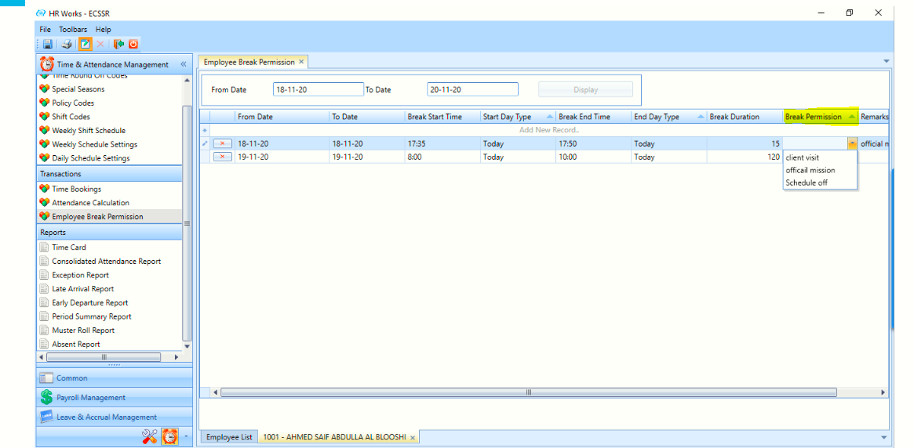
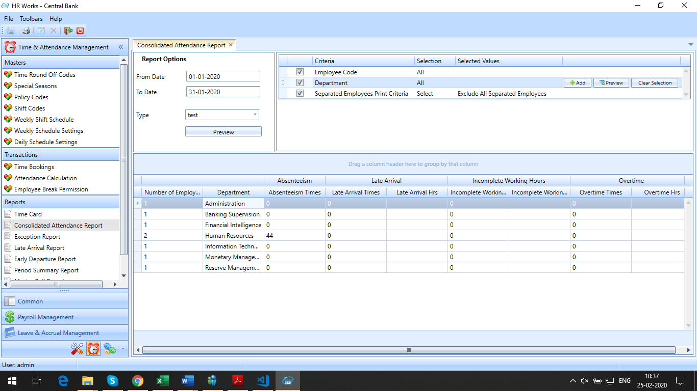

# Time and Attendance Module

## Customisation in Employee Break Permission

### Jan 2021 -  # 20655

The client required some customisation in the Employee Break Permission screen which are explained below.

The client required to select the option for reason in the Employee Break permission screen through a dropdown. The options for reasons must be able to populate from the master screen of the application. Moreover, the user must be able to add, edit, search and set the sort order for the Reasons in Master.

Consider an employee working under 8:00 AM to 05:00 PM shift having Break permission from 10.00 AM to 12.00 PM.

-   In case the employee exits the site at 10.00 AM and if the report is generated at 11:00 AM, it should reflect that the employee is on break permission on the Status column.

-   If employees use break permission, the corresponding permission type should be reflected in the status. (E.g.: Official mission, personal sick, schedule off, etc.)

-   And when the employee reenters the site after permission at 12.00PM and the report status message shall change from break permission options to "Swiped In" or "Present".

-   Similarly the below scenario must also be considered.

-   If the employee has permission from 10 AM to 12 PM.
    • Employee left at 9:45 and came back at 12: OK\
    • 9:45 AM and 12:15 PM: Not OK\
    • 10:00 AM and 12:15 PM: OK

In order to implement the change, follow the steps below:

-   Execute the Report Template and Custom xml.

-   Execute query for enabling parameter  EntityID (Reason Code) in Break Permission. Set Application parameters 'EntityID (Reason Code) in Break Permission'

## Automatic Email Notification from HRWorks

### July 2021 -  # 21149

The client required to send a notification to HR team if an employee is absent for 20 days (Not Continues) without any notification within a contract period. The automatic mail must be generated after 20^th^ absent day.

In order to implement the feature, follow the steps below.

1.  A new Email Setting for Previous Day Attendance Exception emailing must be created.

2.  Set Exception Exceeding Days as 19 (generates email when exception exceeds 19 days. ie. 20 days)

3.  Two parameters must be added in User Defined tab to identify From Date and To Date which should be provided for each employee.

4.  Execute the xml after providing the following values

-   EmailTypeId of newly created Email Setting from HRW_EmailTypes table

-   FORMAT Continuous - Exception email generated only if exceptions occur for given number of days consecutively in the given period.

-   Non Continuous - Exception email generated if exceptions occur for given number of days in the given period.

-   EXTENDED:
    * TRUE - To generate email when given number of exception days is exact or greater in the given period.
    * FALSE - To generate email when given number of exception days exactly matches the exception days in the given period.
    

## Option To Upload Weekly Shift Schedule

### Feb 2020 -  # 18113

The client required an option in the Weekly schedule setting to upload the shift schedule against an employee or an entity with an effective date.

## Option for uploading documents while entering overtime

### Jan 2020 -  # 17531

The client required to upload documents along with Overtime batch entry. Therefore, required an option to upload document while entering Overtime through overtime entry screen. Further the user required to view/ download each employee uploaded document via OT batch report screen.

To implement the changes, execute a query.

### 

## Converting holiday to absent day if the previous day is an absent day

### Dec 2019 -  # 17823

The client required to consider holiday as absent, when the employee is absent on the previous day of a holiday.

## Changes in Time sheet format for EIFM

### Nov 2019 -  # 17097

The client required to revise the timesheet format for EIFM. In the earlier period, the project was taken from the sheet name inserted in the excel file. Now, in the proposed change, the project is added as an additional column in timesheet. Employee working in different project will have multiple lines and data in the days column will be validated as per the project transfer details similar to old format.

To implement the change new column for project was introduced.

## Shortage on Reprocess Day

### Oct 2019 -  # 16377

The client required to display the shortage in the reports, if an employee has an attendance exception i.e. missing In or Out.

 Consider Reprocess in Attendance Calculation As . Options shall be Absent/Shortage. If this Parameter is set as Shortage, hide Calculate Total Hours option in policy code and total hours shall not be calculated in this scenario.

## Attendance Related Violation Report-Employee Wise

### Oct 2019 -  # 16368

The client required a new attendance report which lists the Employee wise attendance violation and Overtime.

To implement the change, execute a Report Template script.

## Hourly Rate allocation report

### Oct 2019- #  16250

The client required hourly rate allocation report to be generated from the system for the selected period batch. The report will be generated Cost centre wise, hourly rate category wise and project wise. The report must consist of the following fields

-   Cost Centre (Position Entity)

-   Hourly rate Category (Position Entity)

-   Account no (Cost centre and hourly rate will have an account no.)

-   Project (From Time sheet)

-   Sum of Hours (Total hours worked by employees in the specific Cost centre and hourly rate category for the project. This total hour includes the OT hours.)

-   Rate (Rate shall be defined for each Cost Centre and hourly rate category. This rate shall be shown here.)

-   Sum of Amount (Sum of Hours\*Rate)

To implement the change, follow the steps below:

1.  Execute an XML

2.  Execute a query

3.  Execute a report template query

4.  Set multiple application Parameter for  Timesheet Rate  in RPT-1 Tab based on cost centre and Hourly Rate

## Department Head Attendance Detail Report

### Oct 2019 -  # 16471

The client required a new attendance report which lists the Department Heads day-wise Attendance data.

To implement the change, follow the steps below.

1.  Execute a report template XML.

2.  Execute an XML for department head wise filtering.

3.  Execute a script for active employee filter.

## Department Head Attendance Summary Report

### Oct 2019 -  # 16470

The client required a new attendance report which lists the Department Heads Attendance Summary.

To implement the change, follow the steps below.

1.  Execute a report template XML.

2.  Execute an XML for department head wise filtering.

3.  Execute a script for active employee filter.

## Display Break Permission Remarks in Attendance Report

### Sep 2019 -  # 16437

The client required a new column in the Consolidated Attendance Report to view the remarks updated during the break permission submission. The user enters the break permissions data from Employee Break Permission screen in HRWorks.

Execute an XML file of report template to implement the changes.

## Customization in Weekly Schedule setting screen

### Aug 2019 -  # 15190

The client required the following changes in the employee wise weekly schedule settings screen,

1.  Introduce a new column in the main grid for displaying IQama ID from the Personal Records.

2.  Selected entities using the  show filter should show in the main grid

For implementing this change,

1.  Execute the query to enable the show filter

2.  Execute the view.

3.  Execute the xml to show to show the entityid and the Header description of Grid column.

## Adjust Shortage hours with Over Time during Payroll calculation

### July 2019-   #15108

A new functionality for adjusting the shortage hours with the overtime is introduced in HR Works. Shortage hours is adjusted from overtime hours in an order of Holiday OT, Off day OT and Normal OT during payroll calculation and the remaining OT hours only will be paid. Further, this functionality must be linked on Department level.

Changes based on customized SP.

## New Report - Attendance Summary Report in HR Works

### July 2019-   #15424

The client required to create the Attendance Summary Report in a new format.

For implementing the changes on the Attendance Summary Report, follow the steps below:

1.  Execute a query for enabling the menu.

2.  Import REPX in the Custom Report Designer.

    
    Figure: Attendance Summary Report

## Absent Report Emailing

### May 2019-   #14615

The client required to send the Absent Summary Report via email to the supervisors and HR.

For this, Run the script for custom report designer.

Run the script for email settings.

Run the script for identifying the Entity Types.

Import the REPX file for the report.

*Figure: Absent Report Generated*

## List Refreshment Allowance in Consolidated attendance Report

### March-2019 -  # 13346

The client required to view the details of the refreshment allowance of the employees in the Consolidated Attendance report which was not included in the report.

- Created new XML ConsolidatedRPTTemplate  Report template for showing   Refreshment allowance .

    
>
    Consolidated Attendance Report showing Refreshment allowance*

## Project Details in Consolidated Attendance Report

### Feb 2019- #12955

The Project Details of the employees were not recorded in the Consolidated Attendance Report. Now the client requires the project information to be listed in Consolidated Attendance report. They also need the provision to list multiple project information, in case the employee has worked on one or more projects for a day. For this, an XML script is executed in the DB. Given below is a screenshot of the **Consolidated Attendance Report** once the changes were implemented.

## Handling OFF day following an absent day

### Feb 2019-   #13434

Initially, while calculating the attendance of an employee, all the off days were considered as the OFF day.

The client needed to calculate the attendance in the following way:

1.  If an employee is absent on the day just before an OFF day that OFF day should to be considered as Absent.

2.  If there are consecutive off days after the Absent day, all the OFF days should be considered as absent day.

These changes are made as below.

1.  In the **Policy Code** Screen, two new fields were added named as 'Weekly Off Following Absent Days' & 'Public Holiday Following Absent Days' in the in the Weekly Off /Public Holiday Parameters section.

2.  New field display will be based on the query

*Fig: Policy Code Screen*

## Yearly Weekly OFF Limit

### Feb-2019-   #14036

Initially, while calculating the attendance of the employees, all the Weekly Off days where considered as Weekly Off irrespective of any limits.

The client needed to set the Weekly Off days limit for a calendar year to all the employees. After the Weekly Off Day limit, the leaves must be considered as absent.

These changes are made as below.

1.  In the **Personal Records**, add a new field named 'Weekly Off Limit' which contains the Effective Date, Limit and Remarks.

2.  A query is executed in the DB for activating the functionality

*Figure: Weekly Off Limit*