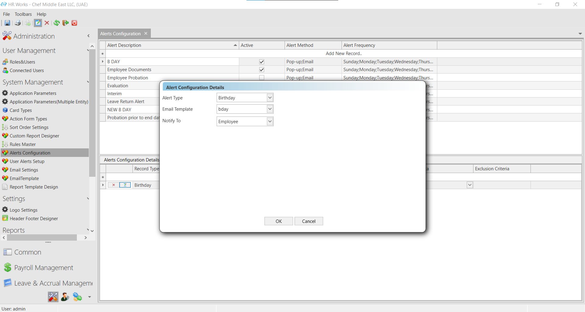
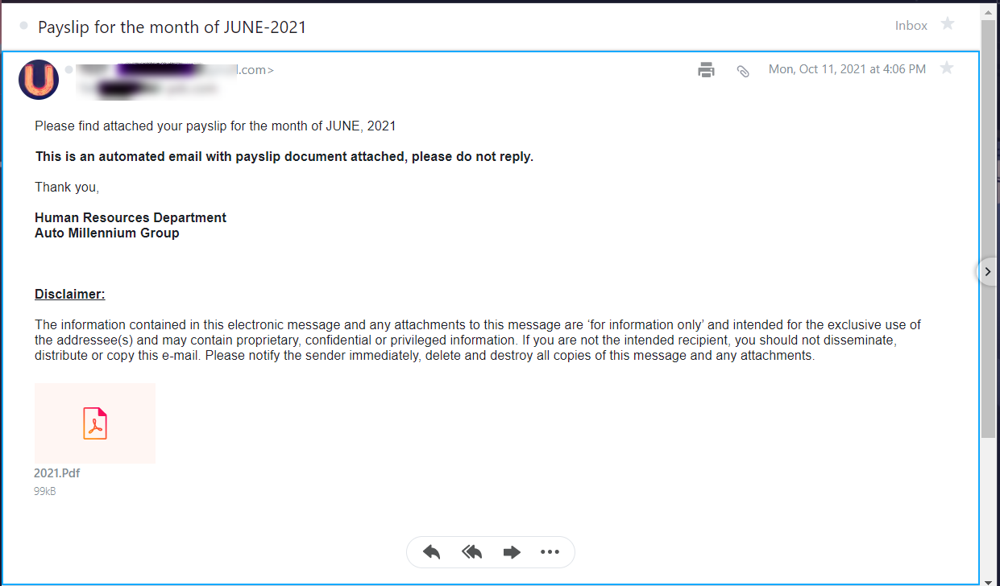

# Services

## Birthday Notification with content

### Jan 2022- # 23688

The client requires a birthday notification to send to the employee with
custom Email content. The image or content should be configurable by
admin.

This feature is enabled by using the script.

## Pay slip email Body

### Oct 2021- # 23442

**The client requires the pay slip email body in a different way.**

In order to implement the change, execute a script.

## General Email Service

### July 2018 (#7694)

General Email Service using **DLIHRMailService** is implemented for the following email modules:

-   Email Settings in HR Works

    -   Attendance Exception

    -   Attendance Report

    -   Employee Self Service

    -   Previous Day Attendance Summary

-   View Calendar Requests and Approval in HR Works Web

-   Payslip emailing in HR Works

-   Transaction Email Alert in HR Works

-   Document Alert in HR Works License Manager and Email Attendance Details services (supports multi DB configurations in Email Attendance Details)

-   OT Pre-Approval Emailing in HR Works Web

-   Email Functionalities in HR Works Plus

## License Manager

### July 2018 (#126)

It is the License Manager utility which determines the Access Control, Menu Visibility and other core constituents of the system. These settings are configured in the utility file to suit to various customer needs. In addition, the number of entities that can be created in the Card Type screen, number of users that can access the system etc. can be restricted by assigning proper utility settings.
